# InkWell Microservices Platform Technical Documentation
Generated from the local backend source tree. Build artifacts and frontend node_modules are excluded. Secrets from configuration files are intentionally not printed.
Scope: backend architecture, service-by-service file explanations, communication flows, security model, database interactions, exception handling, DTO/entity mapping, messaging, monitoring, and Mermaid diagrams.

# InkWell Architecture Overview
InkWell is a Spring Boot microservices platform for a blogging and publishing product. The backend is organized as independent Maven modules that register with Eureka, route public traffic through Spring Cloud Gateway, expose actuator endpoints to Spring Boot Admin, and use MySQL-backed persistence where a service owns state.

## Implemented Services
- discovery-service: port 8761; Eureka registry used by every runtime service for service discovery.
- admin-server: port 9090; Spring Boot Admin dashboard for health, metrics, and operational monitoring.
- api-gateway: port 8080; Public backend entry point, route dispatcher, JWT validator, and gateway policy layer.
- auth-service: port 8081; Identity, authentication, user profile, author request, feedback, OTP, email, and subscription payment state boundary.
- user-service: logical domain only in this repository. No standalone user-service module exists in this repository. User identity, profile, role, OAuth2, refresh-token, and internal user lookup behavior are implemented inside auth-service.
- post-service: port 8082; Post authoring, publishing, public feed, likes, bookmarks, follows, and reading history.
- comment-service: port 8084; Threaded comments, replies, comment likes, and comment cleanup on deleted posts.
- category-service: port 8083; Canonical category and tag taxonomy management.
- media-service: port 8085; Media upload, metadata persistence, and local/S3 storage abstraction.
- newsletter-service: port 8086; Newsletter subscriptions, confirmations, campaign records, templates, and campaign delivery.
- notification-service: port 8087; In-app notifications, broadcasts, audit logs, and optional notification emails.
- payment-service: port 8088; Small Razorpay adapter for order creation and signature verification.
- subscription-service: logical domain only in this repository. No standalone subscription-service module exists in this repository. Subscription tier/status and Razorpay-backed subscription payment state are implemented mainly inside auth-service, with payment-service acting as a smaller Razorpay utility boundary.

## Design Patterns Used
- API Gateway Pattern: api-gateway centralizes public routing, CORS, rate limiting, JWT validation, and identity header propagation.
- Service Discovery Pattern: discovery-service provides Eureka registration and lookup so services use logical names like lb://auth-service.
- Layered Architecture: controllers receive HTTP input, services own business rules, repositories own persistence, and DTOs define API contracts.
- DTO Pattern: request/response records decouple public payloads from JPA entities and place validation at the API boundary.
- Repository Pattern: Spring Data repositories hide SQL/JPA access behind interfaces.
- Event-driven Communication: RabbitMQ routes post, comment, reply, broadcast, and cleanup events across services.
- Circuit Breaker Pattern: post-service configures Resilience4j for category-service calls.
- Adapter Pattern: media storage and Razorpay/mail integrations are wrapped behind service classes.

## Overall Platform Communication
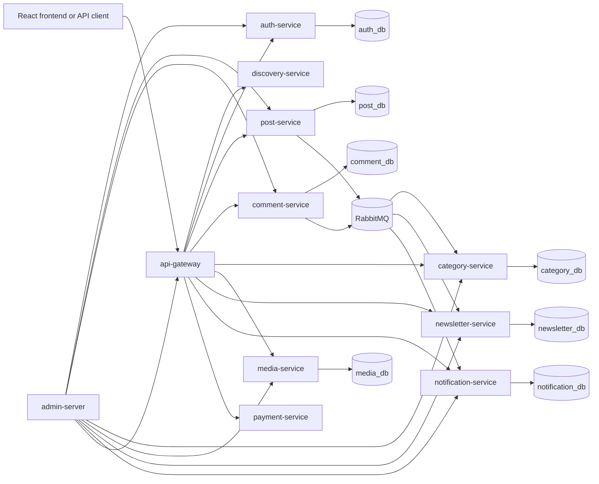

## End-to-End Request Flow
- Client sends HTTP request to api-gateway on port 8080.
- Gateway route predicates match the path and choose the target service.
- For protected routes, JwtAuthenticationFilter validates the bearer token and forwards identity headers such as user id, username, email, role, subscription tier, and subscription status.
- Downstream GatewayAuthenticationFilter converts those headers into GatewayUserPrincipal.
- Controller validates request DTOs and delegates to the service layer.
- Service layer applies business rules and calls repositories, Feign clients, mail/payment adapters, or RabbitMQ.
- Repository layer persists or reads service-owned database records.
- GlobalExceptionHandler converts validation and domain exceptions into consistent API errors.
- Actuator exposes health/metrics to admin-server.

## Core User Flows

### Login/signup flow
AuthController receives register/login. AuthService validates uniqueness and credentials, PasswordEncoder hashes passwords, JwtService issues access token, RefreshTokenService stores refresh tokens, and ApiResponse returns AuthResponse.

### Post creation flow
Author calls api-gateway /api/posts/author. Gateway validates JWT and role context. PostService sanitizes content, saves Post, syncs taxonomy through CategoryClient, and publishes post.published when published.

### Comment flow
Reader calls comment-service. CommentService validates the post through PostClient, sanitizes content, saves Comment, and publishes comment.created or comment.reply for notification-service.

### Subscription/payment flow
User creates payment order in auth-service or payment-service Razorpay boundary. Razorpay signature is verified, PaymentOrder is updated, subscription tier/status is changed on User, and fresh tokens are issued so gateway sees the new subscription claims.

### Notification/newsletter flow
post.published and comment events enter RabbitMQ. notification-service stores in-app notifications and optional email messages. newsletter-service can send campaigns to active subscribers.

### Admin monitoring flow
Each service registers actuator URLs with admin-server. Operators use the admin UI to see health and metrics while Eureka keeps runtime service discovery separate.

### Role-based access flow
Roles READER, AUTHOR, and ADMIN are encoded in JWTs and propagated by api-gateway. Services enforce endpoint or business-rule checks using GatewayUserPrincipal and Spring Security annotations/configuration.

# discovery-service

## Service Purpose
Eureka registry used by every runtime service for service discovery.
- Default port: 8761.
- Database or persistence: None.
- External integrations: Spring Cloud Netflix Eureka.

## Request and Internal Flow
Services register with Eureka at startup. Gateway and Feign clients resolve logical service names through Eureka instead of hard-coded addresses.
- Controller layer: accepts HTTP input, validates DTOs, resolves the principal where needed, and returns ApiResponse or ResponseEntity.
- Service layer: owns business rules, authorization decisions, mapping, transactions, event publishing, and remote client calls.
- Repository layer: persists service-owned state through Spring Data JPA where the service has a database.
- Exception flow: domain exceptions and validation failures are converted by GlobalExceptionHandler where present.
- Authentication/authorization: Normally internal-only. It exposes actuator health for monitoring and does not enforce JWT for registry access.

## Inter-Service Communication
- API Gateway: public traffic is routed to this service through api-gateway route predicates.
- Eureka: the service registers using spring.application.name so callers can use lb:// names or Feign client names.
- JWT propagation: api-gateway validates tokens and forwards identity headers consumed by GatewayAuthenticationFilter when present.
- Admin monitoring: actuator endpoints are registered with admin-server for health and metrics.
- Communication peer: api-gateway.
- Communication peer: admin-server.
- Communication peer: all services.

## File-by-File Explanation

### pom.xml
Type: Maven build descriptor. Defines the service artifact, inherited platform versions, runtime dependencies, and test dependencies. It is needed so Maven can build this service consistently as part of the multi-module platform.
- Why needed: this file keeps its responsibility isolated so the service remains testable and maintainable.
- Contribution: it participates in the service's layered flow, configuration, API contract, persistence, security, integration, or regression-test coverage.

### src/main/resources/application.yml
Type: Runtime configuration. Defines the service name, port, Eureka registration, datasource or external integrations, actuator exposure, and service-specific settings. Sensitive values should be supplied through environment variables rather than committed defaults.
- Why needed: this file keeps its responsibility isolated so the service remains testable and maintainable.
- Contribution: it participates in the service's layered flow, configuration, API contract, persistence, security, integration, or regression-test coverage.

### src/main/java/com/inkwell/discovery/DiscoveryServiceApplication.java
Type: Spring Boot application bootstrap. Starts the Spring Boot application context and enables the service's framework features. It is the executable entry point for local runs, containers, and tests.
- Package: com.inkwell.discovery.
- Types: DiscoveryServiceApplication.
- Important annotations: @EnableEurekaServer, @SpringBootApplication.
- Important methods: main.
- Why needed: this file keeps its responsibility isolated so the service remains testable and maintainable.
- Contribution: it participates in the service's layered flow, configuration, API contract, persistence, security, integration, or regression-test coverage.

### src/main/java/com/inkwell/discovery/package-info.java
Type: Package documentation. Provides package-level Javadoc that explains the service boundary and the role of the root package.
- Package: com.inkwell.discovery.
- Why needed: this file keeps its responsibility isolated so the service remains testable and maintainable.
- Contribution: it participates in the service's layered flow, configuration, API contract, persistence, security, integration, or regression-test coverage.

### src/test/java/com/inkwell/discovery/DiscoveryServiceApplicationTests.java
Type: Automated test. Verifies service behavior, controller delegation, security, exception handling, or integration configuration. It protects the documented behavior from regressions.
- Package: com.inkwell.discovery.
- Types: DiscoveryServiceApplicationTests.
- Important annotations: @Test.
- Why needed: this file keeps its responsibility isolated so the service remains testable and maintainable.
- Contribution: it participates in the service's layered flow, configuration, API contract, persistence, security, integration, or regression-test coverage.

## Service Diagrams

### Sequence Diagram
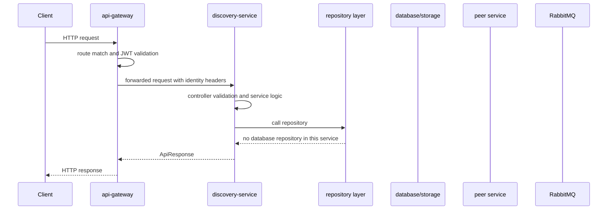

### UML/Class Diagram
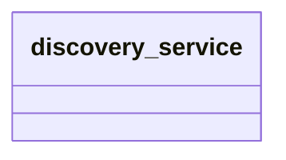

### Architecture Diagram
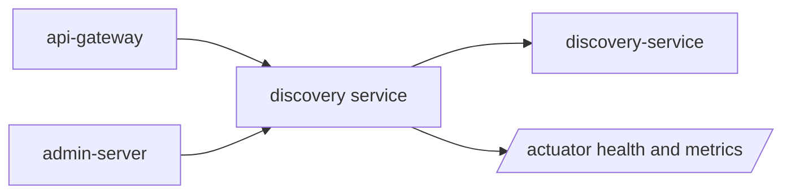

### Service Communication Diagram
```mermaid
flowchart LR
    Client[Client] --> Gateway[api-gateway]
    Gateway --> Service[discovery-service]
    Service --> api_gateway[api-gateway]
    Service --> admin_server[admin-server]
    Service --> all services[all services]
    Service --> Eureka[discovery-service]
    Admin[admin-server] --> Service
```

# admin-server

## Service Purpose
Spring Boot Admin dashboard for health, metrics, and operational monitoring.
- Default port: 9090.
- Database or persistence: None.
- External integrations: Actuator endpoints from registered clients.

## Request and Internal Flow
Each service registers its actuator URLs with Spring Boot Admin. Operators inspect health, metrics, and metadata through the admin UI.
- Controller layer: accepts HTTP input, validates DTOs, resolves the principal where needed, and returns ApiResponse or ResponseEntity.
- Service layer: owns business rules, authorization decisions, mapping, transactions, event publishing, and remote client calls.
- Repository layer: persists service-owned state through Spring Data JPA where the service has a database.
- Exception flow: domain exceptions and validation failures are converted by GlobalExceptionHandler where present.
- Authentication/authorization: The current code has a permissive SecurityConfig so local development monitoring is frictionless.

## Inter-Service Communication
- API Gateway: public traffic is routed to this service through api-gateway route predicates.
- Eureka: the service registers using spring.application.name so callers can use lb:// names or Feign client names.
- JWT propagation: api-gateway validates tokens and forwards identity headers consumed by GatewayAuthenticationFilter when present.
- Admin monitoring: actuator endpoints are registered with admin-server for health and metrics.
- Communication peer: discovery-service.
- Communication peer: all actuator-enabled services.

## File-by-File Explanation

### pom.xml
Type: Maven build descriptor. Defines the service artifact, inherited platform versions, runtime dependencies, and test dependencies. It is needed so Maven can build this service consistently as part of the multi-module platform.
- Why needed: this file keeps its responsibility isolated so the service remains testable and maintainable.
- Contribution: it participates in the service's layered flow, configuration, API contract, persistence, security, integration, or regression-test coverage.

### src/main/resources/application.yml
Type: Runtime configuration. Defines the service name, port, Eureka registration, datasource or external integrations, actuator exposure, and service-specific settings. Sensitive values should be supplied through environment variables rather than committed defaults.
- Why needed: this file keeps its responsibility isolated so the service remains testable and maintainable.
- Contribution: it participates in the service's layered flow, configuration, API contract, persistence, security, integration, or regression-test coverage.

### src/main/java/com/inkwell/admin/AdminServerApplication.java
Type: Spring Boot application bootstrap. Starts the Spring Boot application context and enables the service's framework features. It is the executable entry point for local runs, containers, and tests.
- Package: com.inkwell.admin.
- Types: AdminServerApplication.
- Important annotations: @EnableAdminServer, @SpringBootApplication.
- Important methods: main.
- Why needed: this file keeps its responsibility isolated so the service remains testable and maintainable.
- Contribution: it participates in the service's layered flow, configuration, API contract, persistence, security, integration, or regression-test coverage.

### src/main/java/com/inkwell/admin/SecurityConfig.java
Type: Source file. Supports the src/main/java/com/inkwell/admin/SecurityConfig.java implementation area and contributes to the service's runtime or test behavior.
- Package: com.inkwell.admin.
- Types: SecurityConfig.
- Important annotations: @Configuration, @Bean.
- Important methods: securityFilterChain.
- Why needed: this file keeps its responsibility isolated so the service remains testable and maintainable.
- Contribution: it participates in the service's layered flow, configuration, API contract, persistence, security, integration, or regression-test coverage.

### src/main/java/com/inkwell/admin/package-info.java
Type: Package documentation. Provides package-level Javadoc that explains the service boundary and the role of the root package.
- Package: com.inkwell.admin.
- Why needed: this file keeps its responsibility isolated so the service remains testable and maintainable.
- Contribution: it participates in the service's layered flow, configuration, API contract, persistence, security, integration, or regression-test coverage.

### src/test/java/com/inkwell/admin/AdminServerApplicationTests.java
Type: Automated test. Verifies service behavior, controller delegation, security, exception handling, or integration configuration. It protects the documented behavior from regressions.
- Package: com.inkwell.admin.
- Types: AdminServerApplicationTests.
- Important annotations: @Test.
- Why needed: this file keeps its responsibility isolated so the service remains testable and maintainable.
- Contribution: it participates in the service's layered flow, configuration, API contract, persistence, security, integration, or regression-test coverage.

## Service Diagrams

### Sequence Diagram


### UML/Class Diagram
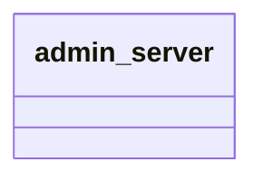

### Architecture Diagram
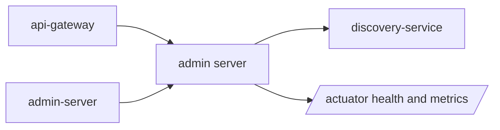

### Service Communication Diagram
```mermaid
flowchart LR
    Client[Client] --> Gateway[api-gateway]
    Gateway --> Service[admin-server]
    Service --> discovery_service[discovery-service]
    Service --> all actuator_enabled services[all actuator-enabled services]
    Service --> Eureka[discovery-service]
    Admin[admin-server] --> Service
```

# api-gateway

## Service Purpose
Public backend entry point, route dispatcher, JWT validator, and gateway policy layer.
- Default port: 8080.
- Database or persistence: Redis for gateway rate limiting.
- External integrations: Eureka, Redis, downstream services.

## Request and Internal Flow
Incoming requests match Spring Cloud Gateway routes. JwtAuthenticationFilter validates protected requests, adds identity headers, and forwards to the discovered service instance.
- Controller layer: accepts HTTP input, validates DTOs, resolves the principal where needed, and returns ApiResponse or ResponseEntity.
- Service layer: owns business rules, authorization decisions, mapping, transactions, event publishing, and remote client calls.
- Repository layer: persists service-owned state through Spring Data JPA where the service has a database.
- Exception flow: domain exceptions and validation failures are converted by GlobalExceptionHandler where present.
- Authentication/authorization: Bearer JWT validation occurs at the edge. Public paths pass through; protected paths require a valid token and role/subscription constraints where configured.

## Inter-Service Communication
- API Gateway: public traffic is routed to this service through api-gateway route predicates.
- Eureka: the service registers using spring.application.name so callers can use lb:// names or Feign client names.
- JWT propagation: api-gateway validates tokens and forwards identity headers consumed by GatewayAuthenticationFilter when present.
- Admin monitoring: actuator endpoints are registered with admin-server for health and metrics.
- Communication peer: auth-service.
- Communication peer: post-service.
- Communication peer: comment-service.
- Communication peer: category-service.
- Communication peer: media-service.
- Communication peer: newsletter-service.
- Communication peer: notification-service.
- Communication peer: payment-service.

## File-by-File Explanation

### pom.xml
Type: Maven build descriptor. Defines the service artifact, inherited platform versions, runtime dependencies, and test dependencies. It is needed so Maven can build this service consistently as part of the multi-module platform.
- Why needed: this file keeps its responsibility isolated so the service remains testable and maintainable.
- Contribution: it participates in the service's layered flow, configuration, API contract, persistence, security, integration, or regression-test coverage.

### src/main/resources/application.yml
Type: Runtime configuration. Defines the service name, port, Eureka registration, datasource or external integrations, actuator exposure, and service-specific settings. Sensitive values should be supplied through environment variables rather than committed defaults.
- Why needed: this file keeps its responsibility isolated so the service remains testable and maintainable.
- Contribution: it participates in the service's layered flow, configuration, API contract, persistence, security, integration, or regression-test coverage.

### src/main/java/com/inkwell/gateway/ApiGatewayApplication.java
Type: Spring Boot application bootstrap. Starts the Spring Boot application context and enables the service's framework features. It is the executable entry point for local runs, containers, and tests.
- Package: com.inkwell.gateway.
- Types: ApiGatewayApplication.
- Important annotations: @SpringBootApplication.
- Important methods: main.
- Why needed: this file keeps its responsibility isolated so the service remains testable and maintainable.
- Contribution: it participates in the service's layered flow, configuration, API contract, persistence, security, integration, or regression-test coverage.

### src/main/java/com/inkwell/gateway/config/ApiGatewayInfoController.java
Type: Spring configuration. Declares Spring beans for cross-cutting infrastructure such as OpenAPI, RabbitMQ, caching, storage, or seed data.
- Package: com.inkwell.gateway.config.
- Types: ApiGatewayInfoController.
- Important annotations: @RestController, @GetMapping.
- Endpoint annotations: @GetMapping("/").
- Important methods: root.
- Why needed: this file keeps its responsibility isolated so the service remains testable and maintainable.
- Contribution: it participates in the service's layered flow, configuration, API contract, persistence, security, integration, or regression-test coverage.

### src/main/java/com/inkwell/gateway/config/RateLimiterConfig.java
Type: Spring configuration. Declares Spring beans for cross-cutting infrastructure such as OpenAPI, RabbitMQ, caching, storage, or seed data.
- Package: com.inkwell.gateway.config.
- Types: RateLimiterConfig.
- Important annotations: @Configuration, @Bean.
- Important methods: userOrIpKeyResolver.
- Why needed: this file keeps its responsibility isolated so the service remains testable and maintainable.
- Contribution: it participates in the service's layered flow, configuration, API contract, persistence, security, integration, or regression-test coverage.

### src/main/java/com/inkwell/gateway/config/SwaggerConfig.java
Type: Spring configuration. Declares Spring beans for cross-cutting infrastructure such as OpenAPI, RabbitMQ, caching, storage, or seed data.
- Package: com.inkwell.gateway.config.
- Types: SwaggerConfig.
- Important annotations: @Configuration, @Bean, @Lazy, @inkwell.
- Important methods: swaggerUrls, inkwellOpenAPI, createSwaggerUrl.
- Why needed: this file keeps its responsibility isolated so the service remains testable and maintainable.
- Contribution: it participates in the service's layered flow, configuration, API contract, persistence, security, integration, or regression-test coverage.

### src/main/java/com/inkwell/gateway/package-info.java
Type: Package documentation. Provides package-level Javadoc that explains the service boundary and the role of the root package.
- Package: com.inkwell.gateway.
- Why needed: this file keeps its responsibility isolated so the service remains testable and maintainable.
- Contribution: it participates in the service's layered flow, configuration, API contract, persistence, security, integration, or regression-test coverage.

### src/main/java/com/inkwell/gateway/security/JwtAuthenticationFilter.java
Type: Security component. Participates in authentication or authorization, usually by configuring Spring Security, reading gateway identity headers, or representing the authenticated principal.
- Package: com.inkwell.gateway.security.
- Types: JwtAuthenticationFilter.
- Important annotations: @Slf4j, @Component, @RequiredArgsConstructor, @Override.
- Important methods: filter, getOrder, isPublicPath, requiresAdmin, requiresAuthor, requiresPremium, hasBearerToken, handleMissingToken, authorizationFailure, hasActiveProSubscription, withGatewayHeaders, writeUnauthorized, writeForbidden, writeError.
- Why needed: this file keeps its responsibility isolated so the service remains testable and maintainable.
- Contribution: it participates in the service's layered flow, configuration, API contract, persistence, security, integration, or regression-test coverage.

### src/main/java/com/inkwell/gateway/security/JwtService.java
Type: Security component. Participates in authentication or authorization, usually by configuring Spring Security, reading gateway identity headers, or representing the authenticated principal.
- Package: com.inkwell.gateway.security.
- Types: JwtService.
- Important annotations: @Service, @Value.
- Important methods: parseToken.
- Why needed: this file keeps its responsibility isolated so the service remains testable and maintainable.
- Contribution: it participates in the service's layered flow, configuration, API contract, persistence, security, integration, or regression-test coverage.

### src/test/java/com/inkwell/gateway/ApiGatewayApplicationTests.java
Type: Automated test. Verifies service behavior, controller delegation, security, exception handling, or integration configuration. It protects the documented behavior from regressions.
- Package: com.inkwell.gateway.
- Types: ApiGatewayApplicationTests.
- Important annotations: @Test.
- Why needed: this file keeps its responsibility isolated so the service remains testable and maintainable.
- Contribution: it participates in the service's layered flow, configuration, API contract, persistence, security, integration, or regression-test coverage.

### src/test/java/com/inkwell/gateway/security/JwtAuthenticationFilterTest.java
Type: Security component. Participates in authentication or authorization, usually by configuring Spring Security, reading gateway identity headers, or representing the authenticated principal.
- Package: com.inkwell.gateway.security.
- Types: JwtAuthenticationFilterTest.
- Important annotations: @ExtendWith, @BeforeEach, @inkwell, @Test, @DisplayName, @org.
- Important methods: generateToken.
- Why needed: this file keeps its responsibility isolated so the service remains testable and maintainable.
- Contribution: it participates in the service's layered flow, configuration, API contract, persistence, security, integration, or regression-test coverage.

## Service Diagrams

### Sequence Diagram
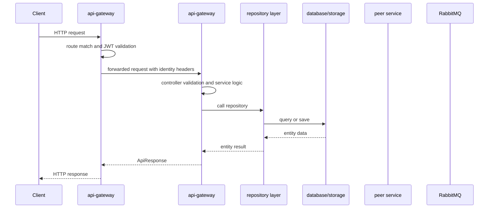

### UML/Class Diagram
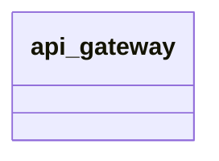

### Architecture Diagram
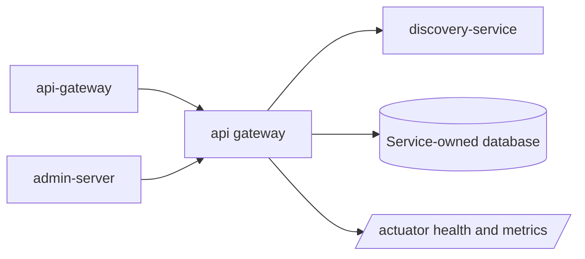

### Service Communication Diagram
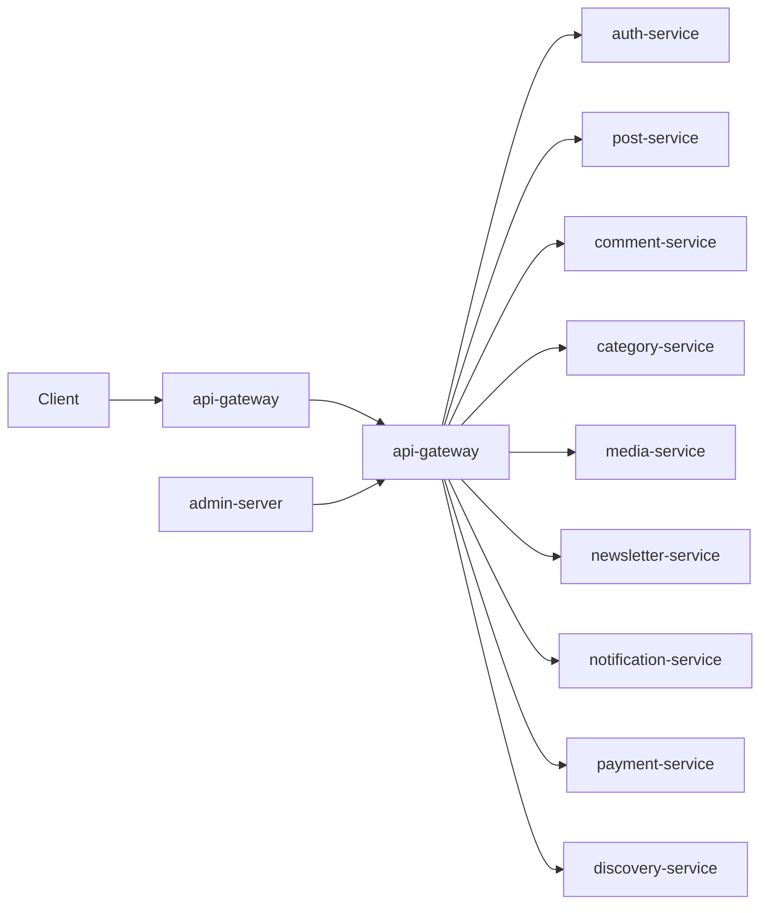

# auth-service

## Service Purpose
Identity, authentication, user profile, author request, feedback, OTP, email, and subscription payment state boundary.
- Default port: 8081.
- Database or persistence: MySQL auth_db plus Redis for rate limiting/temporary data.
- External integrations: Email SMTP, OAuth2 providers, Razorpay API, Eureka, Admin Server.

## Request and Internal Flow
Controllers validate DTOs, services apply business rules, repositories persist users/tokens/requests/payments, and mappers shape API responses.
- Controller layer: accepts HTTP input, validates DTOs, resolves the principal where needed, and returns ApiResponse or ResponseEntity.
- Service layer: owns business rules, authorization decisions, mapping, transactions, event publishing, and remote client calls.
- Repository layer: persists service-owned state through Spring Data JPA where the service has a database.
- Exception flow: domain exceptions and validation failures are converted by GlobalExceptionHandler where present.
- Authentication/authorization: Issues access and refresh JWTs. Gateway-authenticated internal calls pass identity headers that GatewayAuthenticationFilter converts into a principal.

## Inter-Service Communication
- API Gateway: public traffic is routed to this service through api-gateway route predicates.
- Eureka: the service registers using spring.application.name so callers can use lb:// names or Feign client names.
- JWT propagation: api-gateway validates tokens and forwards identity headers consumed by GatewayAuthenticationFilter when present.
- Admin monitoring: actuator endpoints are registered with admin-server for health and metrics.
- Communication peer: api-gateway.
- Communication peer: notification-service.
- Communication peer: payment gateway.
- Communication peer: mail server.

## File-by-File Explanation

### pom.xml
Type: Maven build descriptor. Defines the service artifact, inherited platform versions, runtime dependencies, and test dependencies. It is needed so Maven can build this service consistently as part of the multi-module platform.
- Why needed: this file keeps its responsibility isolated so the service remains testable and maintainable.
- Contribution: it participates in the service's layered flow, configuration, API contract, persistence, security, integration, or regression-test coverage.

### src/main/resources/application.yml
Type: Runtime configuration. Defines the service name, port, Eureka registration, datasource or external integrations, actuator exposure, and service-specific settings. Sensitive values should be supplied through environment variables rather than committed defaults.
- Why needed: this file keeps its responsibility isolated so the service remains testable and maintainable.
- Contribution: it participates in the service's layered flow, configuration, API contract, persistence, security, integration, or regression-test coverage.

### src/main/java/com/inkwell/auth/AuthServiceApplication.java
Type: Spring Boot application bootstrap. Starts the Spring Boot application context and enables the service's framework features. It is the executable entry point for local runs, containers, and tests.
- Package: com.inkwell.auth.
- Types: AuthServiceApplication.
- Important annotations: @EnableAsync, @SpringBootApplication.
- Important methods: main.
- Why needed: this file keeps its responsibility isolated so the service remains testable and maintainable.
- Contribution: it participates in the service's layered flow, configuration, API contract, persistence, security, integration, or regression-test coverage.

### src/main/java/com/inkwell/auth/config/AdminSeeder.java
Type: Spring configuration. Declares Spring beans for cross-cutting infrastructure such as OpenAPI, RabbitMQ, caching, storage, or seed data.
- Package: com.inkwell.auth.config.
- Types: AdminSeeder.
- Important annotations: @code, @Slf4j, @Component, @RequiredArgsConstructor, @inkwell, @Value, @ngeMe123, @Override.
- Important methods: run.
- Why needed: this file keeps its responsibility isolated so the service remains testable and maintainable.
- Contribution: it participates in the service's layered flow, configuration, API contract, persistence, security, integration, or regression-test coverage.

### src/main/java/com/inkwell/auth/config/DataInitializer.java
Type: Spring configuration. Declares Spring beans for cross-cutting infrastructure such as OpenAPI, RabbitMQ, caching, storage, or seed data.
- Package: com.inkwell.auth.config.
- Types: DataInitializer.
- Important annotations: @Slf4j, @Component, @RequiredArgsConstructor, @Override, @inkwell, @123.
- Important methods: run, seedIfMissing.
- Why needed: this file keeps its responsibility isolated so the service remains testable and maintainable.
- Contribution: it participates in the service's layered flow, configuration, API contract, persistence, security, integration, or regression-test coverage.

### src/main/java/com/inkwell/auth/controller/AdminAuthorRequestController.java
Type: REST controller. Exposes HTTP endpoints, accepts request DTOs and path/query parameters, delegates business rules to services, and returns a consistent ApiResponse shape.
- Package: com.inkwell.auth.controller.
- Types: AdminAuthorRequestController.
- Important annotations: @RestController, @RequestMapping, @RequiredArgsConstructor, @PreAuthorize, @GetMapping, @PutMapping, @PathVariable, @Valid, @RequestBody.
- Endpoint annotations: @RequestMapping("/api/admin/author-requests"); @GetMapping; @PutMapping("/{requestId}/approve"); @PutMapping("/{requestId}/reject").
- Important methods: getAllRequests, approve, reject.
- Why needed: this file keeps its responsibility isolated so the service remains testable and maintainable.
- Contribution: it participates in the service's layered flow, configuration, API contract, persistence, security, integration, or regression-test coverage.

### src/main/java/com/inkwell/auth/controller/AdminFeedbackController.java
Type: REST controller. Exposes HTTP endpoints, accepts request DTOs and path/query parameters, delegates business rules to services, and returns a consistent ApiResponse shape.
- Package: com.inkwell.auth.controller.
- Types: AdminFeedbackController.
- Important annotations: @RestController, @RequestMapping, @RequiredArgsConstructor, @PreAuthorize, @GetMapping, @PathVariable, @PutMapping, @Valid, @RequestBody, @PostMapping.
- Endpoint annotations: @RequestMapping("/api/admin/feedback"); @GetMapping; @GetMapping("/{reportId}"); @PutMapping("/{reportId}/status"); @PostMapping("/{reportId}/reply").
- Important methods: getAllReports, getReport, updateStatus, reply.
- Why needed: this file keeps its responsibility isolated so the service remains testable and maintainable.
- Contribution: it participates in the service's layered flow, configuration, API contract, persistence, security, integration, or regression-test coverage.

### src/main/java/com/inkwell/auth/controller/AdminUserController.java
Type: REST controller. Exposes HTTP endpoints, accepts request DTOs and path/query parameters, delegates business rules to services, and returns a consistent ApiResponse shape.
- Package: com.inkwell.auth.controller.
- Types: AdminUserController.
- Important annotations: @RestController, @RequestMapping, @RequiredArgsConstructor, @PreAuthorize, @GetMapping, @PatchMapping, @PathVariable, @Valid, @RequestBody, @DeleteMapping.
- Endpoint annotations: @RequestMapping("/api/auth/admin/users"); @GetMapping; @PatchMapping("/{userId}/role"); @PatchMapping("/{userId}/suspend"); @PatchMapping("/{userId}/reactivate"); @DeleteMapping("/{userId}").
- Important methods: getAllUsers, updateRole, suspend, reactivate, deleteUser.
- Why needed: this file keeps its responsibility isolated so the service remains testable and maintainable.
- Contribution: it participates in the service's layered flow, configuration, API contract, persistence, security, integration, or regression-test coverage.

### src/main/java/com/inkwell/auth/controller/AuthController.java
Type: REST controller. Exposes HTTP endpoints, accepts request DTOs and path/query parameters, delegates business rules to services, and returns a consistent ApiResponse shape.
- Package: com.inkwell.auth.controller.
- Types: AuthController.
- Important annotations: @RestController, @RequestMapping, @RequiredArgsConstructor, @PostMapping, @Valid, @RequestBody, @GetMapping, @PatchMapping.
- Endpoint annotations: @RequestMapping("/api/auth"); @PostMapping("/register"); @PostMapping("/login"); @PostMapping("/refresh"); @PostMapping("/logout"); @GetMapping("/me"); @PatchMapping("/me"); @PatchMapping("/me/password"); @PatchMapping("/me/deactivate"); @PostMapping("/forgot-password"); @PostMapping("/verify-otp"); @PostMapping("/reset-password").
- Important methods: register, login, refresh, logout, me, updateProfile, changePassword, deactivateSelf, forgotPassword, verifyOtp, resetPassword.
- Why needed: this file keeps its responsibility isolated so the service remains testable and maintainable.
- Contribution: it participates in the service's layered flow, configuration, API contract, persistence, security, integration, or regression-test coverage.

### src/main/java/com/inkwell/auth/controller/AuthorRequestController.java
Type: REST controller. Exposes HTTP endpoints, accepts request DTOs and path/query parameters, delegates business rules to services, and returns a consistent ApiResponse shape.
- Package: com.inkwell.auth.controller.
- Types: AuthorRequestController.
- Important annotations: @RestController, @RequestMapping, @RequiredArgsConstructor, @PostMapping, @GetMapping.
- Endpoint annotations: @RequestMapping("/api/author-request"); @PostMapping; @GetMapping("/status").
- Important methods: submitRequest, getStatus.
- Why needed: this file keeps its responsibility isolated so the service remains testable and maintainable.
- Contribution: it participates in the service's layered flow, configuration, API contract, persistence, security, integration, or regression-test coverage.

### src/main/java/com/inkwell/auth/controller/FeedbackController.java
Type: REST controller. Exposes HTTP endpoints, accepts request DTOs and path/query parameters, delegates business rules to services, and returns a consistent ApiResponse shape.
- Package: com.inkwell.auth.controller.
- Types: FeedbackController.
- Important annotations: @RestController, @RequestMapping, @RequiredArgsConstructor, @PostMapping, @Valid, @RequestBody, @GetMapping.
- Endpoint annotations: @RequestMapping("/api/feedback"); @PostMapping("/report"); @GetMapping("/my-reports").
- Important methods: submitFeedback, getMyReports.
- Why needed: this file keeps its responsibility isolated so the service remains testable and maintainable.
- Contribution: it participates in the service's layered flow, configuration, API contract, persistence, security, integration, or regression-test coverage.

### src/main/java/com/inkwell/auth/controller/InternalUserController.java
Type: REST controller. Exposes HTTP endpoints, accepts request DTOs and path/query parameters, delegates business rules to services, and returns a consistent ApiResponse shape.
- Package: com.inkwell.auth.controller.
- Types: InternalUserController.
- Important annotations: @RestController, @RequestMapping, @RequiredArgsConstructor, @GetMapping, @PathVariable.
- Endpoint annotations: @RequestMapping("/api/auth/internal"); @GetMapping("/users/{userId}").
- Important methods: getInternalUser.
- Why needed: this file keeps its responsibility isolated so the service remains testable and maintainable.
- Contribution: it participates in the service's layered flow, configuration, API contract, persistence, security, integration, or regression-test coverage.

### src/main/java/com/inkwell/auth/controller/PaymentController.java
Type: REST controller. Exposes HTTP endpoints, accepts request DTOs and path/query parameters, delegates business rules to services, and returns a consistent ApiResponse shape.
- Package: com.inkwell.auth.controller.
- Types: PaymentController.
- Important annotations: @RestController, @RequestMapping, @RequiredArgsConstructor, @PostMapping, @Valid, @RequestBody, @GetMapping.
- Endpoint annotations: @RequestMapping("/api/auth/payments"); @PostMapping("/orders"); @PostMapping("/verify"); @GetMapping("/history").
- Important methods: createOrder, verifyPayment, history.
- Why needed: this file keeps its responsibility isolated so the service remains testable and maintainable.
- Contribution: it participates in the service's layered flow, configuration, API contract, persistence, security, integration, or regression-test coverage.

### src/main/java/com/inkwell/auth/controller/PublicUserController.java
Type: REST controller. Exposes HTTP endpoints, accepts request DTOs and path/query parameters, delegates business rules to services, and returns a consistent ApiResponse shape.
- Package: com.inkwell.auth.controller.
- Types: PublicUserController.
- Important annotations: @RestController, @RequestMapping, @RequiredArgsConstructor, @GetMapping, @RequestParam, @PathVariable.
- Endpoint annotations: @RequestMapping("/api/auth/public"); @GetMapping("/authors"); @GetMapping("/search"); @GetMapping("/users/{userId}").
- Important methods: authors, search, userById.
- Why needed: this file keeps its responsibility isolated so the service remains testable and maintainable.
- Contribution: it participates in the service's layered flow, configuration, API contract, persistence, security, integration, or regression-test coverage.

### src/main/java/com/inkwell/auth/controller/ServiceInfoController.java
Type: REST controller. Exposes HTTP endpoints, accepts request DTOs and path/query parameters, delegates business rules to services, and returns a consistent ApiResponse shape.
- Package: com.inkwell.auth.controller.
- Types: ServiceInfoController.
- Important annotations: @RestController, @GetMapping.
- Endpoint annotations: @GetMapping("/").
- Important methods: root.
- Why needed: this file keeps its responsibility isolated so the service remains testable and maintainable.
- Contribution: it participates in the service's layered flow, configuration, API contract, persistence, security, integration, or regression-test coverage.

### src/main/java/com/inkwell/auth/dto/ApiResponse.java
Type: DTO/API contract. Defines request or response data crossing service boundaries. DTOs keep API payloads independent from JPA entities and usually host validation annotations.
- Package: com.inkwell.auth.dto.
- Types: ApiResponse.
- Important methods: of.
- Why needed: this file keeps its responsibility isolated so the service remains testable and maintainable.
- Contribution: it participates in the service's layered flow, configuration, API contract, persistence, security, integration, or regression-test coverage.

### src/main/java/com/inkwell/auth/dto/request/AdminRemarkRequest.java
Type: DTO/API contract. Defines request or response data crossing service boundaries. DTOs keep API payloads independent from JPA entities and usually host validation annotations.
- Package: com.inkwell.auth.dto.request.
- Types: AdminRemarkRequest.
- Important annotations: @Size.
- Important methods: AdminRemarkRequest.
- Why needed: this file keeps its responsibility isolated so the service remains testable and maintainable.
- Contribution: it participates in the service's layered flow, configuration, API contract, persistence, security, integration, or regression-test coverage.

### src/main/java/com/inkwell/auth/dto/request/ChangePasswordRequest.java
Type: DTO/API contract. Defines request or response data crossing service boundaries. DTOs keep API payloads independent from JPA entities and usually host validation annotations.
- Package: com.inkwell.auth.dto.request.
- Types: ChangePasswordRequest.
- Important annotations: @NotBlank, @Size, @Pattern.
- Important methods: ChangePasswordRequest.
- Why needed: this file keeps its responsibility isolated so the service remains testable and maintainable.
- Contribution: it participates in the service's layered flow, configuration, API contract, persistence, security, integration, or regression-test coverage.

### src/main/java/com/inkwell/auth/dto/request/CreatePaymentOrderRequest.java
Type: DTO/API contract. Defines request or response data crossing service boundaries. DTOs keep API payloads independent from JPA entities and usually host validation annotations.
- Package: com.inkwell.auth.dto.request.
- Types: CreatePaymentOrderRequest.
- Important annotations: @DecimalMin, @NotBlank, @Size.
- Important methods: CreatePaymentOrderRequest.
- Why needed: this file keeps its responsibility isolated so the service remains testable and maintainable.
- Contribution: it participates in the service's layered flow, configuration, API contract, persistence, security, integration, or regression-test coverage.

### src/main/java/com/inkwell/auth/dto/request/FeedbackMessageRequest.java
Type: DTO/API contract. Defines request or response data crossing service boundaries. DTOs keep API payloads independent from JPA entities and usually host validation annotations.
- Package: com.inkwell.auth.dto.request.
- Types: FeedbackMessageRequest.
- Important annotations: @NotBlank, @Size.
- Important methods: FeedbackMessageRequest.
- Why needed: this file keeps its responsibility isolated so the service remains testable and maintainable.
- Contribution: it participates in the service's layered flow, configuration, API contract, persistence, security, integration, or regression-test coverage.

### src/main/java/com/inkwell/auth/dto/request/FeedbackStatusUpdateRequest.java
Type: DTO/API contract. Defines request or response data crossing service boundaries. DTOs keep API payloads independent from JPA entities and usually host validation annotations.
- Package: com.inkwell.auth.dto.request.
- Types: FeedbackStatusUpdateRequest.
- Important annotations: @NotNull.
- Important methods: FeedbackStatusUpdateRequest.
- Why needed: this file keeps its responsibility isolated so the service remains testable and maintainable.
- Contribution: it participates in the service's layered flow, configuration, API contract, persistence, security, integration, or regression-test coverage.

### src/main/java/com/inkwell/auth/dto/request/ForgotPasswordRequest.java
Type: DTO/API contract. Defines request or response data crossing service boundaries. DTOs keep API payloads independent from JPA entities and usually host validation annotations.
- Package: com.inkwell.auth.dto.request.
- Types: ForgotPasswordRequest.
- Important annotations: @NotBlank, @Email.
- Important methods: ForgotPasswordRequest.
- Why needed: this file keeps its responsibility isolated so the service remains testable and maintainable.
- Contribution: it participates in the service's layered flow, configuration, API contract, persistence, security, integration, or regression-test coverage.

### src/main/java/com/inkwell/auth/dto/request/LoginRequest.java
Type: DTO/API contract. Defines request or response data crossing service boundaries. DTOs keep API payloads independent from JPA entities and usually host validation annotations.
- Package: com.inkwell.auth.dto.request.
- Types: LoginRequest.
- Important annotations: @NotBlank.
- Important methods: LoginRequest.
- Why needed: this file keeps its responsibility isolated so the service remains testable and maintainable.
- Contribution: it participates in the service's layered flow, configuration, API contract, persistence, security, integration, or regression-test coverage.

### src/main/java/com/inkwell/auth/dto/request/ProfileUpdateRequest.java
Type: DTO/API contract. Defines request or response data crossing service boundaries. DTOs keep API payloads independent from JPA entities and usually host validation annotations.
- Package: com.inkwell.auth.dto.request.
- Types: ProfileUpdateRequest.
- Important annotations: @Data, @NotBlank, @Size, @Pattern.
- Why needed: this file keeps its responsibility isolated so the service remains testable and maintainable.
- Contribution: it participates in the service's layered flow, configuration, API contract, persistence, security, integration, or regression-test coverage.

### src/main/java/com/inkwell/auth/dto/request/RefreshTokenRequest.java
Type: DTO/API contract. Defines request or response data crossing service boundaries. DTOs keep API payloads independent from JPA entities and usually host validation annotations.
- Package: com.inkwell.auth.dto.request.
- Types: RefreshTokenRequest.
- Important annotations: @NotBlank.
- Important methods: RefreshTokenRequest.
- Why needed: this file keeps its responsibility isolated so the service remains testable and maintainable.
- Contribution: it participates in the service's layered flow, configuration, API contract, persistence, security, integration, or regression-test coverage.

### src/main/java/com/inkwell/auth/dto/request/RegisterRequest.java
Type: DTO/API contract. Defines request or response data crossing service boundaries. DTOs keep API payloads independent from JPA entities and usually host validation annotations.
- Package: com.inkwell.auth.dto.request.
- Types: RegisterRequest.
- Important annotations: @NotBlank, @Size, @Pattern, @Email.
- Important methods: RegisterRequest.
- Why needed: this file keeps its responsibility isolated so the service remains testable and maintainable.
- Contribution: it participates in the service's layered flow, configuration, API contract, persistence, security, integration, or regression-test coverage.

### src/main/java/com/inkwell/auth/dto/request/ResetPasswordRequest.java
Type: DTO/API contract. Defines request or response data crossing service boundaries. DTOs keep API payloads independent from JPA entities and usually host validation annotations.
- Package: com.inkwell.auth.dto.request.
- Types: ResetPasswordRequest.
- Important annotations: @NotBlank, @Email, @Size.
- Important methods: ResetPasswordRequest.
- Why needed: this file keeps its responsibility isolated so the service remains testable and maintainable.
- Contribution: it participates in the service's layered flow, configuration, API contract, persistence, security, integration, or regression-test coverage.

### src/main/java/com/inkwell/auth/dto/request/RoleUpdateRequest.java
Type: DTO/API contract. Defines request or response data crossing service boundaries. DTOs keep API payloads independent from JPA entities and usually host validation annotations.
- Package: com.inkwell.auth.dto.request.
- Types: RoleUpdateRequest.
- Important annotations: @NotNull.
- Important methods: RoleUpdateRequest.
- Why needed: this file keeps its responsibility isolated so the service remains testable and maintainable.
- Contribution: it participates in the service's layered flow, configuration, API contract, persistence, security, integration, or regression-test coverage.

### src/main/java/com/inkwell/auth/dto/request/UpdateProfileRequest.java
Type: DTO/API contract. Defines request or response data crossing service boundaries. DTOs keep API payloads independent from JPA entities and usually host validation annotations.
- Package: com.inkwell.auth.dto.request.
- Types: UpdateProfileRequest.
- Important annotations: @NotBlank, @Size, @Pattern.
- Important methods: UpdateProfileRequest.
- Why needed: this file keeps its responsibility isolated so the service remains testable and maintainable.
- Contribution: it participates in the service's layered flow, configuration, API contract, persistence, security, integration, or regression-test coverage.

### src/main/java/com/inkwell/auth/dto/request/VerifyOtpRequest.java
Type: DTO/API contract. Defines request or response data crossing service boundaries. DTOs keep API payloads independent from JPA entities and usually host validation annotations.
- Package: com.inkwell.auth.dto.request.
- Types: VerifyOtpRequest.
- Important annotations: @NotBlank, @Email.
- Important methods: VerifyOtpRequest.
- Why needed: this file keeps its responsibility isolated so the service remains testable and maintainable.
- Contribution: it participates in the service's layered flow, configuration, API contract, persistence, security, integration, or regression-test coverage.

### src/main/java/com/inkwell/auth/dto/request/VerifyPaymentRequest.java
Type: DTO/API contract. Defines request or response data crossing service boundaries. DTOs keep API payloads independent from JPA entities and usually host validation annotations.
- Package: com.inkwell.auth.dto.request.
- Types: VerifyPaymentRequest.
- Important annotations: @NotBlank.
- Important methods: VerifyPaymentRequest.
- Why needed: this file keeps its responsibility isolated so the service remains testable and maintainable.
- Contribution: it participates in the service's layered flow, configuration, API contract, persistence, security, integration, or regression-test coverage.

### src/main/java/com/inkwell/auth/dto/response/AuthResponse.java
Type: DTO/API contract. Defines request or response data crossing service boundaries. DTOs keep API payloads independent from JPA entities and usually host validation annotations.
- Package: com.inkwell.auth.dto.response.
- Types: AuthResponse.
- Important methods: AuthResponse.
- Why needed: this file keeps its responsibility isolated so the service remains testable and maintainable.
- Contribution: it participates in the service's layered flow, configuration, API contract, persistence, security, integration, or regression-test coverage.

### src/main/java/com/inkwell/auth/dto/response/AuthorRequestResponse.java
Type: DTO/API contract. Defines request or response data crossing service boundaries. DTOs keep API payloads independent from JPA entities and usually host validation annotations.
- Package: com.inkwell.auth.dto.response.
- Types: AuthorRequestResponse.
- Important methods: AuthorRequestResponse.
- Why needed: this file keeps its responsibility isolated so the service remains testable and maintainable.
- Contribution: it participates in the service's layered flow, configuration, API contract, persistence, security, integration, or regression-test coverage.

### src/main/java/com/inkwell/auth/dto/response/FeedbackMessageResponse.java
Type: DTO/API contract. Defines request or response data crossing service boundaries. DTOs keep API payloads independent from JPA entities and usually host validation annotations.
- Package: com.inkwell.auth.dto.response.
- Types: FeedbackMessageResponse.
- Important methods: FeedbackMessageResponse.
- Why needed: this file keeps its responsibility isolated so the service remains testable and maintainable.
- Contribution: it participates in the service's layered flow, configuration, API contract, persistence, security, integration, or regression-test coverage.

### src/main/java/com/inkwell/auth/dto/response/FeedbackReportResponse.java
Type: DTO/API contract. Defines request or response data crossing service boundaries. DTOs keep API payloads independent from JPA entities and usually host validation annotations.
- Package: com.inkwell.auth.dto.response.
- Types: FeedbackReportResponse.
- Important methods: FeedbackReportResponse.
- Why needed: this file keeps its responsibility isolated so the service remains testable and maintainable.
- Contribution: it participates in the service's layered flow, configuration, API contract, persistence, security, integration, or regression-test coverage.

### src/main/java/com/inkwell/auth/dto/response/PaymentOrderResponse.java
Type: DTO/API contract. Defines request or response data crossing service boundaries. DTOs keep API payloads independent from JPA entities and usually host validation annotations.
- Package: com.inkwell.auth.dto.response.
- Types: PaymentOrderResponse.
- Important methods: PaymentOrderResponse.
- Why needed: this file keeps its responsibility isolated so the service remains testable and maintainable.
- Contribution: it participates in the service's layered flow, configuration, API contract, persistence, security, integration, or regression-test coverage.

### src/main/java/com/inkwell/auth/dto/response/PaymentVerifyResponse.java
Type: DTO/API contract. Defines request or response data crossing service boundaries. DTOs keep API payloads independent from JPA entities and usually host validation annotations.
- Package: com.inkwell.auth.dto.response.
- Types: PaymentVerifyResponse.
- Important methods: PaymentVerifyResponse.
- Why needed: this file keeps its responsibility isolated so the service remains testable and maintainable.
- Contribution: it participates in the service's layered flow, configuration, API contract, persistence, security, integration, or regression-test coverage.

### src/main/java/com/inkwell/auth/dto/response/ProfileResponse.java
Type: DTO/API contract. Defines request or response data crossing service boundaries. DTOs keep API payloads independent from JPA entities and usually host validation annotations.
- Package: com.inkwell.auth.dto.response.
- Types: ProfileResponse.
- Important annotations: @Data, @Builder.
- Why needed: this file keeps its responsibility isolated so the service remains testable and maintainable.
- Contribution: it participates in the service's layered flow, configuration, API contract, persistence, security, integration, or regression-test coverage.

### src/main/java/com/inkwell/auth/dto/response/UserResponse.java
Type: DTO/API contract. Defines request or response data crossing service boundaries. DTOs keep API payloads independent from JPA entities and usually host validation annotations.
- Package: com.inkwell.auth.dto.response.
- Types: UserResponse.
- Important methods: UserResponse.
- Why needed: this file keeps its responsibility isolated so the service remains testable and maintainable.
- Contribution: it participates in the service's layered flow, configuration, API contract, persistence, security, integration, or regression-test coverage.

### src/main/java/com/inkwell/auth/entity/AuditLog.java
Type: JPA entity. Models a database table or persisted aggregate. It is needed so JPA/Hibernate can map domain state to relational records.
- Package: com.inkwell.auth.entity.
- Types: AuditLog.
- Important annotations: @Getter, @Setter, @Builder, @NoArgsConstructor, @AllArgsConstructor, @Entity, @Table, @Id, @Column, @PrePersist.
- Why needed: this file keeps its responsibility isolated so the service remains testable and maintainable.
- Contribution: it participates in the service's layered flow, configuration, API contract, persistence, security, integration, or regression-test coverage.

### src/main/java/com/inkwell/auth/entity/AuthorRequest.java
Type: JPA entity. Models a database table or persisted aggregate. It is needed so JPA/Hibernate can map domain state to relational records.
- Package: com.inkwell.auth.entity.
- Types: AuthorRequest.
- Important annotations: @Getter, @Setter, @Builder, @NoArgsConstructor, @AllArgsConstructor, @Entity, @Table, @Id, @Column, @ManyToOne, @JoinColumn, @Enumerated.
- Why needed: this file keeps its responsibility isolated so the service remains testable and maintainable.
- Contribution: it participates in the service's layered flow, configuration, API contract, persistence, security, integration, or regression-test coverage.

### src/main/java/com/inkwell/auth/entity/EmailVerificationToken.java
Type: JPA entity. Models a database table or persisted aggregate. It is needed so JPA/Hibernate can map domain state to relational records.
- Package: com.inkwell.auth.entity.
- Types: EmailVerificationToken.
- Important annotations: @Getter, @Setter, @Builder, @NoArgsConstructor, @AllArgsConstructor, @Entity, @Table, @Id, @Column, @ManyToOne, @JoinColumn, @jakarta.
- Why needed: this file keeps its responsibility isolated so the service remains testable and maintainable.
- Contribution: it participates in the service's layered flow, configuration, API contract, persistence, security, integration, or regression-test coverage.

### src/main/java/com/inkwell/auth/entity/FeedbackMessage.java
Type: JPA entity. Models a database table or persisted aggregate. It is needed so JPA/Hibernate can map domain state to relational records.
- Package: com.inkwell.auth.entity.
- Types: FeedbackMessage.
- Important annotations: @Getter, @Setter, @Builder, @NoArgsConstructor, @AllArgsConstructor, @Entity, @Table, @Id, @Column, @ManyToOne, @JoinColumn, @PrePersist.
- Why needed: this file keeps its responsibility isolated so the service remains testable and maintainable.
- Contribution: it participates in the service's layered flow, configuration, API contract, persistence, security, integration, or regression-test coverage.

### src/main/java/com/inkwell/auth/entity/FeedbackReport.java
Type: JPA entity. Models a database table or persisted aggregate. It is needed so JPA/Hibernate can map domain state to relational records.
- Package: com.inkwell.auth.entity.
- Types: FeedbackReport.
- Important annotations: @Getter, @Setter, @Builder, @NoArgsConstructor, @AllArgsConstructor, @Entity, @Table, @Id, @Column, @ManyToOne, @JoinColumn, @Enumerated.
- Important methods: addMessage.
- Why needed: this file keeps its responsibility isolated so the service remains testable and maintainable.
- Contribution: it participates in the service's layered flow, configuration, API contract, persistence, security, integration, or regression-test coverage.

### src/main/java/com/inkwell/auth/entity/PasswordOtp.java
Type: JPA entity. Models a database table or persisted aggregate. It is needed so JPA/Hibernate can map domain state to relational records.
- Package: com.inkwell.auth.entity.
- Types: PasswordOtp.
- Important annotations: @Getter, @Setter, @Builder, @NoArgsConstructor, @AllArgsConstructor, @Entity, @Table, @Id, @GeneratedValue, @Column, @PrePersist.
- Why needed: this file keeps its responsibility isolated so the service remains testable and maintainable.
- Contribution: it participates in the service's layered flow, configuration, API contract, persistence, security, integration, or regression-test coverage.

### src/main/java/com/inkwell/auth/entity/PaymentOrder.java
Type: JPA entity. Models a database table or persisted aggregate. It is needed so JPA/Hibernate can map domain state to relational records.
- Package: com.inkwell.auth.entity.
- Types: PaymentOrder.
- Important annotations: @Getter, @Setter, @Builder, @NoArgsConstructor, @AllArgsConstructor, @Entity, @Table, @Id, @Column, @ManyToOne, @JoinColumn, @Enumerated.
- Why needed: this file keeps its responsibility isolated so the service remains testable and maintainable.
- Contribution: it participates in the service's layered flow, configuration, API contract, persistence, security, integration, or regression-test coverage.

### src/main/java/com/inkwell/auth/entity/RefreshToken.java
Type: JPA entity. Models a database table or persisted aggregate. It is needed so JPA/Hibernate can map domain state to relational records.
- Package: com.inkwell.auth.entity.
- Types: RefreshToken.
- Important annotations: @Getter, @Setter, @Builder, @NoArgsConstructor, @AllArgsConstructor, @Entity, @Table, @Id, @GeneratedValue, @Column, @ManyToOne, @JoinColumn.
- Why needed: this file keeps its responsibility isolated so the service remains testable and maintainable.
- Contribution: it participates in the service's layered flow, configuration, API contract, persistence, security, integration, or regression-test coverage.

### src/main/java/com/inkwell/auth/entity/User.java
Type: JPA entity. Models a database table or persisted aggregate. It is needed so JPA/Hibernate can map domain state to relational records.
- Package: com.inkwell.auth.entity.
- Types: User.
- Important annotations: @Getter, @Setter, @Builder, @NoArgsConstructor, @AllArgsConstructor, @Entity, @Table, @Id, @Column, @Enumerated, @PrePersist, @PreUpdate.
- Why needed: this file keeps its responsibility isolated so the service remains testable and maintainable.
- Contribution: it participates in the service's layered flow, configuration, API contract, persistence, security, integration, or regression-test coverage.

### src/main/java/com/inkwell/auth/enumtype/AuthProvider.java
Type: Domain enum. Defines the finite set of domain states or roles used by entities, DTOs, and business rules.
- Package: com.inkwell.auth.enumtype.
- Types: AuthProvider.
- Why needed: this file keeps its responsibility isolated so the service remains testable and maintainable.
- Contribution: it participates in the service's layered flow, configuration, API contract, persistence, security, integration, or regression-test coverage.

### src/main/java/com/inkwell/auth/enumtype/FeedbackStatus.java
Type: Domain enum. Defines the finite set of domain states or roles used by entities, DTOs, and business rules.
- Package: com.inkwell.auth.enumtype.
- Types: FeedbackStatus.
- Why needed: this file keeps its responsibility isolated so the service remains testable and maintainable.
- Contribution: it participates in the service's layered flow, configuration, API contract, persistence, security, integration, or regression-test coverage.

### src/main/java/com/inkwell/auth/enumtype/PaymentGatewayProvider.java
Type: Domain enum. Defines the finite set of domain states or roles used by entities, DTOs, and business rules.
- Package: com.inkwell.auth.enumtype.
- Types: PaymentGatewayProvider.
- Why needed: this file keeps its responsibility isolated so the service remains testable and maintainable.
- Contribution: it participates in the service's layered flow, configuration, API contract, persistence, security, integration, or regression-test coverage.

### src/main/java/com/inkwell/auth/enumtype/PaymentStatus.java
Type: Domain enum. Defines the finite set of domain states or roles used by entities, DTOs, and business rules.
- Package: com.inkwell.auth.enumtype.
- Types: PaymentStatus.
- Why needed: this file keeps its responsibility isolated so the service remains testable and maintainable.
- Contribution: it participates in the service's layered flow, configuration, API contract, persistence, security, integration, or regression-test coverage.

### src/main/java/com/inkwell/auth/enumtype/RequestStatus.java
Type: Domain enum. Defines the finite set of domain states or roles used by entities, DTOs, and business rules.
- Package: com.inkwell.auth.enumtype.
- Types: RequestStatus.
- Why needed: this file keeps its responsibility isolated so the service remains testable and maintainable.
- Contribution: it participates in the service's layered flow, configuration, API contract, persistence, security, integration, or regression-test coverage.

### src/main/java/com/inkwell/auth/enumtype/Role.java
Type: Domain enum. Defines the finite set of domain states or roles used by entities, DTOs, and business rules.
- Package: com.inkwell.auth.enumtype.
- Types: Role.
- Why needed: this file keeps its responsibility isolated so the service remains testable and maintainable.
- Contribution: it participates in the service's layered flow, configuration, API contract, persistence, security, integration, or regression-test coverage.

### src/main/java/com/inkwell/auth/enumtype/SubscriptionStatus.java
Type: Domain enum. Defines the finite set of domain states or roles used by entities, DTOs, and business rules.
- Package: com.inkwell.auth.enumtype.
- Types: SubscriptionStatus.
- Why needed: this file keeps its responsibility isolated so the service remains testable and maintainable.
- Contribution: it participates in the service's layered flow, configuration, API contract, persistence, security, integration, or regression-test coverage.

### src/main/java/com/inkwell/auth/enumtype/SubscriptionTier.java
Type: Domain enum. Defines the finite set of domain states or roles used by entities, DTOs, and business rules.
- Package: com.inkwell.auth.enumtype.
- Types: SubscriptionTier.
- Why needed: this file keeps its responsibility isolated so the service remains testable and maintainable.
- Contribution: it participates in the service's layered flow, configuration, API contract, persistence, security, integration, or regression-test coverage.

### src/main/java/com/inkwell/auth/exception/BadRequestException.java
Type: Exception handling. Defines service-specific errors or translates exceptions into predictable HTTP responses for clients.
- Package: com.inkwell.auth.exception.
- Types: BadRequestException.
- Why needed: this file keeps its responsibility isolated so the service remains testable and maintainable.
- Contribution: it participates in the service's layered flow, configuration, API contract, persistence, security, integration, or regression-test coverage.

### src/main/java/com/inkwell/auth/exception/GlobalExceptionHandler.java
Type: Exception handling. Defines service-specific errors or translates exceptions into predictable HTTP responses for clients.
- Package: com.inkwell.auth.exception.
- Types: GlobalExceptionHandler.
- Important annotations: @RestControllerAdvice, @ExceptionHandler.
- Important methods: handleNotFound, handleBadRequest, handleUnauthorized, handleAccessDenied, handleTooManyRequests, handleValidation, handleGeneric, build, base.
- Why needed: this file keeps its responsibility isolated so the service remains testable and maintainable.
- Contribution: it participates in the service's layered flow, configuration, API contract, persistence, security, integration, or regression-test coverage.

### src/main/java/com/inkwell/auth/exception/ResourceNotFoundException.java
Type: Exception handling. Defines service-specific errors or translates exceptions into predictable HTTP responses for clients.
- Package: com.inkwell.auth.exception.
- Types: ResourceNotFoundException.
- Why needed: this file keeps its responsibility isolated so the service remains testable and maintainable.
- Contribution: it participates in the service's layered flow, configuration, API contract, persistence, security, integration, or regression-test coverage.

### src/main/java/com/inkwell/auth/exception/TooManyRequestsException.java
Type: Exception handling. Defines service-specific errors or translates exceptions into predictable HTTP responses for clients.
- Package: com.inkwell.auth.exception.
- Types: TooManyRequestsException.
- Important annotations: @ResponseStatus.
- Why needed: this file keeps its responsibility isolated so the service remains testable and maintainable.
- Contribution: it participates in the service's layered flow, configuration, API contract, persistence, security, integration, or regression-test coverage.

### src/main/java/com/inkwell/auth/exception/UnauthorizedException.java
Type: Exception handling. Defines service-specific errors or translates exceptions into predictable HTTP responses for clients.
- Package: com.inkwell.auth.exception.
- Types: UnauthorizedException.
- Why needed: this file keeps its responsibility isolated so the service remains testable and maintainable.
- Contribution: it participates in the service's layered flow, configuration, API contract, persistence, security, integration, or regression-test coverage.

### src/main/java/com/inkwell/auth/mapper/UserMapper.java
Type: Source file. Supports the src/main/java/com/inkwell/auth/mapper/UserMapper.java implementation area and contributes to the service's runtime or test behavior.
- Package: com.inkwell.auth.mapper.
- Types: UserMapper.
- Important annotations: @Component.
- Important methods: toResponse.
- Why needed: this file keeps its responsibility isolated so the service remains testable and maintainable.
- Contribution: it participates in the service's layered flow, configuration, API contract, persistence, security, integration, or regression-test coverage.

### src/main/java/com/inkwell/auth/package-info.java
Type: Package documentation. Provides package-level Javadoc that explains the service boundary and the role of the root package.
- Package: com.inkwell.auth.
- Why needed: this file keeps its responsibility isolated so the service remains testable and maintainable.
- Contribution: it participates in the service's layered flow, configuration, API contract, persistence, security, integration, or regression-test coverage.

### src/main/java/com/inkwell/auth/repository/AuditLogRepository.java
Type: Spring Data repository. Provides database access through Spring Data JPA method names and generated implementations. It isolates persistence queries from service logic.
- Package: com.inkwell.auth.repository.
- Types: AuditLogRepository.
- Why needed: this file keeps its responsibility isolated so the service remains testable and maintainable.
- Contribution: it participates in the service's layered flow, configuration, API contract, persistence, security, integration, or regression-test coverage.

### src/main/java/com/inkwell/auth/repository/AuthorRequestRepository.java
Type: Spring Data repository. Provides database access through Spring Data JPA method names and generated implementations. It isolates persistence queries from service logic.
- Package: com.inkwell.auth.repository.
- Types: AuthorRequestRepository.
- Why needed: this file keeps its responsibility isolated so the service remains testable and maintainable.
- Contribution: it participates in the service's layered flow, configuration, API contract, persistence, security, integration, or regression-test coverage.

### src/main/java/com/inkwell/auth/repository/EmailVerificationTokenRepository.java
Type: Spring Data repository. Provides database access through Spring Data JPA method names and generated implementations. It isolates persistence queries from service logic.
- Package: com.inkwell.auth.repository.
- Types: EmailVerificationTokenRepository.
- Why needed: this file keeps its responsibility isolated so the service remains testable and maintainable.
- Contribution: it participates in the service's layered flow, configuration, API contract, persistence, security, integration, or regression-test coverage.

### src/main/java/com/inkwell/auth/repository/FeedbackReportRepository.java
Type: Spring Data repository. Provides database access through Spring Data JPA method names and generated implementations. It isolates persistence queries from service logic.
- Package: com.inkwell.auth.repository.
- Types: FeedbackReportRepository.
- Why needed: this file keeps its responsibility isolated so the service remains testable and maintainable.
- Contribution: it participates in the service's layered flow, configuration, API contract, persistence, security, integration, or regression-test coverage.

### src/main/java/com/inkwell/auth/repository/PasswordOtpRepository.java
Type: Spring Data repository. Provides database access through Spring Data JPA method names and generated implementations. It isolates persistence queries from service logic.
- Package: com.inkwell.auth.repository.
- Types: PasswordOtpRepository.
- Why needed: this file keeps its responsibility isolated so the service remains testable and maintainable.
- Contribution: it participates in the service's layered flow, configuration, API contract, persistence, security, integration, or regression-test coverage.

### src/main/java/com/inkwell/auth/repository/PaymentOrderRepository.java
Type: Spring Data repository. Provides database access through Spring Data JPA method names and generated implementations. It isolates persistence queries from service logic.
- Package: com.inkwell.auth.repository.
- Types: PaymentOrderRepository.
- Why needed: this file keeps its responsibility isolated so the service remains testable and maintainable.
- Contribution: it participates in the service's layered flow, configuration, API contract, persistence, security, integration, or regression-test coverage.

### src/main/java/com/inkwell/auth/repository/RefreshTokenRepository.java
Type: Spring Data repository. Provides database access through Spring Data JPA method names and generated implementations. It isolates persistence queries from service logic.
- Package: com.inkwell.auth.repository.
- Types: RefreshTokenRepository.
- Why needed: this file keeps its responsibility isolated so the service remains testable and maintainable.
- Contribution: it participates in the service's layered flow, configuration, API contract, persistence, security, integration, or regression-test coverage.

### src/main/java/com/inkwell/auth/repository/UserRepository.java
Type: Spring Data repository. Provides database access through Spring Data JPA method names and generated implementations. It isolates persistence queries from service logic.
- Package: com.inkwell.auth.repository.
- Types: UserRepository.
- Why needed: this file keeps its responsibility isolated so the service remains testable and maintainable.
- Contribution: it participates in the service's layered flow, configuration, API contract, persistence, security, integration, or regression-test coverage.

### src/main/java/com/inkwell/auth/security/GatewayAuthenticationFilter.java
Type: Security component. Participates in authentication or authorization, usually by configuring Spring Security, reading gateway identity headers, or representing the authenticated principal.
- Package: com.inkwell.auth.security.
- Types: GatewayAuthenticationFilter.
- Important annotations: @Component, @Override.
- Important methods: doFilterInternal.
- Why needed: this file keeps its responsibility isolated so the service remains testable and maintainable.
- Contribution: it participates in the service's layered flow, configuration, API contract, persistence, security, integration, or regression-test coverage.

### src/main/java/com/inkwell/auth/security/GatewayUserPrincipal.java
Type: Security component. Participates in authentication or authorization, usually by configuring Spring Security, reading gateway identity headers, or representing the authenticated principal.
- Package: com.inkwell.auth.security.
- Types: GatewayUserPrincipal.
- Important methods: GatewayUserPrincipal, userUuid.
- Why needed: this file keeps its responsibility isolated so the service remains testable and maintainable.
- Contribution: it participates in the service's layered flow, configuration, API contract, persistence, security, integration, or regression-test coverage.

### src/main/java/com/inkwell/auth/security/JwtService.java
Type: Security component. Participates in authentication or authorization, usually by configuring Spring Security, reading gateway identity headers, or representing the authenticated principal.
- Package: com.inkwell.auth.security.
- Types: JwtService.
- Important annotations: @Service, @Value.
- Important methods: generateAccessToken, parseToken.
- Why needed: this file keeps its responsibility isolated so the service remains testable and maintainable.
- Contribution: it participates in the service's layered flow, configuration, API contract, persistence, security, integration, or regression-test coverage.

### src/main/java/com/inkwell/auth/security/OAuth2SuccessHandler.java
Type: Security component. Participates in authentication or authorization, usually by configuring Spring Security, reading gateway identity headers, or representing the authenticated principal.
- Package: com.inkwell.auth.security.
- Types: OAuth2SuccessHandler.
- Important annotations: @Component, @RequiredArgsConstructor, @Value, @Override.
- Important methods: onAuthenticationSuccess.
- Why needed: this file keeps its responsibility isolated so the service remains testable and maintainable.
- Contribution: it participates in the service's layered flow, configuration, API contract, persistence, security, integration, or regression-test coverage.

### src/main/java/com/inkwell/auth/security/SecurityConfig.java
Type: Security component. Participates in authentication or authorization, usually by configuring Spring Security, reading gateway identity headers, or representing the authenticated principal.
- Package: com.inkwell.auth.security.
- Types: SecurityConfig.
- Important annotations: @Configuration, @EnableMethodSecurity, @RequiredArgsConstructor, @Bean.
- Important methods: securityFilterChain, passwordEncoder.
- Why needed: this file keeps its responsibility isolated so the service remains testable and maintainable.
- Contribution: it participates in the service's layered flow, configuration, API contract, persistence, security, integration, or regression-test coverage.

### src/main/java/com/inkwell/auth/service/AuditLogService.java
Type: Business service. Contains business logic, validation decisions, transaction boundaries, repository calls, messaging, and external-client orchestration. Controllers stay thin because this file owns behavior.
- Package: com.inkwell.auth.service.
- Types: AuditLogService.
- Important annotations: @Service, @RequiredArgsConstructor, @Transactional.
- Important methods: logAction, getAuditLogs.
- Why needed: this file keeps its responsibility isolated so the service remains testable and maintainable.
- Contribution: it participates in the service's layered flow, configuration, API contract, persistence, security, integration, or regression-test coverage.

### src/main/java/com/inkwell/auth/service/AuthService.java
Type: Business service. Contains business logic, validation decisions, transaction boundaries, repository calls, messaging, and external-client orchestration. Controllers stay thin because this file owns behavior.
- Package: com.inkwell.auth.service.
- Types: AuthService.
- Important annotations: @Slf4j, @Service, @RequiredArgsConstructor, @Value, @Transactional.
- Important methods: register, login, refresh, resetPassword, logout, getCurrentUser, updateProfile, changePassword, deactivateOwnAccount, searchUsers, getAuthors, getUserResponse, updateRole, toggleUserActive, getUser, deleteUser, buildAuthResponse, validateUnique.
- Why needed: this file keeps its responsibility isolated so the service remains testable and maintainable.
- Contribution: it participates in the service's layered flow, configuration, API contract, persistence, security, integration, or regression-test coverage.

### src/main/java/com/inkwell/auth/service/AuthorRequestService.java
Type: Business service. Contains business logic, validation decisions, transaction boundaries, repository calls, messaging, and external-client orchestration. Controllers stay thin because this file owns behavior.
- Package: com.inkwell.auth.service.
- Types: AuthorRequestService.
- Important annotations: @Slf4j, @Service, @RequiredArgsConstructor, @Transactional.
- Important methods: submitRequest, getRequestStatus, getAllRequests, approveRequest, rejectRequest, toResponse.
- Why needed: this file keeps its responsibility isolated so the service remains testable and maintainable.
- Contribution: it participates in the service's layered flow, configuration, API contract, persistence, security, integration, or regression-test coverage.

### src/main/java/com/inkwell/auth/service/EmailService.java
Type: Business service. Contains business logic, validation decisions, transaction boundaries, repository calls, messaging, and external-client orchestration. Controllers stay thin because this file owns behavior.
- Package: com.inkwell.auth.service.
- Types: EmailService, PaymentEmailDetails.
- Important annotations: @Slf4j, @Service, @RequiredArgsConstructor, @Value, @inkwell, @Async.
- Important methods: sendOtpEmail, sendWelcomeEmail, sendLoginNotificationEmail, PaymentEmailDetails, sendPaymentSuccessEmail, send.
- Why needed: this file keeps its responsibility isolated so the service remains testable and maintainable.
- Contribution: it participates in the service's layered flow, configuration, API contract, persistence, security, integration, or regression-test coverage.

### src/main/java/com/inkwell/auth/service/FeedbackService.java
Type: Business service. Contains business logic, validation decisions, transaction boundaries, repository calls, messaging, and external-client orchestration. Controllers stay thin because this file owns behavior.
- Package: com.inkwell.auth.service.
- Types: FeedbackService.
- Important annotations: @Slf4j, @Service, @RequiredArgsConstructor, @Transactional.
- Important methods: submitFeedback, getUserReports, getAllReports, getReportById, updateStatus, addAdminReply, toResponse.
- Why needed: this file keeps its responsibility isolated so the service remains testable and maintainable.
- Contribution: it participates in the service's layered flow, configuration, API contract, persistence, security, integration, or regression-test coverage.

### src/main/java/com/inkwell/auth/service/LoginRateLimiter.java
Type: Business service. Contains business logic, validation decisions, transaction boundaries, repository calls, messaging, and external-client orchestration. Controllers stay thin because this file owns behavior.
- Package: com.inkwell.auth.service.
- Types: LoginRateLimiter.
- Important annotations: @Component, @RequiredArgsConstructor.
- Important methods: checkAndIncrement, resetOnSuccess.
- Why needed: this file keeps its responsibility isolated so the service remains testable and maintainable.
- Contribution: it participates in the service's layered flow, configuration, API contract, persistence, security, integration, or regression-test coverage.

### src/main/java/com/inkwell/auth/service/OAuth2AccountService.java
Type: Business service. Contains business logic, validation decisions, transaction boundaries, repository calls, messaging, and external-client orchestration. Controllers stay thin because this file owns behavior.
- Package: com.inkwell.auth.service.
- Types: OAuth2AccountService.
- Important annotations: @Service, @RequiredArgsConstructor, @Override, @github.
- Important methods: loadUser, processUser.
- Why needed: this file keeps its responsibility isolated so the service remains testable and maintainable.
- Contribution: it participates in the service's layered flow, configuration, API contract, persistence, security, integration, or regression-test coverage.

### src/main/java/com/inkwell/auth/service/OtpService.java
Type: Business service. Contains business logic, validation decisions, transaction boundaries, repository calls, messaging, and external-client orchestration. Controllers stay thin because this file owns behavior.
- Package: com.inkwell.auth.service.
- Types: OtpService.
- Important annotations: @Slf4j, @Service, @RequiredArgsConstructor, @Value, @Transactional.
- Important methods: generateAndSend, verify, ensureVerified, cleanup.
- Why needed: this file keeps its responsibility isolated so the service remains testable and maintainable.
- Contribution: it participates in the service's layered flow, configuration, API contract, persistence, security, integration, or regression-test coverage.

### src/main/java/com/inkwell/auth/service/PaymentGatewayClient.java
Type: Business service. Contains business logic, validation decisions, transaction boundaries, repository calls, messaging, and external-client orchestration. Controllers stay thin because this file owns behavior.
- Package: com.inkwell.auth.service.
- Types: PaymentGatewayClient, RazorpayOrder.
- Important annotations: @Component, @Value, @Autowired.
- Important methods: razorpayConfigured, getRazorpayKeyId, createRazorpayOrder, RazorpayOrder.
- Why needed: this file keeps its responsibility isolated so the service remains testable and maintainable.
- Contribution: it participates in the service's layered flow, configuration, API contract, persistence, security, integration, or regression-test coverage.

### src/main/java/com/inkwell/auth/service/PaymentService.java
Type: Business service. Contains business logic, validation decisions, transaction boundaries, repository calls, messaging, and external-client orchestration. Controllers stay thin because this file owns behavior.
- Package: com.inkwell.auth.service.
- Types: PaymentService.
- Important annotations: @Service, @RequiredArgsConstructor, @Value, @Transactional.
- Important methods: createOrder, verifyOrder, getHistory, buildVerifyResponse, toResponse, hmacSha256.
- Why needed: this file keeps its responsibility isolated so the service remains testable and maintainable.
- Contribution: it participates in the service's layered flow, configuration, API contract, persistence, security, integration, or regression-test coverage.

### src/main/java/com/inkwell/auth/service/RefreshTokenService.java
Type: Business service. Contains business logic, validation decisions, transaction boundaries, repository calls, messaging, and external-client orchestration. Controllers stay thin because this file owns behavior.
- Package: com.inkwell.auth.service.
- Types: RefreshTokenService.
- Important annotations: @Service, @RequiredArgsConstructor, @Value, @Transactional.
- Important methods: createForUser, verify, revoke, revokeAll.
- Why needed: this file keeps its responsibility isolated so the service remains testable and maintainable.
- Contribution: it participates in the service's layered flow, configuration, API contract, persistence, security, integration, or regression-test coverage.

### src/main/java/com/inkwell/auth/util/SecurityUtils.java
Type: Utility helper. Contains reusable stateless logic such as security principal extraction, slug creation, sanitization, or read-time calculation.
- Package: com.inkwell.auth.util.
- Types: SecurityUtils.
- Important methods: currentPrincipal.
- Why needed: this file keeps its responsibility isolated so the service remains testable and maintainable.
- Contribution: it participates in the service's layered flow, configuration, API contract, persistence, security, integration, or regression-test coverage.

### src/test/resources/application-test.yml
Type: Runtime configuration. Defines the service name, port, Eureka registration, datasource or external integrations, actuator exposure, and service-specific settings. Sensitive values should be supplied through environment variables rather than committed defaults.
- Why needed: this file keeps its responsibility isolated so the service remains testable and maintainable.
- Contribution: it participates in the service's layered flow, configuration, API contract, persistence, security, integration, or regression-test coverage.

### src/test/java/com/inkwell/auth/AuthServiceApplicationTests.java
Type: Automated test. Verifies service behavior, controller delegation, security, exception handling, or integration configuration. It protects the documented behavior from regressions.
- Package: com.inkwell.auth.
- Types: AuthServiceApplicationTests.
- Important annotations: @Test.
- Why needed: this file keeps its responsibility isolated so the service remains testable and maintainable.
- Contribution: it participates in the service's layered flow, configuration, API contract, persistence, security, integration, or regression-test coverage.

### src/test/java/com/inkwell/auth/config/AdminSeederTest.java
Type: Spring configuration. Declares Spring beans for cross-cutting infrastructure such as OpenAPI, RabbitMQ, caching, storage, or seed data.
- Package: com.inkwell.auth.config.
- Types: AdminSeederTest.
- Important annotations: @ExtendWith, @Mock, @InjectMocks, @Test, @DisplayName, @123, @inkwell.
- Why needed: this file keeps its responsibility isolated so the service remains testable and maintainable.
- Contribution: it participates in the service's layered flow, configuration, API contract, persistence, security, integration, or regression-test coverage.

### src/test/java/com/inkwell/auth/controller/AuthControllerDirectTest.java
Type: REST controller. Exposes HTTP endpoints, accepts request DTOs and path/query parameters, delegates business rules to services, and returns a consistent ApiResponse shape.
- Package: com.inkwell.auth.controller.
- Types: AuthControllerDirectTest.
- Important annotations: @ExtendWith, @Mock, @BeforeEach, @inkwell, @AfterEach, @Test, @123.
- Important methods: userResponse.
- Why needed: this file keeps its responsibility isolated so the service remains testable and maintainable.
- Contribution: it participates in the service's layered flow, configuration, API contract, persistence, security, integration, or regression-test coverage.

### src/test/java/com/inkwell/auth/controller/AuthControllerTest.java
Type: REST controller. Exposes HTTP endpoints, accepts request DTOs and path/query parameters, delegates business rules to services, and returns a consistent ApiResponse shape.
- Package: com.inkwell.auth.controller.
- Types: AuthControllerTest.
- Important annotations: @WebMvcTest, @AutoConfigureMockMvc, @ActiveProfiles, @Autowired, @MockBean, @Test, @DisplayName, @inkwell, @123.
- Why needed: this file keeps its responsibility isolated so the service remains testable and maintainable.
- Contribution: it participates in the service's layered flow, configuration, API contract, persistence, security, integration, or regression-test coverage.

### src/test/java/com/inkwell/auth/controller/AuthorRequestControllerTest.java
Type: REST controller. Exposes HTTP endpoints, accepts request DTOs and path/query parameters, delegates business rules to services, and returns a consistent ApiResponse shape.
- Package: com.inkwell.auth.controller.
- Types: AuthorRequestControllerTest.
- Important annotations: @ExtendWith, @Mock, @InjectMocks, @BeforeEach, @test, @AfterEach, @Test.
- Why needed: this file keeps its responsibility isolated so the service remains testable and maintainable.
- Contribution: it participates in the service's layered flow, configuration, API contract, persistence, security, integration, or regression-test coverage.

### src/test/java/com/inkwell/auth/controller/FeedbackControllerTest.java
Type: REST controller. Exposes HTTP endpoints, accepts request DTOs and path/query parameters, delegates business rules to services, and returns a consistent ApiResponse shape.
- Package: com.inkwell.auth.controller.
- Types: FeedbackControllerTest.
- Important annotations: @ExtendWith, @Mock, @InjectMocks, @BeforeEach, @test, @AfterEach, @Test.
- Why needed: this file keeps its responsibility isolated so the service remains testable and maintainable.
- Contribution: it participates in the service's layered flow, configuration, API contract, persistence, security, integration, or regression-test coverage.

### src/test/java/com/inkwell/auth/exception/GlobalExceptionHandlerTest.java
Type: Exception handling. Defines service-specific errors or translates exceptions into predictable HTTP responses for clients.
- Package: com.inkwell.auth.exception.
- Types: GlobalExceptionHandlerTest.
- Important annotations: @Test, @DisplayName.
- Why needed: this file keeps its responsibility isolated so the service remains testable and maintainable.
- Contribution: it participates in the service's layered flow, configuration, API contract, persistence, security, integration, or regression-test coverage.

### src/test/java/com/inkwell/auth/mapper/UserMapperTest.java
Type: Automated test. Verifies service behavior, controller delegation, security, exception handling, or integration configuration. It protects the documented behavior from regressions.
- Package: com.inkwell.auth.mapper.
- Types: UserMapperTest.
- Important annotations: @Test, @DisplayName, @inkwell.
- Why needed: this file keeps its responsibility isolated so the service remains testable and maintainable.
- Contribution: it participates in the service's layered flow, configuration, API contract, persistence, security, integration, or regression-test coverage.

### src/test/java/com/inkwell/auth/security/GatewayAuthenticationFilterTest.java
Type: Security component. Participates in authentication or authorization, usually by configuring Spring Security, reading gateway identity headers, or representing the authenticated principal.
- Package: com.inkwell.auth.security.
- Types: GatewayAuthenticationFilterTest.
- Important annotations: @ExtendWith, @InjectMocks, @Mock, @BeforeEach, @AfterEach, @Test, @inkwell.
- Why needed: this file keeps its responsibility isolated so the service remains testable and maintainable.
- Contribution: it participates in the service's layered flow, configuration, API contract, persistence, security, integration, or regression-test coverage.

### src/test/java/com/inkwell/auth/security/JwtServiceTest.java
Type: Security component. Participates in authentication or authorization, usually by configuring Spring Security, reading gateway identity headers, or representing the authenticated principal.
- Package: com.inkwell.auth.security.
- Types: JwtServiceTest.
- Important annotations: @BeforeEach, @inkwell, @Test, @DisplayName.
- Why needed: this file keeps its responsibility isolated so the service remains testable and maintainable.
- Contribution: it participates in the service's layered flow, configuration, API contract, persistence, security, integration, or regression-test coverage.

### src/test/java/com/inkwell/auth/service/AuditLogServiceTest.java
Type: Business service. Contains business logic, validation decisions, transaction boundaries, repository calls, messaging, and external-client orchestration. Controllers stay thin because this file owns behavior.
- Package: com.inkwell.auth.service.
- Types: AuditLogServiceTest.
- Important annotations: @ExtendWith, @Mock, @InjectMocks, @Test, @DisplayName, @inkwell.
- Why needed: this file keeps its responsibility isolated so the service remains testable and maintainable.
- Contribution: it participates in the service's layered flow, configuration, API contract, persistence, security, integration, or regression-test coverage.

### src/test/java/com/inkwell/auth/service/AuthServiceTest.java
Type: Business service. Contains business logic, validation decisions, transaction boundaries, repository calls, messaging, and external-client orchestration. Controllers stay thin because this file owns behavior.
- Package: com.inkwell.auth.service.
- Types: AuthServiceTest.
- Important annotations: @ExtendWith, @Mock, @InjectMocks, @BeforeEach, @inkwell, @123, @Test, @DisplayName, @INKWELL, @456, @789.
- Important methods: userResponse.
- Why needed: this file keeps its responsibility isolated so the service remains testable and maintainable.
- Contribution: it participates in the service's layered flow, configuration, API contract, persistence, security, integration, or regression-test coverage.

### src/test/java/com/inkwell/auth/service/AuthorRequestServiceTest.java
Type: Business service. Contains business logic, validation decisions, transaction boundaries, repository calls, messaging, and external-client orchestration. Controllers stay thin because this file owns behavior.
- Package: com.inkwell.auth.service.
- Types: AuthorRequestServiceTest.
- Important annotations: @ExtendWith, @Mock, @InjectMocks, @BeforeEach, @test, @Test.
- Why needed: this file keeps its responsibility isolated so the service remains testable and maintainable.
- Contribution: it participates in the service's layered flow, configuration, API contract, persistence, security, integration, or regression-test coverage.

### src/test/java/com/inkwell/auth/service/EmailServiceTest.java
Type: Business service. Contains business logic, validation decisions, transaction boundaries, repository calls, messaging, and external-client orchestration. Controllers stay thin because this file owns behavior.
- Package: com.inkwell.auth.service.
- Types: EmailServiceTest.
- Important annotations: @ExtendWith, @Mock, @InjectMocks, @inkwell, @Test, @DisplayName.
- Important methods: setupDefaults.
- Why needed: this file keeps its responsibility isolated so the service remains testable and maintainable.
- Contribution: it participates in the service's layered flow, configuration, API contract, persistence, security, integration, or regression-test coverage.

### src/test/java/com/inkwell/auth/service/FeedbackServiceTest.java
Type: Business service. Contains business logic, validation decisions, transaction boundaries, repository calls, messaging, and external-client orchestration. Controllers stay thin because this file owns behavior.
- Package: com.inkwell.auth.service.
- Types: FeedbackServiceTest.
- Important annotations: @ExtendWith, @Mock, @InjectMocks, @BeforeEach, @test, @Test.
- Why needed: this file keeps its responsibility isolated so the service remains testable and maintainable.
- Contribution: it participates in the service's layered flow, configuration, API contract, persistence, security, integration, or regression-test coverage.

### src/test/java/com/inkwell/auth/service/LoginRateLimiterTest.java
Type: Business service. Contains business logic, validation decisions, transaction boundaries, repository calls, messaging, and external-client orchestration. Controllers stay thin because this file owns behavior.
- Package: com.inkwell.auth.service.
- Types: LoginRateLimiterTest.
- Important annotations: @ExtendWith, @Mock, @InjectMocks, @Test, @DisplayName, @inkwell, @INKWELL.
- Why needed: this file keeps its responsibility isolated so the service remains testable and maintainable.
- Contribution: it participates in the service's layered flow, configuration, API contract, persistence, security, integration, or regression-test coverage.

### src/test/java/com/inkwell/auth/service/OAuth2AccountServiceTest.java
Type: Business service. Contains business logic, validation decisions, transaction boundaries, repository calls, messaging, and external-client orchestration. Controllers stay thin because this file owns behavior.
- Package: com.inkwell.auth.service.
- Types: OAuth2AccountServiceTest.
- Important annotations: @ExtendWith, @Mock, @InjectMocks, @Test, @DisplayName, @inkwell, @github.
- Important methods: createRequest.
- Why needed: this file keeps its responsibility isolated so the service remains testable and maintainable.
- Contribution: it participates in the service's layered flow, configuration, API contract, persistence, security, integration, or regression-test coverage.

### src/test/java/com/inkwell/auth/service/OtpServiceTest.java
Type: Business service. Contains business logic, validation decisions, transaction boundaries, repository calls, messaging, and external-client orchestration. Controllers stay thin because this file owns behavior.
- Package: com.inkwell.auth.service.
- Types: OtpServiceTest.
- Important annotations: @ExtendWith, @Mock, @InjectMocks, @Test, @DisplayName, @inkwell.
- Why needed: this file keeps its responsibility isolated so the service remains testable and maintainable.
- Contribution: it participates in the service's layered flow, configuration, API contract, persistence, security, integration, or regression-test coverage.

### src/test/java/com/inkwell/auth/service/PaymentGatewayClientTest.java
Type: Business service. Contains business logic, validation decisions, transaction boundaries, repository calls, messaging, and external-client orchestration. Controllers stay thin because this file owns behavior.
- Package: com.inkwell.auth.service.
- Types: PaymentGatewayClientTest.
- Important annotations: @BeforeEach, @Test, @SuppressWarnings.
- Important methods: configureCredentials, response.
- Why needed: this file keeps its responsibility isolated so the service remains testable and maintainable.
- Contribution: it participates in the service's layered flow, configuration, API contract, persistence, security, integration, or regression-test coverage.

### src/test/java/com/inkwell/auth/service/PaymentServiceTest.java
Type: Business service. Contains business logic, validation decisions, transaction boundaries, repository calls, messaging, and external-client orchestration. Controllers stay thin because this file owns behavior.
- Package: com.inkwell.auth.service.
- Types: PaymentServiceTest.
- Important annotations: @ExtendWith, @Mock, @InjectMocks, @BeforeEach, @inkwell, @Test, @DisplayName.
- Important methods: paymentOrder, stubTokenResponse, signature.
- Why needed: this file keeps its responsibility isolated so the service remains testable and maintainable.
- Contribution: it participates in the service's layered flow, configuration, API contract, persistence, security, integration, or regression-test coverage.

### src/test/java/com/inkwell/auth/service/RefreshTokenServiceTest.java
Type: Business service. Contains business logic, validation decisions, transaction boundaries, repository calls, messaging, and external-client orchestration. Controllers stay thin because this file owns behavior.
- Package: com.inkwell.auth.service.
- Types: RefreshTokenServiceTest.
- Important annotations: @ExtendWith, @Mock, @InjectMocks, @inkwell, @Test, @DisplayName.
- Important methods: testUser.
- Why needed: this file keeps its responsibility isolated so the service remains testable and maintainable.
- Contribution: it participates in the service's layered flow, configuration, API contract, persistence, security, integration, or regression-test coverage.

### src/test/java/com/inkwell/auth/util/SecurityUtilsTest.java
Type: Utility helper. Contains reusable stateless logic such as security principal extraction, slug creation, sanitization, or read-time calculation.
- Package: com.inkwell.auth.util.
- Types: SecurityUtilsTest.
- Important annotations: @AfterEach, @Test, @inkwell.
- Why needed: this file keeps its responsibility isolated so the service remains testable and maintainable.
- Contribution: it participates in the service's layered flow, configuration, API contract, persistence, security, integration, or regression-test coverage.

## Service Diagrams

### Sequence Diagram


### UML/Class Diagram
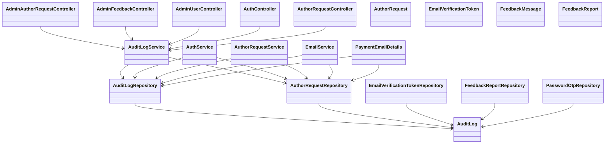

### Architecture Diagram
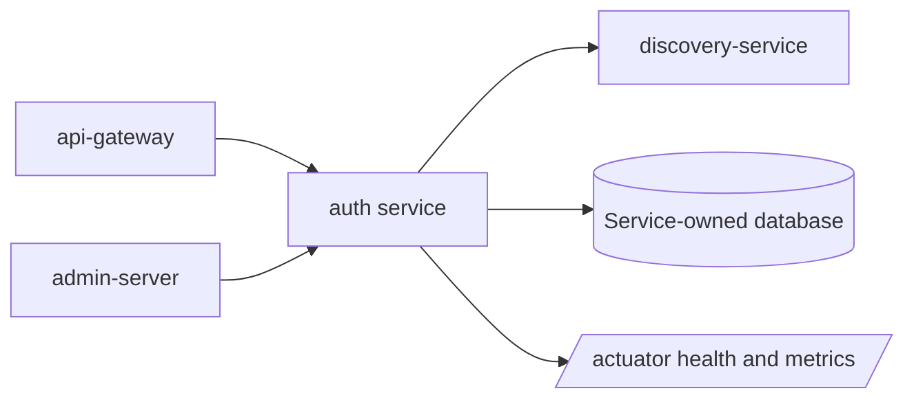

### Service Communication Diagram
```mermaid
flowchart LR
    Client[Client] --> Gateway[api-gateway]
    Gateway --> Service[auth-service]
    Service --> api_gateway[api-gateway]
    Service --> notification_service[notification-service]
    Service --> payment gateway[payment gateway]
    Service --> mail server[mail server]
    Service --> Eureka[discovery-service]
    Admin[admin-server] --> Service
```

# user-service
No standalone user-service module exists in this repository. User identity, profile, role, OAuth2, refresh-token, and internal user lookup behavior are implemented inside auth-service.

## How to Treat This Domain
Document, test, and operate this domain through the concrete modules listed above. If a future standalone module is introduced, move the relevant controllers, services, entities, repositories, and routes into that module and update gateway routing.

## Logical Domain Diagrams
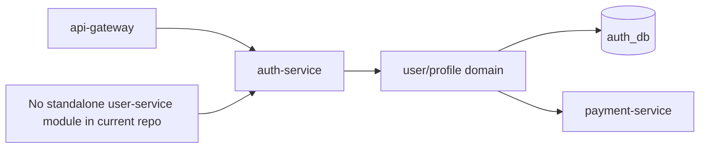
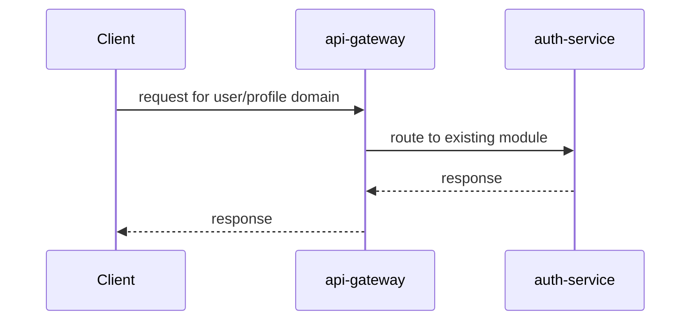

# post-service

## Service Purpose
Post authoring, publishing, public feed, likes, bookmarks, follows, and reading history.
- Default port: 8082.
- Database or persistence: MySQL post_db plus Redis cache.
- External integrations: category-service through OpenFeign, RabbitMQ events, Eureka, Admin Server.

## Request and Internal Flow
Controllers delegate to PostService and FollowBookmarkService. Repositories persist posts/social actions. CategoryClient syncs taxonomy. RabbitMQ publishes post events.
- Controller layer: accepts HTTP input, validates DTOs, resolves the principal where needed, and returns ApiResponse or ResponseEntity.
- Service layer: owns business rules, authorization decisions, mapping, transactions, event publishing, and remote client calls.
- Repository layer: persists service-owned state through Spring Data JPA where the service has a database.
- Exception flow: domain exceptions and validation failures are converted by GlobalExceptionHandler where present.
- Authentication/authorization: Gateway headers build GatewayUserPrincipal. Author/admin operations require author/admin role checks inside service logic.

## Inter-Service Communication
- API Gateway: public traffic is routed to this service through api-gateway route predicates.
- Eureka: the service registers using spring.application.name so callers can use lb:// names or Feign client names.
- JWT propagation: api-gateway validates tokens and forwards identity headers consumed by GatewayAuthenticationFilter when present.
- Admin monitoring: actuator endpoints are registered with admin-server for health and metrics.
- Communication peer: category-service.
- Communication peer: comment-service.
- Communication peer: newsletter-service.
- Communication peer: notification-service.

## File-by-File Explanation

### pom.xml
Type: Maven build descriptor. Defines the service artifact, inherited platform versions, runtime dependencies, and test dependencies. It is needed so Maven can build this service consistently as part of the multi-module platform.
- Why needed: this file keeps its responsibility isolated so the service remains testable and maintainable.
- Contribution: it participates in the service's layered flow, configuration, API contract, persistence, security, integration, or regression-test coverage.

### src/main/resources/application.yml
Type: Runtime configuration. Defines the service name, port, Eureka registration, datasource or external integrations, actuator exposure, and service-specific settings. Sensitive values should be supplied through environment variables rather than committed defaults.
- Why needed: this file keeps its responsibility isolated so the service remains testable and maintainable.
- Contribution: it participates in the service's layered flow, configuration, API contract, persistence, security, integration, or regression-test coverage.

### src/main/java/com/inkwell/post/PostServiceApplication.java
Type: Spring Boot application bootstrap. Starts the Spring Boot application context and enables the service's framework features. It is the executable entry point for local runs, containers, and tests.
- Package: com.inkwell.post.
- Types: PostServiceApplication.
- Important annotations: @EnableScheduling, @EnableFeignClients, @SpringBootApplication.
- Important methods: main.
- Why needed: this file keeps its responsibility isolated so the service remains testable and maintainable.
- Contribution: it participates in the service's layered flow, configuration, API contract, persistence, security, integration, or regression-test coverage.

### src/main/java/com/inkwell/post/client/CategoryClient.java
Type: Inter-service client. Declares a typed client for calling another microservice by its Eureka service name. It avoids hard-coded URLs and keeps remote contracts explicit.
- Package: com.inkwell.post.client.
- Types: CategoryClient.
- Important annotations: @FeignClient, @PostMapping, @PathVariable, @RequestBody.
- Endpoint annotations: @PostMapping("/posts/{postId}/taxonomy").
- Why needed: this file keeps its responsibility isolated so the service remains testable and maintainable.
- Contribution: it participates in the service's layered flow, configuration, API contract, persistence, security, integration, or regression-test coverage.

### src/main/java/com/inkwell/post/client/TaxonomySyncRequest.java
Type: Inter-service client. Declares a typed client for calling another microservice by its Eureka service name. It avoids hard-coded URLs and keeps remote contracts explicit.
- Package: com.inkwell.post.client.
- Types: TaxonomySyncRequest.
- Important methods: TaxonomySyncRequest.
- Why needed: this file keeps its responsibility isolated so the service remains testable and maintainable.
- Contribution: it participates in the service's layered flow, configuration, API contract, persistence, security, integration, or regression-test coverage.

### src/main/java/com/inkwell/post/config/CacheConfig.java
Type: Spring configuration. Declares Spring beans for cross-cutting infrastructure such as OpenAPI, RabbitMQ, caching, storage, or seed data.
- Package: com.inkwell.post.config.
- Types: CacheConfig.
- Important annotations: @Slf4j, @Configuration, @Bean, @Primary.
- Important methods: cacheManager.
- Why needed: this file keeps its responsibility isolated so the service remains testable and maintainable.
- Contribution: it participates in the service's layered flow, configuration, API contract, persistence, security, integration, or regression-test coverage.

### src/main/java/com/inkwell/post/config/DataInitializer.java
Type: Spring configuration. Declares Spring beans for cross-cutting infrastructure such as OpenAPI, RabbitMQ, caching, storage, or seed data.
- Package: com.inkwell.post.config.
- Types: DataInitializer.
- Important annotations: @Component, @RequiredArgsConstructor, @Override.
- Important methods: run.
- Why needed: this file keeps its responsibility isolated so the service remains testable and maintainable.
- Contribution: it participates in the service's layered flow, configuration, API contract, persistence, security, integration, or regression-test coverage.

### src/main/java/com/inkwell/post/config/OpenApiConfig.java
Type: Spring configuration. Declares Spring beans for cross-cutting infrastructure such as OpenAPI, RabbitMQ, caching, storage, or seed data.
- Package: com.inkwell.post.config.
- Types: OpenApiConfig.
- Important annotations: @Configuration, @Bean.
- Important methods: postOpenApi.
- Why needed: this file keeps its responsibility isolated so the service remains testable and maintainable.
- Contribution: it participates in the service's layered flow, configuration, API contract, persistence, security, integration, or regression-test coverage.

### src/main/java/com/inkwell/post/config/PostVisibilityConverter.java
Type: Spring configuration. Declares Spring beans for cross-cutting infrastructure such as OpenAPI, RabbitMQ, caching, storage, or seed data.
- Package: com.inkwell.post.config.
- Types: values, constant, PostVisibilityConverter.
- Important annotations: @Slf4j, @Converter, @Override.
- Important methods: convertToDatabaseColumn, convertToEntityAttribute.
- Why needed: this file keeps its responsibility isolated so the service remains testable and maintainable.
- Contribution: it participates in the service's layered flow, configuration, API contract, persistence, security, integration, or regression-test coverage.

### src/main/java/com/inkwell/post/config/RabbitConfig.java
Type: Spring configuration. Declares Spring beans for cross-cutting infrastructure such as OpenAPI, RabbitMQ, caching, storage, or seed data.
- Package: com.inkwell.post.config.
- Types: RabbitConfig.
- Important annotations: @Configuration, @Bean.
- Important methods: jackson2JsonMessageConverter, inkwellExchange, postPublishedQueue, postPublishedBinding.
- Why needed: this file keeps its responsibility isolated so the service remains testable and maintainable.
- Contribution: it participates in the service's layered flow, configuration, API contract, persistence, security, integration, or regression-test coverage.

### src/main/java/com/inkwell/post/controller/AdminPostController.java
Type: REST controller. Exposes HTTP endpoints, accepts request DTOs and path/query parameters, delegates business rules to services, and returns a consistent ApiResponse shape.
- Package: com.inkwell.post.controller.
- Types: AdminPostController.
- Important annotations: @RestController, @RequestMapping, @RequiredArgsConstructor, @PreAuthorize, @GetMapping, @RequestParam, @PatchMapping, @PathVariable, @DeleteMapping.
- Endpoint annotations: @RequestMapping("/api/posts/admin"); @GetMapping; @PatchMapping("/{postId}/feature"); @DeleteMapping("/{postId}").
- Important methods: search, feature, delete.
- Why needed: this file keeps its responsibility isolated so the service remains testable and maintainable.
- Contribution: it participates in the service's layered flow, configuration, API contract, persistence, security, integration, or regression-test coverage.

### src/main/java/com/inkwell/post/controller/AuthorPostController.java
Type: REST controller. Exposes HTTP endpoints, accepts request DTOs and path/query parameters, delegates business rules to services, and returns a consistent ApiResponse shape.
- Package: com.inkwell.post.controller.
- Types: AuthorPostController.
- Important annotations: @RestController, @RequestMapping, @RequiredArgsConstructor, @PostMapping, @Valid, @RequestBody, @PutMapping, @PathVariable, @GetMapping, @RequestParam, @DeleteMapping.
- Endpoint annotations: @RequestMapping("/api/posts/author"); @PostMapping; @PutMapping("/{postId}"); @GetMapping; @GetMapping("/{postId}"); @PostMapping("/{postId}/like"); @DeleteMapping("/{postId}").
- Important methods: create, update, myPosts, byId, like, delete.
- Why needed: this file keeps its responsibility isolated so the service remains testable and maintainable.
- Contribution: it participates in the service's layered flow, configuration, API contract, persistence, security, integration, or regression-test coverage.

### src/main/java/com/inkwell/post/controller/AuthorProfileController.java
Type: REST controller. Exposes HTTP endpoints, accepts request DTOs and path/query parameters, delegates business rules to services, and returns a consistent ApiResponse shape.
- Package: com.inkwell.post.controller.
- Types: AuthorProfileController.
- Important annotations: @RestController, @RequestMapping, @RequiredArgsConstructor, @GetMapping, @PathVariable, @PostMapping, @DeleteMapping.
- Endpoint annotations: @RequestMapping("/api/posts/authors"); @GetMapping("/{authorId}/followers/count"); @PostMapping("/{authorId}/follow"); @DeleteMapping("/{authorId}/unfollow"); @GetMapping("/{authorId}/follow/status"); @GetMapping("/me/followers"); @GetMapping("/me/followers/count").
- Important methods: followersCount, follow, unfollow, followStatus, myFollowers, myFollowersCount.
- Why needed: this file keeps its responsibility isolated so the service remains testable and maintainable.
- Contribution: it participates in the service's layered flow, configuration, API contract, persistence, security, integration, or regression-test coverage.

### src/main/java/com/inkwell/post/controller/ExplorePostController.java
Type: REST controller. Exposes HTTP endpoints, accepts request DTOs and path/query parameters, delegates business rules to services, and returns a consistent ApiResponse shape.
- Package: com.inkwell.post.controller.
- Types: ExplorePostController.
- Important annotations: @RestController, @RequestMapping, @RequiredArgsConstructor, @GetMapping, @RequestParam.
- Endpoint annotations: @RequestMapping("/api/posts/explore"); @GetMapping.
- Important methods: explore.
- Why needed: this file keeps its responsibility isolated so the service remains testable and maintainable.
- Contribution: it participates in the service's layered flow, configuration, API contract, persistence, security, integration, or regression-test coverage.

### src/main/java/com/inkwell/post/controller/InternalPostController.java
Type: REST controller. Exposes HTTP endpoints, accepts request DTOs and path/query parameters, delegates business rules to services, and returns a consistent ApiResponse shape.
- Package: com.inkwell.post.controller.
- Types: InternalPostController.
- Important annotations: @RestController, @RequestMapping, @RequiredArgsConstructor, @GetMapping, @PathVariable.
- Endpoint annotations: @RequestMapping("/api/posts/internal"); @GetMapping("/{postId}/meta").
- Important methods: meta.
- Why needed: this file keeps its responsibility isolated so the service remains testable and maintainable.
- Contribution: it participates in the service's layered flow, configuration, API contract, persistence, security, integration, or regression-test coverage.

### src/main/java/com/inkwell/post/controller/PublicPostController.java
Type: REST controller. Exposes HTTP endpoints, accepts request DTOs and path/query parameters, delegates business rules to services, and returns a consistent ApiResponse shape.
- Package: com.inkwell.post.controller.
- Types: PublicPostController.
- Important annotations: @RestController, @RequestMapping, @RequiredArgsConstructor, @GetMapping, @RequestParam, @PathVariable.
- Endpoint annotations: @RequestMapping("/api/posts/public"); @GetMapping; @GetMapping("/{slug}"); @GetMapping("/stats").
- Important methods: feed, bySlug.
- Why needed: this file keeps its responsibility isolated so the service remains testable and maintainable.
- Contribution: it participates in the service's layered flow, configuration, API contract, persistence, security, integration, or regression-test coverage.

### src/main/java/com/inkwell/post/controller/ReaderPostController.java
Type: REST controller. Exposes HTTP endpoints, accepts request DTOs and path/query parameters, delegates business rules to services, and returns a consistent ApiResponse shape.
- Package: com.inkwell.post.controller.
- Types: ReaderPostController.
- Important annotations: @RestController, @RequestMapping, @RequiredArgsConstructor, @PostMapping, @PathVariable, @GetMapping, @org, @DeleteMapping.
- Endpoint annotations: @RequestMapping("/api/posts/reader"); @PostMapping("/{postId}/like"); @PostMapping("/{authorId}/follow"); @GetMapping("/following"); @GetMapping("/{authorId}/follow/status"); @PostMapping("/{postId}/bookmark"); @GetMapping("/bookmarks"); @GetMapping("/history"); @DeleteMapping("/history/clear").
- Important methods: like, toggleFollow, getFollowing, getFollowStatus, toggleBookmark, getBookmarks, clearHistory.
- Why needed: this file keeps its responsibility isolated so the service remains testable and maintainable.
- Contribution: it participates in the service's layered flow, configuration, API contract, persistence, security, integration, or regression-test coverage.

### src/main/java/com/inkwell/post/controller/ReadingHistoryController.java
Type: REST controller. Exposes HTTP endpoints, accepts request DTOs and path/query parameters, delegates business rules to services, and returns a consistent ApiResponse shape.
- Package: com.inkwell.post.controller.
- Types: ReadingHistoryController.
- Important annotations: @RestController, @RequestMapping, @RequiredArgsConstructor, @PostMapping, @RequestBody, @GetMapping, @RequestParam, @DeleteMapping, @PathVariable.
- Endpoint annotations: @RequestMapping("/api/reading-history"); @PostMapping; @GetMapping("/me"); @DeleteMapping("/{id}"); @DeleteMapping("/clear").
- Important methods: saveHistory, getMyHistory, deleteHistoryItem, clearHistory.
- Why needed: this file keeps its responsibility isolated so the service remains testable and maintainable.
- Contribution: it participates in the service's layered flow, configuration, API contract, persistence, security, integration, or regression-test coverage.

### src/main/java/com/inkwell/post/controller/ServiceInfoController.java
Type: REST controller. Exposes HTTP endpoints, accepts request DTOs and path/query parameters, delegates business rules to services, and returns a consistent ApiResponse shape.
- Package: com.inkwell.post.controller.
- Types: ServiceInfoController.
- Important annotations: @RestController, @GetMapping.
- Endpoint annotations: @GetMapping("/").
- Important methods: root.
- Why needed: this file keeps its responsibility isolated so the service remains testable and maintainable.
- Contribution: it participates in the service's layered flow, configuration, API contract, persistence, security, integration, or regression-test coverage.

### src/main/java/com/inkwell/post/dto/ApiResponse.java
Type: DTO/API contract. Defines request or response data crossing service boundaries. DTOs keep API payloads independent from JPA entities and usually host validation annotations.
- Package: com.inkwell.post.dto.
- Types: ApiResponse.
- Important methods: of.
- Why needed: this file keeps its responsibility isolated so the service remains testable and maintainable.
- Contribution: it participates in the service's layered flow, configuration, API contract, persistence, security, integration, or regression-test coverage.

### src/main/java/com/inkwell/post/dto/request/SavePostRequest.java
Type: DTO/API contract. Defines request or response data crossing service boundaries. DTOs keep API payloads independent from JPA entities and usually host validation annotations.
- Package: com.inkwell.post.dto.request.
- Types: SavePostRequest.
- Important annotations: @NotBlank, @Size, @NotNull.
- Important methods: SavePostRequest.
- Why needed: this file keeps its responsibility isolated so the service remains testable and maintainable.
- Contribution: it participates in the service's layered flow, configuration, API contract, persistence, security, integration, or regression-test coverage.

### src/main/java/com/inkwell/post/dto/response/LikeResponse.java
Type: DTO/API contract. Defines request or response data crossing service boundaries. DTOs keep API payloads independent from JPA entities and usually host validation annotations.
- Package: com.inkwell.post.dto.response.
- Types: LikeResponse.
- Important methods: LikeResponse.
- Why needed: this file keeps its responsibility isolated so the service remains testable and maintainable.
- Contribution: it participates in the service's layered flow, configuration, API contract, persistence, security, integration, or regression-test coverage.

### src/main/java/com/inkwell/post/dto/response/PageResponse.java
Type: DTO/API contract. Defines request or response data crossing service boundaries. DTOs keep API payloads independent from JPA entities and usually host validation annotations.
- Package: com.inkwell.post.dto.response.
- Types: PageResponse.
- Why needed: this file keeps its responsibility isolated so the service remains testable and maintainable.
- Contribution: it participates in the service's layered flow, configuration, API contract, persistence, security, integration, or regression-test coverage.

### src/main/java/com/inkwell/post/dto/response/PostMetaResponse.java
Type: DTO/API contract. Defines request or response data crossing service boundaries. DTOs keep API payloads independent from JPA entities and usually host validation annotations.
- Package: com.inkwell.post.dto.response.
- Types: PostMetaResponse.
- Important methods: PostMetaResponse.
- Why needed: this file keeps its responsibility isolated so the service remains testable and maintainable.
- Contribution: it participates in the service's layered flow, configuration, API contract, persistence, security, integration, or regression-test coverage.

### src/main/java/com/inkwell/post/dto/response/PostResponse.java
Type: DTO/API contract. Defines request or response data crossing service boundaries. DTOs keep API payloads independent from JPA entities and usually host validation annotations.
- Package: com.inkwell.post.dto.response.
- Types: PostResponse.
- Important methods: PostResponse.
- Why needed: this file keeps its responsibility isolated so the service remains testable and maintainable.
- Contribution: it participates in the service's layered flow, configuration, API contract, persistence, security, integration, or regression-test coverage.

### src/main/java/com/inkwell/post/entity/Bookmark.java
Type: JPA entity. Models a database table or persisted aggregate. It is needed so JPA/Hibernate can map domain state to relational records.
- Package: com.inkwell.post.entity.
- Types: Bookmark.
- Important annotations: @Getter, @Setter, @Builder, @NoArgsConstructor, @AllArgsConstructor, @Entity, @Table, @UniqueConstraint, @Id, @Column, @PrePersist.
- Why needed: this file keeps its responsibility isolated so the service remains testable and maintainable.
- Contribution: it participates in the service's layered flow, configuration, API contract, persistence, security, integration, or regression-test coverage.

### src/main/java/com/inkwell/post/entity/Follow.java
Type: JPA entity. Models a database table or persisted aggregate. It is needed so JPA/Hibernate can map domain state to relational records.
- Package: com.inkwell.post.entity.
- Types: Follow.
- Important annotations: @Getter, @Setter, @Builder, @NoArgsConstructor, @AllArgsConstructor, @Entity, @Table, @UniqueConstraint, @Id, @Column, @PrePersist.
- Why needed: this file keeps its responsibility isolated so the service remains testable and maintainable.
- Contribution: it participates in the service's layered flow, configuration, API contract, persistence, security, integration, or regression-test coverage.

### src/main/java/com/inkwell/post/entity/Post.java
Type: JPA entity. Models a database table or persisted aggregate. It is needed so JPA/Hibernate can map domain state to relational records.
- Package: com.inkwell.post.entity.
- Types: Post.
- Important annotations: @Getter, @Setter, @Builder, @NoArgsConstructor, @AllArgsConstructor, @Entity, @Table, @Id, @Column, @Enumerated, @Convert, @ElementCollection.
- Why needed: this file keeps its responsibility isolated so the service remains testable and maintainable.
- Contribution: it participates in the service's layered flow, configuration, API contract, persistence, security, integration, or regression-test coverage.

### src/main/java/com/inkwell/post/entity/PostHistory.java
Type: JPA entity. Models a database table or persisted aggregate. It is needed so JPA/Hibernate can map domain state to relational records.
- Package: com.inkwell.post.entity.
- Types: PostHistory.
- Important annotations: @Getter, @Setter, @Builder, @NoArgsConstructor, @AllArgsConstructor, @Entity, @Table, @Id, @Column, @PrePersist, @PreUpdate.
- Why needed: this file keeps its responsibility isolated so the service remains testable and maintainable.
- Contribution: it participates in the service's layered flow, configuration, API contract, persistence, security, integration, or regression-test coverage.

### src/main/java/com/inkwell/post/entity/PostLike.java
Type: JPA entity. Models a database table or persisted aggregate. It is needed so JPA/Hibernate can map domain state to relational records.
- Package: com.inkwell.post.entity.
- Types: PostLike, PostLikeId.
- Important annotations: @Getter, @Setter, @NoArgsConstructor, @AllArgsConstructor, @Entity, @IdClass, @Table, @Id, @Column, @Data.
- Why needed: this file keeps its responsibility isolated so the service remains testable and maintainable.
- Contribution: it participates in the service's layered flow, configuration, API contract, persistence, security, integration, or regression-test coverage.

### src/main/java/com/inkwell/post/enumtype/PostStatus.java
Type: Domain enum. Defines the finite set of domain states or roles used by entities, DTOs, and business rules.
- Package: com.inkwell.post.enumtype.
- Types: PostStatus.
- Why needed: this file keeps its responsibility isolated so the service remains testable and maintainable.
- Contribution: it participates in the service's layered flow, configuration, API contract, persistence, security, integration, or regression-test coverage.

### src/main/java/com/inkwell/post/enumtype/PostVisibility.java
Type: Domain enum. Defines the finite set of domain states or roles used by entities, DTOs, and business rules.
- Package: com.inkwell.post.enumtype.
- Types: PostVisibility.
- Why needed: this file keeps its responsibility isolated so the service remains testable and maintainable.
- Contribution: it participates in the service's layered flow, configuration, API contract, persistence, security, integration, or regression-test coverage.

### src/main/java/com/inkwell/post/exception/BadRequestException.java
Type: Exception handling. Defines service-specific errors or translates exceptions into predictable HTTP responses for clients.
- Package: com.inkwell.post.exception.
- Types: BadRequestException.
- Why needed: this file keeps its responsibility isolated so the service remains testable and maintainable.
- Contribution: it participates in the service's layered flow, configuration, API contract, persistence, security, integration, or regression-test coverage.

### src/main/java/com/inkwell/post/exception/ForbiddenException.java
Type: Exception handling. Defines service-specific errors or translates exceptions into predictable HTTP responses for clients.
- Package: com.inkwell.post.exception.
- Types: ForbiddenException.
- Why needed: this file keeps its responsibility isolated so the service remains testable and maintainable.
- Contribution: it participates in the service's layered flow, configuration, API contract, persistence, security, integration, or regression-test coverage.

### src/main/java/com/inkwell/post/exception/GlobalExceptionHandler.java
Type: Exception handling. Defines service-specific errors or translates exceptions into predictable HTTP responses for clients.
- Package: com.inkwell.post.exception.
- Types: GlobalExceptionHandler, values, values, deserialization, mismatch, mismatch, mismatch, deserialization, error.
- Important annotations: @Slf4j, @RestControllerAdvice, @ExceptionHandler.
- Important methods: notFound, badRequest, forbidden, validation, messageNotReadable, dataIntegrity, generic, build, base, extractEnumError.
- Why needed: this file keeps its responsibility isolated so the service remains testable and maintainable.
- Contribution: it participates in the service's layered flow, configuration, API contract, persistence, security, integration, or regression-test coverage.

### src/main/java/com/inkwell/post/exception/ResourceNotFoundException.java
Type: Exception handling. Defines service-specific errors or translates exceptions into predictable HTTP responses for clients.
- Package: com.inkwell.post.exception.
- Types: ResourceNotFoundException.
- Why needed: this file keeps its responsibility isolated so the service remains testable and maintainable.
- Contribution: it participates in the service's layered flow, configuration, API contract, persistence, security, integration, or regression-test coverage.

### src/main/java/com/inkwell/post/package-info.java
Type: Package documentation. Provides package-level Javadoc that explains the service boundary and the role of the root package.
- Package: com.inkwell.post.
- Why needed: this file keeps its responsibility isolated so the service remains testable and maintainable.
- Contribution: it participates in the service's layered flow, configuration, API contract, persistence, security, integration, or regression-test coverage.

### src/main/java/com/inkwell/post/repository/BookmarkRepository.java
Type: Spring Data repository. Provides database access through Spring Data JPA method names and generated implementations. It isolates persistence queries from service logic.
- Package: com.inkwell.post.repository.
- Types: BookmarkRepository.
- Important annotations: @Query, @Param.
- Why needed: this file keeps its responsibility isolated so the service remains testable and maintainable.
- Contribution: it participates in the service's layered flow, configuration, API contract, persistence, security, integration, or regression-test coverage.

### src/main/java/com/inkwell/post/repository/FollowRepository.java
Type: Spring Data repository. Provides database access through Spring Data JPA method names and generated implementations. It isolates persistence queries from service logic.
- Package: com.inkwell.post.repository.
- Types: FollowRepository.
- Why needed: this file keeps its responsibility isolated so the service remains testable and maintainable.
- Contribution: it participates in the service's layered flow, configuration, API contract, persistence, security, integration, or regression-test coverage.

### src/main/java/com/inkwell/post/repository/PostHistoryRepository.java
Type: Spring Data repository. Provides database access through Spring Data JPA method names and generated implementations. It isolates persistence queries from service logic.
- Package: com.inkwell.post.repository.
- Types: PostHistoryRepository.
- Why needed: this file keeps its responsibility isolated so the service remains testable and maintainable.
- Contribution: it participates in the service's layered flow, configuration, API contract, persistence, security, integration, or regression-test coverage.

### src/main/java/com/inkwell/post/repository/PostLikeRepository.java
Type: Spring Data repository. Provides database access through Spring Data JPA method names and generated implementations. It isolates persistence queries from service logic.
- Package: com.inkwell.post.repository.
- Types: PostLikeRepository.
- Why needed: this file keeps its responsibility isolated so the service remains testable and maintainable.
- Contribution: it participates in the service's layered flow, configuration, API contract, persistence, security, integration, or regression-test coverage.

### src/main/java/com/inkwell/post/repository/PostRepository.java
Type: Spring Data repository. Provides database access through Spring Data JPA method names and generated implementations. It isolates persistence queries from service logic.
- Package: com.inkwell.post.repository.
- Types: PostRepository.
- Important annotations: @Query, @Param.
- Why needed: this file keeps its responsibility isolated so the service remains testable and maintainable.
- Contribution: it participates in the service's layered flow, configuration, API contract, persistence, security, integration, or regression-test coverage.

### src/main/java/com/inkwell/post/security/GatewayAuthenticationFilter.java
Type: Security component. Participates in authentication or authorization, usually by configuring Spring Security, reading gateway identity headers, or representing the authenticated principal.
- Package: com.inkwell.post.security.
- Types: GatewayAuthenticationFilter.
- Important annotations: @Component, @Override.
- Important methods: doFilterInternal.
- Why needed: this file keeps its responsibility isolated so the service remains testable and maintainable.
- Contribution: it participates in the service's layered flow, configuration, API contract, persistence, security, integration, or regression-test coverage.

### src/main/java/com/inkwell/post/security/GatewayUserPrincipal.java
Type: Security component. Participates in authentication or authorization, usually by configuring Spring Security, reading gateway identity headers, or representing the authenticated principal.
- Package: com.inkwell.post.security.
- Types: GatewayUserPrincipal.
- Important methods: GatewayUserPrincipal, userUuid, isAdmin, isAuthorOrAdmin.
- Why needed: this file keeps its responsibility isolated so the service remains testable and maintainable.
- Contribution: it participates in the service's layered flow, configuration, API contract, persistence, security, integration, or regression-test coverage.

### src/main/java/com/inkwell/post/security/SecurityConfig.java
Type: Security component. Participates in authentication or authorization, usually by configuring Spring Security, reading gateway identity headers, or representing the authenticated principal.
- Package: com.inkwell.post.security.
- Types: SecurityConfig.
- Important annotations: @Configuration, @EnableMethodSecurity, @RequiredArgsConstructor, @Bean.
- Important methods: securityFilterChain.
- Why needed: this file keeps its responsibility isolated so the service remains testable and maintainable.
- Contribution: it participates in the service's layered flow, configuration, API contract, persistence, security, integration, or regression-test coverage.

### src/main/java/com/inkwell/post/service/FollowBookmarkService.java
Type: Business service. Contains business logic, validation decisions, transaction boundaries, repository calls, messaging, and external-client orchestration. Controllers stay thin because this file owns behavior.
- Package: com.inkwell.post.service.
- Types: FollowBookmarkService, not.
- Important annotations: @Service, @RequiredArgsConstructor, @Transactional.
- Important methods: toggleFollow, getFollowingIds, getFollowStatus, getFollowersCount, getMyFollowers, toggleBookmark, getBookmarkedPosts, isBookmarked, getHistory, recordHistory, clearHistory, deleteHistoryItem, toResponse.
- Why needed: this file keeps its responsibility isolated so the service remains testable and maintainable.
- Contribution: it participates in the service's layered flow, configuration, API contract, persistence, security, integration, or regression-test coverage.

### src/main/java/com/inkwell/post/service/PostScheduler.java
Type: Business service. Contains business logic, validation decisions, transaction boundaries, repository calls, messaging, and external-client orchestration. Controllers stay thin because this file owns behavior.
- Package: com.inkwell.post.service.
- Types: PostScheduler.
- Important annotations: @Slf4j, @Component, @RequiredArgsConstructor, @Scheduled, @Transactional.
- Important methods: publishScheduledPosts.
- Why needed: this file keeps its responsibility isolated so the service remains testable and maintainable.
- Contribution: it participates in the service's layered flow, configuration, API contract, persistence, security, integration, or regression-test coverage.

### src/main/java/com/inkwell/post/service/PostService.java
Type: Business service. Contains business logic, validation decisions, transaction boundaries, repository calls, messaging, and external-client orchestration. Controllers stay thin because this file owns behavior.
- Package: com.inkwell.post.service.
- Types: PostService.
- Important annotations: @Slf4j, @Service, @RequiredArgsConstructor, @Transactional, @CircuitBreaker.
- Important methods: createPost, updatePost, publicFeed, authorPosts, getBySlug, resolveCurrentPrincipal, enforceAccessControl, canReadFullContent, applyPremiumLock, getById, getMeta, toggleLike, deletePost, featurePost, adminDeletePost, adminSearch, applyChanges, maybePublish.
- Why needed: this file keeps its responsibility isolated so the service remains testable and maintainable.
- Contribution: it participates in the service's layered flow, configuration, API contract, persistence, security, integration, or regression-test coverage.

### src/main/java/com/inkwell/post/util/HtmlSanitizer.java
Type: Utility helper. Contains reusable stateless logic such as security principal extraction, slug creation, sanitization, or read-time calculation.
- Package: com.inkwell.post.util.
- Types: HtmlSanitizer.
- Important annotations: @Component.
- Important methods: sanitize.
- Why needed: this file keeps its responsibility isolated so the service remains testable and maintainable.
- Contribution: it participates in the service's layered flow, configuration, API contract, persistence, security, integration, or regression-test coverage.

### src/main/java/com/inkwell/post/util/ReadTimeUtil.java
Type: Utility helper. Contains reusable stateless logic such as security principal extraction, slug creation, sanitization, or read-time calculation.
- Package: com.inkwell.post.util.
- Types: ReadTimeUtil.
- Important methods: estimate.
- Why needed: this file keeps its responsibility isolated so the service remains testable and maintainable.
- Contribution: it participates in the service's layered flow, configuration, API contract, persistence, security, integration, or regression-test coverage.

### src/main/java/com/inkwell/post/util/SecurityUtils.java
Type: Utility helper. Contains reusable stateless logic such as security principal extraction, slug creation, sanitization, or read-time calculation.
- Package: com.inkwell.post.util.
- Types: SecurityUtils.
- Important methods: currentPrincipal.
- Why needed: this file keeps its responsibility isolated so the service remains testable and maintainable.
- Contribution: it participates in the service's layered flow, configuration, API contract, persistence, security, integration, or regression-test coverage.

### src/main/java/com/inkwell/post/util/SlugUtil.java
Type: Utility helper. Contains reusable stateless logic such as security principal extraction, slug creation, sanitization, or read-time calculation.
- Package: com.inkwell.post.util.
- Types: SlugUtil.
- Important methods: toSlug.
- Why needed: this file keeps its responsibility isolated so the service remains testable and maintainable.
- Contribution: it participates in the service's layered flow, configuration, API contract, persistence, security, integration, or regression-test coverage.

### src/test/resources/application-test.yml
Type: Runtime configuration. Defines the service name, port, Eureka registration, datasource or external integrations, actuator exposure, and service-specific settings. Sensitive values should be supplied through environment variables rather than committed defaults.
- Why needed: this file keeps its responsibility isolated so the service remains testable and maintainable.
- Contribution: it participates in the service's layered flow, configuration, API contract, persistence, security, integration, or regression-test coverage.

### src/test/java/com/inkwell/post/PostServiceApplicationTests.java
Type: Automated test. Verifies service behavior, controller delegation, security, exception handling, or integration configuration. It protects the documented behavior from regressions.
- Package: com.inkwell.post.
- Types: PostServiceApplicationTests.
- Important annotations: @Test.
- Why needed: this file keeps its responsibility isolated so the service remains testable and maintainable.
- Contribution: it participates in the service's layered flow, configuration, API contract, persistence, security, integration, or regression-test coverage.

### src/test/java/com/inkwell/post/controller/ExplorePostControllerTest.java
Type: REST controller. Exposes HTTP endpoints, accepts request DTOs and path/query parameters, delegates business rules to services, and returns a consistent ApiResponse shape.
- Package: com.inkwell.post.controller.
- Types: ExplorePostControllerTest.
- Important annotations: @ExtendWith, @Mock, @InjectMocks, @Test, @DisplayName.
- Why needed: this file keeps its responsibility isolated so the service remains testable and maintainable.
- Contribution: it participates in the service's layered flow, configuration, API contract, persistence, security, integration, or regression-test coverage.

### src/test/java/com/inkwell/post/controller/PostControllerDirectTest.java
Type: REST controller. Exposes HTTP endpoints, accepts request DTOs and path/query parameters, delegates business rules to services, and returns a consistent ApiResponse shape.
- Package: com.inkwell.post.controller.
- Types: PostControllerDirectTest.
- Important annotations: @Test, @test.
- Why needed: this file keeps its responsibility isolated so the service remains testable and maintainable.
- Contribution: it participates in the service's layered flow, configuration, API contract, persistence, security, integration, or regression-test coverage.

### src/test/java/com/inkwell/post/controller/ReadingHistoryControllerTest.java
Type: REST controller. Exposes HTTP endpoints, accepts request DTOs and path/query parameters, delegates business rules to services, and returns a consistent ApiResponse shape.
- Package: com.inkwell.post.controller.
- Types: ReadingHistoryControllerTest.
- Important annotations: @ExtendWith, @Mock, @InjectMocks, @BeforeEach, @test, @AfterEach, @Test.
- Why needed: this file keeps its responsibility isolated so the service remains testable and maintainable.
- Contribution: it participates in the service's layered flow, configuration, API contract, persistence, security, integration, or regression-test coverage.

### src/test/java/com/inkwell/post/exception/GlobalExceptionHandlerTest.java
Type: Exception handling. Defines service-specific errors or translates exceptions into predictable HTTP responses for clients.
- Package: com.inkwell.post.exception.
- Types: GlobalExceptionHandlerTest, deserialization.
- Important annotations: @Test, @DisplayName, @SuppressWarnings.
- Important methods: validationTarget.
- Why needed: this file keeps its responsibility isolated so the service remains testable and maintainable.
- Contribution: it participates in the service's layered flow, configuration, API contract, persistence, security, integration, or regression-test coverage.

### src/test/java/com/inkwell/post/security/GatewayAuthenticationFilterTest.java
Type: Security component. Participates in authentication or authorization, usually by configuring Spring Security, reading gateway identity headers, or representing the authenticated principal.
- Package: com.inkwell.post.security.
- Types: GatewayAuthenticationFilterTest.
- Important annotations: @AfterEach, @Test, @test.
- Why needed: this file keeps its responsibility isolated so the service remains testable and maintainable.
- Contribution: it participates in the service's layered flow, configuration, API contract, persistence, security, integration, or regression-test coverage.

### src/test/java/com/inkwell/post/service/FollowBookmarkServiceTest.java
Type: Business service. Contains business logic, validation decisions, transaction boundaries, repository calls, messaging, and external-client orchestration. Controllers stay thin because this file owns behavior.
- Package: com.inkwell.post.service.
- Types: FollowBookmarkServiceTest.
- Important annotations: @ExtendWith, @Mock, @InjectMocks, @BeforeEach, @test, @Test.
- Why needed: this file keeps its responsibility isolated so the service remains testable and maintainable.
- Contribution: it participates in the service's layered flow, configuration, API contract, persistence, security, integration, or regression-test coverage.

### src/test/java/com/inkwell/post/service/PostSchedulerTest.java
Type: Business service. Contains business logic, validation decisions, transaction boundaries, repository calls, messaging, and external-client orchestration. Controllers stay thin because this file owns behavior.
- Package: com.inkwell.post.service.
- Types: PostSchedulerTest.
- Important annotations: @ExtendWith, @Mock, @InjectMocks, @Test, @DisplayName.
- Why needed: this file keeps its responsibility isolated so the service remains testable and maintainable.
- Contribution: it participates in the service's layered flow, configuration, API contract, persistence, security, integration, or regression-test coverage.

### src/test/java/com/inkwell/post/service/PostServiceTest.java
Type: Business service. Contains business logic, validation decisions, transaction boundaries, repository calls, messaging, and external-client orchestration. Controllers stay thin because this file owns behavior.
- Package: com.inkwell.post.service.
- Types: PostServiceTest, CreateUpdateTests, PublicFeedTests, GetBySlugTests, LikeTests, DeleteTests, AdminSearchTests, FeatureTests, StatsTests, PremiumAdminTests.
- Important annotations: @ExtendWith, @Mock, @InjectMocks, @BeforeEach, @inkwell, @Nested, @DisplayName, @Test, @test.
- Why needed: this file keeps its responsibility isolated so the service remains testable and maintainable.
- Contribution: it participates in the service's layered flow, configuration, API contract, persistence, security, integration, or regression-test coverage.

### src/test/java/com/inkwell/post/util/HtmlSanitizerTest.java
Type: Utility helper. Contains reusable stateless logic such as security principal extraction, slug creation, sanitization, or read-time calculation.
- Package: com.inkwell.post.util.
- Types: HtmlSanitizerTest.
- Important annotations: @Test, @DisplayName.
- Why needed: this file keeps its responsibility isolated so the service remains testable and maintainable.
- Contribution: it participates in the service's layered flow, configuration, API contract, persistence, security, integration, or regression-test coverage.

### src/test/java/com/inkwell/post/util/ReadTimeUtilTest.java
Type: Utility helper. Contains reusable stateless logic such as security principal extraction, slug creation, sanitization, or read-time calculation.
- Package: com.inkwell.post.util.
- Types: ReadTimeUtilTest.
- Important annotations: @Test, @DisplayName.
- Why needed: this file keeps its responsibility isolated so the service remains testable and maintainable.
- Contribution: it participates in the service's layered flow, configuration, API contract, persistence, security, integration, or regression-test coverage.

### src/test/java/com/inkwell/post/util/SecurityUtilsTest.java
Type: Utility helper. Contains reusable stateless logic such as security principal extraction, slug creation, sanitization, or read-time calculation.
- Package: com.inkwell.post.util.
- Types: SecurityUtilsTest.
- Important annotations: @AfterEach, @Test, @test.
- Why needed: this file keeps its responsibility isolated so the service remains testable and maintainable.
- Contribution: it participates in the service's layered flow, configuration, API contract, persistence, security, integration, or regression-test coverage.

### src/test/java/com/inkwell/post/util/SlugUtilTest.java
Type: Utility helper. Contains reusable stateless logic such as security principal extraction, slug creation, sanitization, or read-time calculation.
- Package: com.inkwell.post.util.
- Types: SlugUtilTest.
- Important annotations: @Test, @DisplayName.
- Why needed: this file keeps its responsibility isolated so the service remains testable and maintainable.
- Contribution: it participates in the service's layered flow, configuration, API contract, persistence, security, integration, or regression-test coverage.

## Service Diagrams

### Sequence Diagram
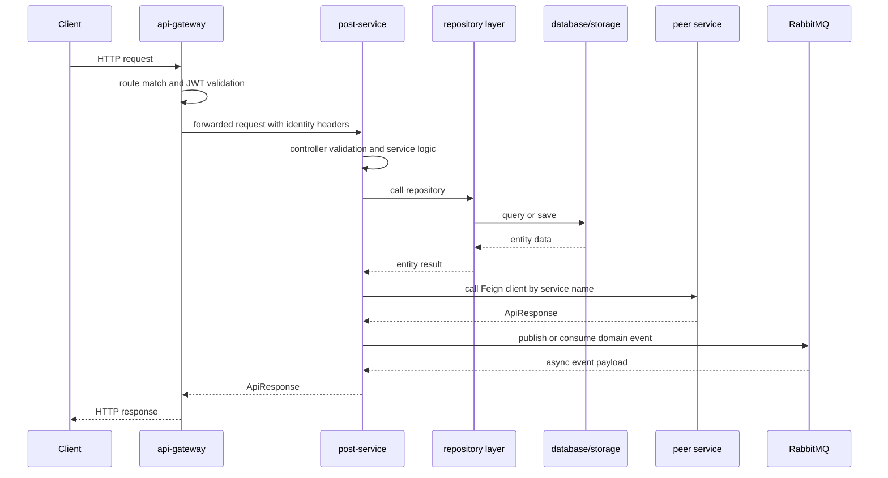

### UML/Class Diagram
```mermaid
classDiagram
    class AdminPostController
    class AuthorPostController
    class AuthorProfileController
    class ExplorePostController
    class InternalPostController
    class FollowBookmarkService
    class not
    class PostScheduler
    class PostService
    class FollowBookmarkServiceTest
    class BookmarkRepository
    class FollowRepository
    class PostHistoryRepository
    class PostLikeRepository
    class PostRepository
    class Bookmark
    class Follow
    class Post
    class PostHistory
    class PostLike
    class CategoryClient
    class TaxonomySyncRequest
    AdminPostController --> FollowBookmarkService
    AuthorPostController --> FollowBookmarkService
    AuthorProfileController --> FollowBookmarkService
    ExplorePostController --> FollowBookmarkService
    InternalPostController --> FollowBookmarkService
    FollowBookmarkService --> BookmarkRepository
    FollowBookmarkService --> FollowRepository
    FollowBookmarkService --> CategoryClient
    FollowBookmarkService --> TaxonomySyncRequest
    not --> BookmarkRepository
    not --> FollowRepository
    not --> CategoryClient
    not --> TaxonomySyncRequest
    PostScheduler --> BookmarkRepository
    PostScheduler --> FollowRepository
    PostScheduler --> CategoryClient
    PostScheduler --> TaxonomySyncRequest
    PostService --> BookmarkRepository
    PostService --> FollowRepository
    PostService --> CategoryClient
    PostService --> TaxonomySyncRequest
    FollowBookmarkServiceTest --> BookmarkRepository
    FollowBookmarkServiceTest --> FollowRepository
    FollowBookmarkServiceTest --> CategoryClient
    FollowBookmarkServiceTest --> TaxonomySyncRequest
    BookmarkRepository --> Bookmark
    FollowRepository --> Bookmark
    PostHistoryRepository --> Bookmark
    PostLikeRepository --> Bookmark
    PostRepository --> Bookmark
```

### Architecture Diagram
```mermaid
flowchart LR
    Gateway[api-gateway] --> Service[post service]
    Service --> Eureka[discovery-service]
    Admin[admin-server] --> Service
    Service --> DB[(Service-owned database)]
    Service --> Peer[Peer service through Feign]
    Service --> Rabbit[(RabbitMQ)]
    Service --> Actuator[/actuator health and metrics/]
```

### Service Communication Diagram
```mermaid
flowchart LR
    Client[Client] --> Gateway[api-gateway]
    Gateway --> Service[post-service]
    Service --> category_service[category-service]
    Service --> comment_service[comment-service]
    Service --> newsletter_service[newsletter-service]
    Service --> notification_service[notification-service]
    Service --> Eureka[discovery-service]
    Admin[admin-server] --> Service
```

# comment-service

## Service Purpose
Threaded comments, replies, comment likes, and comment cleanup on deleted posts.
- Default port: 8084.
- Database or persistence: MySQL comment_db.
- External integrations: post-service through OpenFeign, RabbitMQ events, Eureka, Admin Server.

## Request and Internal Flow
CommentController validates comment DTOs, CommentService checks post metadata, sanitizes content, persists comments/likes, and publishes notification events.
- Controller layer: accepts HTTP input, validates DTOs, resolves the principal where needed, and returns ApiResponse or ResponseEntity.
- Service layer: owns business rules, authorization decisions, mapping, transactions, event publishing, and remote client calls.
- Repository layer: persists service-owned state through Spring Data JPA where the service has a database.
- Exception flow: domain exceptions and validation failures are converted by GlobalExceptionHandler where present.
- Authentication/authorization: GatewayAuthenticationFilter trusts identity headers from api-gateway and makes a GatewayUserPrincipal available to controllers/services.

## Inter-Service Communication
- API Gateway: public traffic is routed to this service through api-gateway route predicates.
- Eureka: the service registers using spring.application.name so callers can use lb:// names or Feign client names.
- JWT propagation: api-gateway validates tokens and forwards identity headers consumed by GatewayAuthenticationFilter when present.
- Admin monitoring: actuator endpoints are registered with admin-server for health and metrics.
- Communication peer: post-service.
- Communication peer: notification-service.

## File-by-File Explanation

### pom.xml
Type: Maven build descriptor. Defines the service artifact, inherited platform versions, runtime dependencies, and test dependencies. It is needed so Maven can build this service consistently as part of the multi-module platform.
- Why needed: this file keeps its responsibility isolated so the service remains testable and maintainable.
- Contribution: it participates in the service's layered flow, configuration, API contract, persistence, security, integration, or regression-test coverage.

### src/main/resources/application.yml
Type: Runtime configuration. Defines the service name, port, Eureka registration, datasource or external integrations, actuator exposure, and service-specific settings. Sensitive values should be supplied through environment variables rather than committed defaults.
- Why needed: this file keeps its responsibility isolated so the service remains testable and maintainable.
- Contribution: it participates in the service's layered flow, configuration, API contract, persistence, security, integration, or regression-test coverage.

### src/main/java/com/inkwell/comment/CommentServiceApplication.java
Type: Spring Boot application bootstrap. Starts the Spring Boot application context and enables the service's framework features. It is the executable entry point for local runs, containers, and tests.
- Package: com.inkwell.comment.
- Types: CommentServiceApplication.
- Important annotations: @EnableFeignClients, @SpringBootApplication.
- Important methods: main.
- Why needed: this file keeps its responsibility isolated so the service remains testable and maintainable.
- Contribution: it participates in the service's layered flow, configuration, API contract, persistence, security, integration, or regression-test coverage.

### src/main/java/com/inkwell/comment/client/PostClient.java
Type: Inter-service client. Declares a typed client for calling another microservice by its Eureka service name. It avoids hard-coded URLs and keeps remote contracts explicit.
- Package: com.inkwell.comment.client.
- Types: PostClient.
- Important annotations: @FeignClient, @GetMapping, @PathVariable.
- Endpoint annotations: @GetMapping("/{postId}/meta").
- Why needed: this file keeps its responsibility isolated so the service remains testable and maintainable.
- Contribution: it participates in the service's layered flow, configuration, API contract, persistence, security, integration, or regression-test coverage.

### src/main/java/com/inkwell/comment/config/AppConfig.java
Type: Spring configuration. Declares Spring beans for cross-cutting infrastructure such as OpenAPI, RabbitMQ, caching, storage, or seed data.
- Package: com.inkwell.comment.config.
- Types: AppConfig.
- Important annotations: @Configuration, @Bean.
- Important methods: jackson2JsonMessageConverter, commentOpenApi, inkwellExchange, postDeletedQueue, postDeletedBinding.
- Why needed: this file keeps its responsibility isolated so the service remains testable and maintainable.
- Contribution: it participates in the service's layered flow, configuration, API contract, persistence, security, integration, or regression-test coverage.

### src/main/java/com/inkwell/comment/controller/CommentController.java
Type: REST controller. Exposes HTTP endpoints, accepts request DTOs and path/query parameters, delegates business rules to services, and returns a consistent ApiResponse shape.
- Package: com.inkwell.comment.controller.
- Types: CommentController.
- Important annotations: @RestController, @RequestMapping, @RequiredArgsConstructor, @GetMapping, @PathVariable, @PostMapping, @Valid, @RequestBody, @PutMapping, @DeleteMapping, @PatchMapping, @RequestParam.
- Endpoint annotations: @RequestMapping("/api/comments"); @GetMapping("/public/post/{postId}"); @PostMapping; @PutMapping("/{commentId}"); @DeleteMapping("/{commentId}"); @PostMapping("/{commentId}/like"); @PostMapping("/{commentId}/reply"); @PatchMapping("/author/{commentId}/approve"); @PatchMapping("/author/{commentId}/reject"); @PatchMapping("/admin/{commentId}/delete"); @GetMapping("/admin/count").
- Important methods: byPost, add, update, delete, like, reply, approve, reject, adminDelete, countAll.
- Why needed: this file keeps its responsibility isolated so the service remains testable and maintainable.
- Contribution: it participates in the service's layered flow, configuration, API contract, persistence, security, integration, or regression-test coverage.

### src/main/java/com/inkwell/comment/controller/ServiceInfoController.java
Type: REST controller. Exposes HTTP endpoints, accepts request DTOs and path/query parameters, delegates business rules to services, and returns a consistent ApiResponse shape.
- Package: com.inkwell.comment.controller.
- Types: ServiceInfoController.
- Important annotations: @RestController, @GetMapping.
- Endpoint annotations: @GetMapping("/").
- Important methods: root.
- Why needed: this file keeps its responsibility isolated so the service remains testable and maintainable.
- Contribution: it participates in the service's layered flow, configuration, API contract, persistence, security, integration, or regression-test coverage.

### src/main/java/com/inkwell/comment/dto/ApiResponse.java
Type: DTO/API contract. Defines request or response data crossing service boundaries. DTOs keep API payloads independent from JPA entities and usually host validation annotations.
- Package: com.inkwell.comment.dto.
- Types: ApiResponse.
- Important methods: of.
- Why needed: this file keeps its responsibility isolated so the service remains testable and maintainable.
- Contribution: it participates in the service's layered flow, configuration, API contract, persistence, security, integration, or regression-test coverage.

### src/main/java/com/inkwell/comment/dto/request/CommentRequest.java
Type: DTO/API contract. Defines request or response data crossing service boundaries. DTOs keep API payloads independent from JPA entities and usually host validation annotations.
- Package: com.inkwell.comment.dto.request.
- Types: CommentRequest.
- Important annotations: @NotBlank.
- Important methods: CommentRequest.
- Why needed: this file keeps its responsibility isolated so the service remains testable and maintainable.
- Contribution: it participates in the service's layered flow, configuration, API contract, persistence, security, integration, or regression-test coverage.

### src/main/java/com/inkwell/comment/dto/request/UpdateCommentRequest.java
Type: DTO/API contract. Defines request or response data crossing service boundaries. DTOs keep API payloads independent from JPA entities and usually host validation annotations.
- Package: com.inkwell.comment.dto.request.
- Types: UpdateCommentRequest.
- Important annotations: @NotBlank.
- Important methods: UpdateCommentRequest.
- Why needed: this file keeps its responsibility isolated so the service remains testable and maintainable.
- Contribution: it participates in the service's layered flow, configuration, API contract, persistence, security, integration, or regression-test coverage.

### src/main/java/com/inkwell/comment/dto/response/CommentResponse.java
Type: DTO/API contract. Defines request or response data crossing service boundaries. DTOs keep API payloads independent from JPA entities and usually host validation annotations.
- Package: com.inkwell.comment.dto.response.
- Types: CommentResponse.
- Important methods: CommentResponse.
- Why needed: this file keeps its responsibility isolated so the service remains testable and maintainable.
- Contribution: it participates in the service's layered flow, configuration, API contract, persistence, security, integration, or regression-test coverage.

### src/main/java/com/inkwell/comment/dto/response/LikeResponse.java
Type: DTO/API contract. Defines request or response data crossing service boundaries. DTOs keep API payloads independent from JPA entities and usually host validation annotations.
- Package: com.inkwell.comment.dto.response.
- Types: LikeResponse.
- Important methods: LikeResponse.
- Why needed: this file keeps its responsibility isolated so the service remains testable and maintainable.
- Contribution: it participates in the service's layered flow, configuration, API contract, persistence, security, integration, or regression-test coverage.

### src/main/java/com/inkwell/comment/dto/response/PostMetaResponse.java
Type: DTO/API contract. Defines request or response data crossing service boundaries. DTOs keep API payloads independent from JPA entities and usually host validation annotations.
- Package: com.inkwell.comment.dto.response.
- Types: PostMetaResponse.
- Important methods: PostMetaResponse.
- Why needed: this file keeps its responsibility isolated so the service remains testable and maintainable.
- Contribution: it participates in the service's layered flow, configuration, API contract, persistence, security, integration, or regression-test coverage.

### src/main/java/com/inkwell/comment/entity/Comment.java
Type: JPA entity. Models a database table or persisted aggregate. It is needed so JPA/Hibernate can map domain state to relational records.
- Package: com.inkwell.comment.entity.
- Types: Comment.
- Important annotations: @Getter, @Setter, @Builder, @NoArgsConstructor, @AllArgsConstructor, @Entity, @Table, @Id, @Column, @Enumerated, @PrePersist, @PreUpdate.
- Why needed: this file keeps its responsibility isolated so the service remains testable and maintainable.
- Contribution: it participates in the service's layered flow, configuration, API contract, persistence, security, integration, or regression-test coverage.

### src/main/java/com/inkwell/comment/entity/CommentLike.java
Type: JPA entity. Models a database table or persisted aggregate. It is needed so JPA/Hibernate can map domain state to relational records.
- Package: com.inkwell.comment.entity.
- Types: CommentLike, CommentLikeId.
- Important annotations: @Getter, @Setter, @NoArgsConstructor, @AllArgsConstructor, @Entity, @IdClass, @Table, @Id, @Column, @Data.
- Why needed: this file keeps its responsibility isolated so the service remains testable and maintainable.
- Contribution: it participates in the service's layered flow, configuration, API contract, persistence, security, integration, or regression-test coverage.

### src/main/java/com/inkwell/comment/enumtype/CommentStatus.java
Type: Domain enum. Defines the finite set of domain states or roles used by entities, DTOs, and business rules.
- Package: com.inkwell.comment.enumtype.
- Types: CommentStatus.
- Why needed: this file keeps its responsibility isolated so the service remains testable and maintainable.
- Contribution: it participates in the service's layered flow, configuration, API contract, persistence, security, integration, or regression-test coverage.

### src/main/java/com/inkwell/comment/exception/ForbiddenException.java
Type: Exception handling. Defines service-specific errors or translates exceptions into predictable HTTP responses for clients.
- Package: com.inkwell.comment.exception.
- Types: ForbiddenException.
- Why needed: this file keeps its responsibility isolated so the service remains testable and maintainable.
- Contribution: it participates in the service's layered flow, configuration, API contract, persistence, security, integration, or regression-test coverage.

### src/main/java/com/inkwell/comment/exception/GlobalExceptionHandler.java
Type: Exception handling. Defines service-specific errors or translates exceptions into predictable HTTP responses for clients.
- Package: com.inkwell.comment.exception.
- Types: GlobalExceptionHandler.
- Important annotations: @RestControllerAdvice, @ExceptionHandler.
- Important methods: notFound, forbidden, generic.
- Why needed: this file keeps its responsibility isolated so the service remains testable and maintainable.
- Contribution: it participates in the service's layered flow, configuration, API contract, persistence, security, integration, or regression-test coverage.

### src/main/java/com/inkwell/comment/exception/ResourceNotFoundException.java
Type: Exception handling. Defines service-specific errors or translates exceptions into predictable HTTP responses for clients.
- Package: com.inkwell.comment.exception.
- Types: ResourceNotFoundException.
- Why needed: this file keeps its responsibility isolated so the service remains testable and maintainable.
- Contribution: it participates in the service's layered flow, configuration, API contract, persistence, security, integration, or regression-test coverage.

### src/main/java/com/inkwell/comment/package-info.java
Type: Package documentation. Provides package-level Javadoc that explains the service boundary and the role of the root package.
- Package: com.inkwell.comment.
- Why needed: this file keeps its responsibility isolated so the service remains testable and maintainable.
- Contribution: it participates in the service's layered flow, configuration, API contract, persistence, security, integration, or regression-test coverage.

### src/main/java/com/inkwell/comment/repository/CommentLikeRepository.java
Type: Spring Data repository. Provides database access through Spring Data JPA method names and generated implementations. It isolates persistence queries from service logic.
- Package: com.inkwell.comment.repository.
- Types: CommentLikeRepository.
- Why needed: this file keeps its responsibility isolated so the service remains testable and maintainable.
- Contribution: it participates in the service's layered flow, configuration, API contract, persistence, security, integration, or regression-test coverage.

### src/main/java/com/inkwell/comment/repository/CommentRepository.java
Type: Spring Data repository. Provides database access through Spring Data JPA method names and generated implementations. It isolates persistence queries from service logic.
- Package: com.inkwell.comment.repository.
- Types: CommentRepository.
- Why needed: this file keeps its responsibility isolated so the service remains testable and maintainable.
- Contribution: it participates in the service's layered flow, configuration, API contract, persistence, security, integration, or regression-test coverage.

### src/main/java/com/inkwell/comment/security/GatewayAuthenticationFilter.java
Type: Security component. Participates in authentication or authorization, usually by configuring Spring Security, reading gateway identity headers, or representing the authenticated principal.
- Package: com.inkwell.comment.security.
- Types: GatewayAuthenticationFilter.
- Important annotations: @Component, @Override.
- Important methods: doFilterInternal.
- Why needed: this file keeps its responsibility isolated so the service remains testable and maintainable.
- Contribution: it participates in the service's layered flow, configuration, API contract, persistence, security, integration, or regression-test coverage.

### src/main/java/com/inkwell/comment/security/GatewayUserPrincipal.java
Type: Security component. Participates in authentication or authorization, usually by configuring Spring Security, reading gateway identity headers, or representing the authenticated principal.
- Package: com.inkwell.comment.security.
- Types: GatewayUserPrincipal.
- Important methods: GatewayUserPrincipal, userUuid, isAdmin.
- Why needed: this file keeps its responsibility isolated so the service remains testable and maintainable.
- Contribution: it participates in the service's layered flow, configuration, API contract, persistence, security, integration, or regression-test coverage.

### src/main/java/com/inkwell/comment/security/SecurityConfig.java
Type: Security component. Participates in authentication or authorization, usually by configuring Spring Security, reading gateway identity headers, or representing the authenticated principal.
- Package: com.inkwell.comment.security.
- Types: SecurityConfig.
- Important annotations: @Configuration, @EnableMethodSecurity, @RequiredArgsConstructor, @Bean.
- Important methods: securityFilterChain.
- Why needed: this file keeps its responsibility isolated so the service remains testable and maintainable.
- Contribution: it participates in the service's layered flow, configuration, API contract, persistence, security, integration, or regression-test coverage.

### src/main/java/com/inkwell/comment/service/CommentService.java
Type: Business service. Contains business logic, validation decisions, transaction boundaries, repository calls, messaging, and external-client orchestration. Controllers stay thin because this file owns behavior.
- Package: com.inkwell.comment.service.
- Types: CommentService.
- Important annotations: @Slf4j, @Service, @RequiredArgsConstructor, @Transactional, @RabbitListener.
- Important methods: byPost, addComment, replyToComment, updateOwn, deleteOwn, toggleLike, moderate, countByPost, countAll, onPostDeleted, getComment, toResponse.
- Why needed: this file keeps its responsibility isolated so the service remains testable and maintainable.
- Contribution: it participates in the service's layered flow, configuration, API contract, persistence, security, integration, or regression-test coverage.

### src/main/java/com/inkwell/comment/util/HtmlSanitizer.java
Type: Utility helper. Contains reusable stateless logic such as security principal extraction, slug creation, sanitization, or read-time calculation.
- Package: com.inkwell.comment.util.
- Types: HtmlSanitizer.
- Important annotations: @Component.
- Important methods: sanitize.
- Why needed: this file keeps its responsibility isolated so the service remains testable and maintainable.
- Contribution: it participates in the service's layered flow, configuration, API contract, persistence, security, integration, or regression-test coverage.

### src/main/java/com/inkwell/comment/util/SecurityUtils.java
Type: Utility helper. Contains reusable stateless logic such as security principal extraction, slug creation, sanitization, or read-time calculation.
- Package: com.inkwell.comment.util.
- Types: SecurityUtils.
- Important methods: currentPrincipal.
- Why needed: this file keeps its responsibility isolated so the service remains testable and maintainable.
- Contribution: it participates in the service's layered flow, configuration, API contract, persistence, security, integration, or regression-test coverage.

### src/test/resources/application-test.yml
Type: Runtime configuration. Defines the service name, port, Eureka registration, datasource or external integrations, actuator exposure, and service-specific settings. Sensitive values should be supplied through environment variables rather than committed defaults.
- Why needed: this file keeps its responsibility isolated so the service remains testable and maintainable.
- Contribution: it participates in the service's layered flow, configuration, API contract, persistence, security, integration, or regression-test coverage.

### src/test/java/com/inkwell/comment/CommentServiceApplicationTests.java
Type: Automated test. Verifies service behavior, controller delegation, security, exception handling, or integration configuration. It protects the documented behavior from regressions.
- Package: com.inkwell.comment.
- Types: CommentServiceApplicationTests.
- Important annotations: @Test.
- Why needed: this file keeps its responsibility isolated so the service remains testable and maintainable.
- Contribution: it participates in the service's layered flow, configuration, API contract, persistence, security, integration, or regression-test coverage.

### src/test/java/com/inkwell/comment/controller/CommentControllerDirectTest.java
Type: REST controller. Exposes HTTP endpoints, accepts request DTOs and path/query parameters, delegates business rules to services, and returns a consistent ApiResponse shape.
- Package: com.inkwell.comment.controller.
- Types: CommentControllerDirectTest.
- Important annotations: @test, @AfterEach, @Test.
- Why needed: this file keeps its responsibility isolated so the service remains testable and maintainable.
- Contribution: it participates in the service's layered flow, configuration, API contract, persistence, security, integration, or regression-test coverage.

### src/test/java/com/inkwell/comment/exception/GlobalExceptionHandlerTest.java
Type: Exception handling. Defines service-specific errors or translates exceptions into predictable HTTP responses for clients.
- Package: com.inkwell.comment.exception.
- Types: GlobalExceptionHandlerTest.
- Important annotations: @Test, @DisplayName.
- Why needed: this file keeps its responsibility isolated so the service remains testable and maintainable.
- Contribution: it participates in the service's layered flow, configuration, API contract, persistence, security, integration, or regression-test coverage.

### src/test/java/com/inkwell/comment/security/GatewayAuthenticationFilterTest.java
Type: Security component. Participates in authentication or authorization, usually by configuring Spring Security, reading gateway identity headers, or representing the authenticated principal.
- Package: com.inkwell.comment.security.
- Types: GatewayAuthenticationFilterTest.
- Important annotations: @AfterEach, @Test, @test.
- Why needed: this file keeps its responsibility isolated so the service remains testable and maintainable.
- Contribution: it participates in the service's layered flow, configuration, API contract, persistence, security, integration, or regression-test coverage.

### src/test/java/com/inkwell/comment/service/CommentServiceTest.java
Type: Business service. Contains business logic, validation decisions, transaction boundaries, repository calls, messaging, and external-client orchestration. Controllers stay thin because this file owns behavior.
- Package: com.inkwell.comment.service.
- Types: CommentServiceTest.
- Important annotations: @ExtendWith, @Mock, @InjectMocks, @BeforeEach, @inkwell, @Test, @DisplayName, @test.
- Why needed: this file keeps its responsibility isolated so the service remains testable and maintainable.
- Contribution: it participates in the service's layered flow, configuration, API contract, persistence, security, integration, or regression-test coverage.

### src/test/java/com/inkwell/comment/util/HtmlSanitizerTest.java
Type: Utility helper. Contains reusable stateless logic such as security principal extraction, slug creation, sanitization, or read-time calculation.
- Package: com.inkwell.comment.util.
- Types: HtmlSanitizerTest.
- Important annotations: @Test, @DisplayName.
- Why needed: this file keeps its responsibility isolated so the service remains testable and maintainable.
- Contribution: it participates in the service's layered flow, configuration, API contract, persistence, security, integration, or regression-test coverage.

## Service Diagrams

### Sequence Diagram
```mermaid
sequenceDiagram
    participant Client
    participant Gateway as api-gateway
    participant Service as comment-service
    participant Repo as repository layer
    participant DB as database/storage
    participant Remote as peer service
    participant Rabbit as RabbitMQ
    Client->>Gateway: HTTP request
    Gateway->>Gateway: route match and JWT validation
    Gateway->>Service: forwarded request with identity headers
    Service->>Service: controller validation and service logic
    Service->>Repo: call repository
    Repo->>DB: query or save
    DB-->>Repo: entity data
    Repo-->>Service: entity result
    Service->>Remote: call Feign client by service name
    Remote-->>Service: ApiResponse
    Service->>Rabbit: publish or consume domain event
    Rabbit-->>Service: async event payload
    Service-->>Gateway: ApiResponse
    Gateway-->>Client: HTTP response
```

### UML/Class Diagram
```mermaid
classDiagram
    class CommentController
    class ServiceInfoController
    class CommentControllerDirectTest
    class CommentService
    class CommentServiceTest
    class CommentLikeRepository
    class CommentRepository
    class Comment
    class CommentLike
    class CommentLikeId
    class PostClient
    CommentController --> CommentService
    ServiceInfoController --> CommentService
    CommentControllerDirectTest --> CommentService
    CommentService --> CommentLikeRepository
    CommentService --> CommentRepository
    CommentService --> PostClient
    CommentServiceTest --> CommentLikeRepository
    CommentServiceTest --> CommentRepository
    CommentServiceTest --> PostClient
    CommentLikeRepository --> Comment
    CommentRepository --> Comment
```

### Architecture Diagram
```mermaid
flowchart LR
    Gateway[api-gateway] --> Service[comment service]
    Service --> Eureka[discovery-service]
    Admin[admin-server] --> Service
    Service --> DB[(Service-owned database)]
    Service --> Peer[Peer service through Feign]
    Service --> Rabbit[(RabbitMQ)]
    Service --> Actuator[/actuator health and metrics/]
```

### Service Communication Diagram
```mermaid
flowchart LR
    Client[Client] --> Gateway[api-gateway]
    Gateway --> Service[comment-service]
    Service --> post_service[post-service]
    Service --> notification_service[notification-service]
    Service --> Eureka[discovery-service]
    Admin[admin-server] --> Service
```

# category-service

## Service Purpose
Canonical category and tag taxonomy management.
- Default port: 8083.
- Database or persistence: MySQL category_db.
- External integrations: RabbitMQ post.deleted events, Eureka, Admin Server.

## Request and Internal Flow
Admin/public/internal controllers call CategoryService. Repositories persist categories/tags and post taxonomy mappings.
- Controller layer: accepts HTTP input, validates DTOs, resolves the principal where needed, and returns ApiResponse or ResponseEntity.
- Service layer: owns business rules, authorization decisions, mapping, transactions, event publishing, and remote client calls.
- Repository layer: persists service-owned state through Spring Data JPA where the service has a database.
- Exception flow: domain exceptions and validation failures are converted by GlobalExceptionHandler where present.
- Authentication/authorization: Gateway identity headers support protected admin/internal endpoints.

## Inter-Service Communication
- API Gateway: public traffic is routed to this service through api-gateway route predicates.
- Eureka: the service registers using spring.application.name so callers can use lb:// names or Feign client names.
- JWT propagation: api-gateway validates tokens and forwards identity headers consumed by GatewayAuthenticationFilter when present.
- Admin monitoring: actuator endpoints are registered with admin-server for health and metrics.
- Communication peer: post-service.

## File-by-File Explanation

### pom.xml
Type: Maven build descriptor. Defines the service artifact, inherited platform versions, runtime dependencies, and test dependencies. It is needed so Maven can build this service consistently as part of the multi-module platform.
- Why needed: this file keeps its responsibility isolated so the service remains testable and maintainable.
- Contribution: it participates in the service's layered flow, configuration, API contract, persistence, security, integration, or regression-test coverage.

### src/main/resources/application.yml
Type: Runtime configuration. Defines the service name, port, Eureka registration, datasource or external integrations, actuator exposure, and service-specific settings. Sensitive values should be supplied through environment variables rather than committed defaults.
- Why needed: this file keeps its responsibility isolated so the service remains testable and maintainable.
- Contribution: it participates in the service's layered flow, configuration, API contract, persistence, security, integration, or regression-test coverage.

### src/main/java/com/inkwell/category/CategoryServiceApplication.java
Type: Spring Boot application bootstrap. Starts the Spring Boot application context and enables the service's framework features. It is the executable entry point for local runs, containers, and tests.
- Package: com.inkwell.category.
- Types: CategoryServiceApplication.
- Important annotations: @SpringBootApplication.
- Important methods: main.
- Why needed: this file keeps its responsibility isolated so the service remains testable and maintainable.
- Contribution: it participates in the service's layered flow, configuration, API contract, persistence, security, integration, or regression-test coverage.

### src/main/java/com/inkwell/category/config/DataInitializer.java
Type: Spring configuration. Declares Spring beans for cross-cutting infrastructure such as OpenAPI, RabbitMQ, caching, storage, or seed data.
- Package: com.inkwell.category.config.
- Types: DataInitializer.
- Important annotations: @Component, @RequiredArgsConstructor, @Override.
- Important methods: run.
- Why needed: this file keeps its responsibility isolated so the service remains testable and maintainable.
- Contribution: it participates in the service's layered flow, configuration, API contract, persistence, security, integration, or regression-test coverage.

### src/main/java/com/inkwell/category/config/OpenApiConfig.java
Type: Spring configuration. Declares Spring beans for cross-cutting infrastructure such as OpenAPI, RabbitMQ, caching, storage, or seed data.
- Package: com.inkwell.category.config.
- Types: OpenApiConfig.
- Important annotations: @Configuration, @Bean.
- Important methods: categoryOpenApi.
- Why needed: this file keeps its responsibility isolated so the service remains testable and maintainable.
- Contribution: it participates in the service's layered flow, configuration, API contract, persistence, security, integration, or regression-test coverage.

### src/main/java/com/inkwell/category/config/RabbitConfig.java
Type: Spring configuration. Declares Spring beans for cross-cutting infrastructure such as OpenAPI, RabbitMQ, caching, storage, or seed data.
- Package: com.inkwell.category.config.
- Types: RabbitConfig.
- Important annotations: @Configuration, @Bean.
- Important methods: jackson2JsonMessageConverter, inkwellExchange, categoryPostDeletedQueue, categoryPostDeletedBinding.
- Why needed: this file keeps its responsibility isolated so the service remains testable and maintainable.
- Contribution: it participates in the service's layered flow, configuration, API contract, persistence, security, integration, or regression-test coverage.

### src/main/java/com/inkwell/category/controller/AdminCategoryController.java
Type: REST controller. Exposes HTTP endpoints, accepts request DTOs and path/query parameters, delegates business rules to services, and returns a consistent ApiResponse shape.
- Package: com.inkwell.category.controller.
- Types: AdminCategoryController.
- Important annotations: @RestController, @RequestMapping, @RequiredArgsConstructor, @PreAuthorize, @PostMapping, @Valid, @RequestBody, @org.
- Endpoint annotations: @RequestMapping("/api/categories/admin"); @PostMapping("/categories"); @PostMapping("/tags").
- Important methods: createCategory, createTag, updateCategory, deleteCategory, deleteTag.
- Why needed: this file keeps its responsibility isolated so the service remains testable and maintainable.
- Contribution: it participates in the service's layered flow, configuration, API contract, persistence, security, integration, or regression-test coverage.

### src/main/java/com/inkwell/category/controller/InternalCategoryController.java
Type: REST controller. Exposes HTTP endpoints, accepts request DTOs and path/query parameters, delegates business rules to services, and returns a consistent ApiResponse shape.
- Package: com.inkwell.category.controller.
- Types: InternalCategoryController.
- Important annotations: @RestController, @RequestMapping, @RequiredArgsConstructor, @PostMapping, @PathVariable, @RequestBody.
- Endpoint annotations: @RequestMapping("/api/categories/internal"); @PostMapping("/posts/{postId}/taxonomy").
- Important methods: sync.
- Why needed: this file keeps its responsibility isolated so the service remains testable and maintainable.
- Contribution: it participates in the service's layered flow, configuration, API contract, persistence, security, integration, or regression-test coverage.

### src/main/java/com/inkwell/category/controller/PublicCategoryController.java
Type: REST controller. Exposes HTTP endpoints, accepts request DTOs and path/query parameters, delegates business rules to services, and returns a consistent ApiResponse shape.
- Package: com.inkwell.category.controller.
- Types: PublicCategoryController.
- Important annotations: @RestController, @RequestMapping, @RequiredArgsConstructor, @GetMapping, @org.
- Endpoint annotations: @RequestMapping("/api/categories/public"); @GetMapping("/categories"); @GetMapping("/categories/top"); @GetMapping("/categories/active"); @GetMapping("/tags"); @GetMapping("/tags/active"); @GetMapping("/tags/trending"); @GetMapping("/categories/{slug}"); @GetMapping("/tags/{slug}"); @GetMapping("/posts/{postId}/tags"); @GetMapping("/posts/{postId}/categories").
- Important methods: categories, topCategories, activeCategories, tags, activeTags, trendingTags, getCategoryBySlug, getTagBySlug, getTagsByPost, getCategoriesByPost.
- Why needed: this file keeps its responsibility isolated so the service remains testable and maintainable.
- Contribution: it participates in the service's layered flow, configuration, API contract, persistence, security, integration, or regression-test coverage.

### src/main/java/com/inkwell/category/controller/ServiceInfoController.java
Type: REST controller. Exposes HTTP endpoints, accepts request DTOs and path/query parameters, delegates business rules to services, and returns a consistent ApiResponse shape.
- Package: com.inkwell.category.controller.
- Types: ServiceInfoController.
- Important annotations: @RestController, @GetMapping.
- Endpoint annotations: @GetMapping("/").
- Important methods: root.
- Why needed: this file keeps its responsibility isolated so the service remains testable and maintainable.
- Contribution: it participates in the service's layered flow, configuration, API contract, persistence, security, integration, or regression-test coverage.

### src/main/java/com/inkwell/category/dto/ApiResponse.java
Type: DTO/API contract. Defines request or response data crossing service boundaries. DTOs keep API payloads independent from JPA entities and usually host validation annotations.
- Package: com.inkwell.category.dto.
- Types: ApiResponse.
- Important methods: of.
- Why needed: this file keeps its responsibility isolated so the service remains testable and maintainable.
- Contribution: it participates in the service's layered flow, configuration, API contract, persistence, security, integration, or regression-test coverage.

### src/main/java/com/inkwell/category/dto/request/CategoryRequest.java
Type: DTO/API contract. Defines request or response data crossing service boundaries. DTOs keep API payloads independent from JPA entities and usually host validation annotations.
- Package: com.inkwell.category.dto.request.
- Types: CategoryRequest.
- Important annotations: @NotBlank, @Size.
- Important methods: CategoryRequest.
- Why needed: this file keeps its responsibility isolated so the service remains testable and maintainable.
- Contribution: it participates in the service's layered flow, configuration, API contract, persistence, security, integration, or regression-test coverage.

### src/main/java/com/inkwell/category/dto/request/TagRequest.java
Type: DTO/API contract. Defines request or response data crossing service boundaries. DTOs keep API payloads independent from JPA entities and usually host validation annotations.
- Package: com.inkwell.category.dto.request.
- Types: TagRequest.
- Important annotations: @NotBlank, @Size.
- Important methods: TagRequest.
- Why needed: this file keeps its responsibility isolated so the service remains testable and maintainable.
- Contribution: it participates in the service's layered flow, configuration, API contract, persistence, security, integration, or regression-test coverage.

### src/main/java/com/inkwell/category/dto/request/TaxonomySyncRequest.java
Type: DTO/API contract. Defines request or response data crossing service boundaries. DTOs keep API payloads independent from JPA entities and usually host validation annotations.
- Package: com.inkwell.category.dto.request.
- Types: TaxonomySyncRequest.
- Important methods: TaxonomySyncRequest.
- Why needed: this file keeps its responsibility isolated so the service remains testable and maintainable.
- Contribution: it participates in the service's layered flow, configuration, API contract, persistence, security, integration, or regression-test coverage.

### src/main/java/com/inkwell/category/dto/response/CategoryResponse.java
Type: DTO/API contract. Defines request or response data crossing service boundaries. DTOs keep API payloads independent from JPA entities and usually host validation annotations.
- Package: com.inkwell.category.dto.response.
- Types: CategoryResponse.
- Important methods: CategoryResponse.
- Why needed: this file keeps its responsibility isolated so the service remains testable and maintainable.
- Contribution: it participates in the service's layered flow, configuration, API contract, persistence, security, integration, or regression-test coverage.

### src/main/java/com/inkwell/category/dto/response/TagResponse.java
Type: DTO/API contract. Defines request or response data crossing service boundaries. DTOs keep API payloads independent from JPA entities and usually host validation annotations.
- Package: com.inkwell.category.dto.response.
- Types: TagResponse.
- Important methods: TagResponse.
- Why needed: this file keeps its responsibility isolated so the service remains testable and maintainable.
- Contribution: it participates in the service's layered flow, configuration, API contract, persistence, security, integration, or regression-test coverage.

### src/main/java/com/inkwell/category/entity/Category.java
Type: JPA entity. Models a database table or persisted aggregate. It is needed so JPA/Hibernate can map domain state to relational records.
- Package: com.inkwell.category.entity.
- Types: Category.
- Important annotations: @Getter, @Setter, @Builder, @NoArgsConstructor, @AllArgsConstructor, @Entity, @Table, @Id, @Column, @PrePersist.
- Why needed: this file keeps its responsibility isolated so the service remains testable and maintainable.
- Contribution: it participates in the service's layered flow, configuration, API contract, persistence, security, integration, or regression-test coverage.

### src/main/java/com/inkwell/category/entity/PostCategoryMapping.java
Type: JPA entity. Models a database table or persisted aggregate. It is needed so JPA/Hibernate can map domain state to relational records.
- Package: com.inkwell.category.entity.
- Types: PostCategoryMapping.
- Important annotations: @Getter, @Setter, @NoArgsConstructor, @AllArgsConstructor, @Entity, @Table, @Id, @Column.
- Why needed: this file keeps its responsibility isolated so the service remains testable and maintainable.
- Contribution: it participates in the service's layered flow, configuration, API contract, persistence, security, integration, or regression-test coverage.

### src/main/java/com/inkwell/category/entity/PostTagMapping.java
Type: JPA entity. Models a database table or persisted aggregate. It is needed so JPA/Hibernate can map domain state to relational records.
- Package: com.inkwell.category.entity.
- Types: PostTagMapping, PostTagMappingId.
- Important annotations: @Getter, @Setter, @NoArgsConstructor, @AllArgsConstructor, @Entity, @IdClass, @Table, @Id, @Column, @Data.
- Why needed: this file keeps its responsibility isolated so the service remains testable and maintainable.
- Contribution: it participates in the service's layered flow, configuration, API contract, persistence, security, integration, or regression-test coverage.

### src/main/java/com/inkwell/category/entity/Tag.java
Type: JPA entity. Models a database table or persisted aggregate. It is needed so JPA/Hibernate can map domain state to relational records.
- Package: com.inkwell.category.entity.
- Types: Tag.
- Important annotations: @Getter, @Setter, @Builder, @NoArgsConstructor, @AllArgsConstructor, @Entity, @Table, @Id, @Column, @PrePersist.
- Why needed: this file keeps its responsibility isolated so the service remains testable and maintainable.
- Contribution: it participates in the service's layered flow, configuration, API contract, persistence, security, integration, or regression-test coverage.

### src/main/java/com/inkwell/category/exception/GlobalExceptionHandler.java
Type: Exception handling. Defines service-specific errors or translates exceptions into predictable HTTP responses for clients.
- Package: com.inkwell.category.exception.
- Types: GlobalExceptionHandler.
- Important annotations: @RestControllerAdvice, @ExceptionHandler.
- Important methods: notFound, generic.
- Why needed: this file keeps its responsibility isolated so the service remains testable and maintainable.
- Contribution: it participates in the service's layered flow, configuration, API contract, persistence, security, integration, or regression-test coverage.

### src/main/java/com/inkwell/category/exception/ResourceNotFoundException.java
Type: Exception handling. Defines service-specific errors or translates exceptions into predictable HTTP responses for clients.
- Package: com.inkwell.category.exception.
- Types: ResourceNotFoundException.
- Why needed: this file keeps its responsibility isolated so the service remains testable and maintainable.
- Contribution: it participates in the service's layered flow, configuration, API contract, persistence, security, integration, or regression-test coverage.

### src/main/java/com/inkwell/category/package-info.java
Type: Package documentation. Provides package-level Javadoc that explains the service boundary and the role of the root package.
- Package: com.inkwell.category.
- Why needed: this file keeps its responsibility isolated so the service remains testable and maintainable.
- Contribution: it participates in the service's layered flow, configuration, API contract, persistence, security, integration, or regression-test coverage.

### src/main/java/com/inkwell/category/repository/CategoryRepository.java
Type: Spring Data repository. Provides database access through Spring Data JPA method names and generated implementations. It isolates persistence queries from service logic.
- Package: com.inkwell.category.repository.
- Types: CategoryRepository.
- Why needed: this file keeps its responsibility isolated so the service remains testable and maintainable.
- Contribution: it participates in the service's layered flow, configuration, API contract, persistence, security, integration, or regression-test coverage.

### src/main/java/com/inkwell/category/repository/PostCategoryMappingRepository.java
Type: Spring Data repository. Provides database access through Spring Data JPA method names and generated implementations. It isolates persistence queries from service logic.
- Package: com.inkwell.category.repository.
- Types: PostCategoryMappingRepository.
- Why needed: this file keeps its responsibility isolated so the service remains testable and maintainable.
- Contribution: it participates in the service's layered flow, configuration, API contract, persistence, security, integration, or regression-test coverage.

### src/main/java/com/inkwell/category/repository/PostTagMappingRepository.java
Type: Spring Data repository. Provides database access through Spring Data JPA method names and generated implementations. It isolates persistence queries from service logic.
- Package: com.inkwell.category.repository.
- Types: PostTagMappingRepository.
- Why needed: this file keeps its responsibility isolated so the service remains testable and maintainable.
- Contribution: it participates in the service's layered flow, configuration, API contract, persistence, security, integration, or regression-test coverage.

### src/main/java/com/inkwell/category/repository/TagRepository.java
Type: Spring Data repository. Provides database access through Spring Data JPA method names and generated implementations. It isolates persistence queries from service logic.
- Package: com.inkwell.category.repository.
- Types: TagRepository.
- Why needed: this file keeps its responsibility isolated so the service remains testable and maintainable.
- Contribution: it participates in the service's layered flow, configuration, API contract, persistence, security, integration, or regression-test coverage.

### src/main/java/com/inkwell/category/security/GatewayAuthenticationFilter.java
Type: Security component. Participates in authentication or authorization, usually by configuring Spring Security, reading gateway identity headers, or representing the authenticated principal.
- Package: com.inkwell.category.security.
- Types: GatewayAuthenticationFilter.
- Important annotations: @Component, @Override.
- Important methods: doFilterInternal.
- Why needed: this file keeps its responsibility isolated so the service remains testable and maintainable.
- Contribution: it participates in the service's layered flow, configuration, API contract, persistence, security, integration, or regression-test coverage.

### src/main/java/com/inkwell/category/security/GatewayUserPrincipal.java
Type: Security component. Participates in authentication or authorization, usually by configuring Spring Security, reading gateway identity headers, or representing the authenticated principal.
- Package: com.inkwell.category.security.
- Types: GatewayUserPrincipal.
- Important methods: GatewayUserPrincipal, userUuid.
- Why needed: this file keeps its responsibility isolated so the service remains testable and maintainable.
- Contribution: it participates in the service's layered flow, configuration, API contract, persistence, security, integration, or regression-test coverage.

### src/main/java/com/inkwell/category/security/SecurityConfig.java
Type: Security component. Participates in authentication or authorization, usually by configuring Spring Security, reading gateway identity headers, or representing the authenticated principal.
- Package: com.inkwell.category.security.
- Types: SecurityConfig.
- Important annotations: @Configuration, @EnableMethodSecurity, @RequiredArgsConstructor, @Bean.
- Important methods: securityFilterChain.
- Why needed: this file keeps its responsibility isolated so the service remains testable and maintainable.
- Contribution: it participates in the service's layered flow, configuration, API contract, persistence, security, integration, or regression-test coverage.

### src/main/java/com/inkwell/category/service/CategoryService.java
Type: Business service. Contains business logic, validation decisions, transaction boundaries, repository calls, messaging, and external-client orchestration. Controllers stay thin because this file owns behavior.
- Package: com.inkwell.category.service.
- Types: CategoryService.
- Important annotations: @Slf4j, @Service, @RequiredArgsConstructor, @Transactional, @RabbitListener.
- Important methods: getCategories, getActiveCategories, getTop5Categories, getTags, getActiveTags, trendingTags, getBySlug, getTagBySlug, getTagsByPost, getCategoriesByPost, createCategory, createTag, updateCategory, deleteCategory, deleteTag, syncTaxonomy, onPostDeleted, refreshCounts.
- Why needed: this file keeps its responsibility isolated so the service remains testable and maintainable.
- Contribution: it participates in the service's layered flow, configuration, API contract, persistence, security, integration, or regression-test coverage.

### src/main/java/com/inkwell/category/util/SlugUtil.java
Type: Utility helper. Contains reusable stateless logic such as security principal extraction, slug creation, sanitization, or read-time calculation.
- Package: com.inkwell.category.util.
- Types: SlugUtil.
- Important methods: toSlug.
- Why needed: this file keeps its responsibility isolated so the service remains testable and maintainable.
- Contribution: it participates in the service's layered flow, configuration, API contract, persistence, security, integration, or regression-test coverage.

### src/test/resources/application-test.yml
Type: Runtime configuration. Defines the service name, port, Eureka registration, datasource or external integrations, actuator exposure, and service-specific settings. Sensitive values should be supplied through environment variables rather than committed defaults.
- Why needed: this file keeps its responsibility isolated so the service remains testable and maintainable.
- Contribution: it participates in the service's layered flow, configuration, API contract, persistence, security, integration, or regression-test coverage.

### src/test/java/com/inkwell/category/CategoryServiceApplicationTests.java
Type: Automated test. Verifies service behavior, controller delegation, security, exception handling, or integration configuration. It protects the documented behavior from regressions.
- Package: com.inkwell.category.
- Types: CategoryServiceApplicationTests.
- Important annotations: @Test.
- Why needed: this file keeps its responsibility isolated so the service remains testable and maintainable.
- Contribution: it participates in the service's layered flow, configuration, API contract, persistence, security, integration, or regression-test coverage.

### src/test/java/com/inkwell/category/controller/CategoryControllerTest.java
Type: REST controller. Exposes HTTP endpoints, accepts request DTOs and path/query parameters, delegates business rules to services, and returns a consistent ApiResponse shape.
- Package: com.inkwell.category.controller.
- Types: CategoryControllerTest.
- Important annotations: @Test.
- Why needed: this file keeps its responsibility isolated so the service remains testable and maintainable.
- Contribution: it participates in the service's layered flow, configuration, API contract, persistence, security, integration, or regression-test coverage.

### src/test/java/com/inkwell/category/exception/GlobalExceptionHandlerTest.java
Type: Exception handling. Defines service-specific errors or translates exceptions into predictable HTTP responses for clients.
- Package: com.inkwell.category.exception.
- Types: GlobalExceptionHandlerTest.
- Important annotations: @Test.
- Why needed: this file keeps its responsibility isolated so the service remains testable and maintainable.
- Contribution: it participates in the service's layered flow, configuration, API contract, persistence, security, integration, or regression-test coverage.

### src/test/java/com/inkwell/category/security/GatewayAuthenticationFilterTest.java
Type: Security component. Participates in authentication or authorization, usually by configuring Spring Security, reading gateway identity headers, or representing the authenticated principal.
- Package: com.inkwell.category.security.
- Types: GatewayAuthenticationFilterTest.
- Important annotations: @AfterEach, @Test, @test.
- Why needed: this file keeps its responsibility isolated so the service remains testable and maintainable.
- Contribution: it participates in the service's layered flow, configuration, API contract, persistence, security, integration, or regression-test coverage.

### src/test/java/com/inkwell/category/service/CategoryServiceTest.java
Type: Business service. Contains business logic, validation decisions, transaction boundaries, repository calls, messaging, and external-client orchestration. Controllers stay thin because this file owns behavior.
- Package: com.inkwell.category.service.
- Types: CategoryServiceTest.
- Important annotations: @ExtendWith, @Mock, @InjectMocks, @Test, @DisplayName.
- Important methods: category, tag.
- Why needed: this file keeps its responsibility isolated so the service remains testable and maintainable.
- Contribution: it participates in the service's layered flow, configuration, API contract, persistence, security, integration, or regression-test coverage.

### src/test/java/com/inkwell/category/util/SlugUtilTest.java
Type: Utility helper. Contains reusable stateless logic such as security principal extraction, slug creation, sanitization, or read-time calculation.
- Package: com.inkwell.category.util.
- Types: SlugUtilTest.
- Important annotations: @Test, @DisplayName, @World.
- Why needed: this file keeps its responsibility isolated so the service remains testable and maintainable.
- Contribution: it participates in the service's layered flow, configuration, API contract, persistence, security, integration, or regression-test coverage.

## Service Diagrams

### Sequence Diagram
```mermaid
sequenceDiagram
    participant Client
    participant Gateway as api-gateway
    participant Service as category-service
    participant Repo as repository layer
    participant DB as database/storage
    participant Remote as peer service
    participant Rabbit as RabbitMQ
    Client->>Gateway: HTTP request
    Gateway->>Gateway: route match and JWT validation
    Gateway->>Service: forwarded request with identity headers
    Service->>Service: controller validation and service logic
    Service->>Repo: call repository
    Repo->>DB: query or save
    DB-->>Repo: entity data
    Repo-->>Service: entity result
    Service->>Rabbit: publish or consume domain event
    Rabbit-->>Service: async event payload
    Service-->>Gateway: ApiResponse
    Gateway-->>Client: HTTP response
```

### UML/Class Diagram
```mermaid
classDiagram
    class AdminCategoryController
    class InternalCategoryController
    class PublicCategoryController
    class ServiceInfoController
    class CategoryControllerTest
    class CategoryService
    class CategoryServiceTest
    class CategoryRepository
    class PostCategoryMappingRepository
    class PostTagMappingRepository
    class TagRepository
    class Category
    class PostCategoryMapping
    class PostTagMapping
    class PostTagMappingId
    class Tag
    AdminCategoryController --> CategoryService
    InternalCategoryController --> CategoryService
    PublicCategoryController --> CategoryService
    ServiceInfoController --> CategoryService
    CategoryControllerTest --> CategoryService
    CategoryService --> CategoryRepository
    CategoryService --> PostCategoryMappingRepository
    CategoryServiceTest --> CategoryRepository
    CategoryServiceTest --> PostCategoryMappingRepository
    CategoryRepository --> Category
    PostCategoryMappingRepository --> Category
    PostTagMappingRepository --> Category
    TagRepository --> Category
```

### Architecture Diagram
```mermaid
flowchart LR
    Gateway[api-gateway] --> Service[category service]
    Service --> Eureka[discovery-service]
    Admin[admin-server] --> Service
    Service --> DB[(Service-owned database)]
    Service --> Rabbit[(RabbitMQ)]
    Service --> Actuator[/actuator health and metrics/]
```

### Service Communication Diagram
```mermaid
flowchart LR
    Client[Client] --> Gateway[api-gateway]
    Gateway --> Service[category-service]
    Service --> post_service[post-service]
    Service --> Eureka[discovery-service]
    Admin[admin-server] --> Service
```

# media-service

## Service Purpose
Media upload, metadata persistence, and local/S3 storage abstraction.
- Default port: 8085.
- Database or persistence: MySQL media_db plus local filesystem or S3 object storage.
- External integrations: Local disk or AWS S3, Eureka, Admin Server.

## Request and Internal Flow
MediaController receives multipart uploads, MediaService validates and stores files through StorageService, then MediaRepository stores metadata.
- Controller layer: accepts HTTP input, validates DTOs, resolves the principal where needed, and returns ApiResponse or ResponseEntity.
- Service layer: owns business rules, authorization decisions, mapping, transactions, event publishing, and remote client calls.
- Repository layer: persists service-owned state through Spring Data JPA where the service has a database.
- Exception flow: domain exceptions and validation failures are converted by GlobalExceptionHandler where present.
- Authentication/authorization: Gateway-authenticated uploads use GatewayUserPrincipal; public file URLs can be served for read access.

## Inter-Service Communication
- API Gateway: public traffic is routed to this service through api-gateway route predicates.
- Eureka: the service registers using spring.application.name so callers can use lb:// names or Feign client names.
- JWT propagation: api-gateway validates tokens and forwards identity headers consumed by GatewayAuthenticationFilter when present.
- Admin monitoring: actuator endpoints are registered with admin-server for health and metrics.
- Communication peer: api-gateway.
- Communication peer: post-service/frontend consumers.

## File-by-File Explanation

### pom.xml
Type: Maven build descriptor. Defines the service artifact, inherited platform versions, runtime dependencies, and test dependencies. It is needed so Maven can build this service consistently as part of the multi-module platform.
- Why needed: this file keeps its responsibility isolated so the service remains testable and maintainable.
- Contribution: it participates in the service's layered flow, configuration, API contract, persistence, security, integration, or regression-test coverage.

### src/main/resources/application.yml
Type: Runtime configuration. Defines the service name, port, Eureka registration, datasource or external integrations, actuator exposure, and service-specific settings. Sensitive values should be supplied through environment variables rather than committed defaults.
- Why needed: this file keeps its responsibility isolated so the service remains testable and maintainable.
- Contribution: it participates in the service's layered flow, configuration, API contract, persistence, security, integration, or regression-test coverage.

### src/main/java/com/inkwell/media/MediaServiceApplication.java
Type: Spring Boot application bootstrap. Starts the Spring Boot application context and enables the service's framework features. It is the executable entry point for local runs, containers, and tests.
- Package: com.inkwell.media.
- Types: MediaServiceApplication.
- Important annotations: @SpringBootApplication.
- Important methods: main.
- Why needed: this file keeps its responsibility isolated so the service remains testable and maintainable.
- Contribution: it participates in the service's layered flow, configuration, API contract, persistence, security, integration, or regression-test coverage.

### src/main/java/com/inkwell/media/config/AppConfig.java
Type: Spring configuration. Declares Spring beans for cross-cutting infrastructure such as OpenAPI, RabbitMQ, caching, storage, or seed data.
- Package: com.inkwell.media.config.
- Types: AppConfig.
- Important annotations: @Configuration, @Bean, @ConditionalOnProperty.
- Important methods: mediaOpenApi, s3Client.
- Why needed: this file keeps its responsibility isolated so the service remains testable and maintainable.
- Contribution: it participates in the service's layered flow, configuration, API contract, persistence, security, integration, or regression-test coverage.

### src/main/java/com/inkwell/media/controller/MediaController.java
Type: REST controller. Exposes HTTP endpoints, accepts request DTOs and path/query parameters, delegates business rules to services, and returns a consistent ApiResponse shape.
- Package: com.inkwell.media.controller.
- Types: MediaController.
- Important annotations: @RestController, @RequestMapping, @RequiredArgsConstructor, @Value, @PostMapping, @RequestPart, @RequestParam, @GetMapping, @PathVariable, @PatchMapping, @DeleteMapping, @PreAuthorize.
- Endpoint annotations: @RequestMapping("/api/media"); @PostMapping("/author/upload"); @PostMapping("/user/upload-avatar"); @GetMapping("/author/library"); @GetMapping("/public/post/{postId}"); @GetMapping("/public/files/{filename:.+}"); @PatchMapping("/{mediaId}/alt"); @PatchMapping("/{mediaId}/link"); @DeleteMapping("/{mediaId}"); @GetMapping("/admin/all").
- Important methods: upload, uploadAvatar, myLibrary, byPost, file, updateAlt, link, delete, all.
- Why needed: this file keeps its responsibility isolated so the service remains testable and maintainable.
- Contribution: it participates in the service's layered flow, configuration, API contract, persistence, security, integration, or regression-test coverage.

### src/main/java/com/inkwell/media/controller/ServiceInfoController.java
Type: REST controller. Exposes HTTP endpoints, accepts request DTOs and path/query parameters, delegates business rules to services, and returns a consistent ApiResponse shape.
- Package: com.inkwell.media.controller.
- Types: ServiceInfoController.
- Important annotations: @RestController, @GetMapping.
- Endpoint annotations: @GetMapping("/").
- Important methods: root.
- Why needed: this file keeps its responsibility isolated so the service remains testable and maintainable.
- Contribution: it participates in the service's layered flow, configuration, API contract, persistence, security, integration, or regression-test coverage.

### src/main/java/com/inkwell/media/dto/ApiResponse.java
Type: DTO/API contract. Defines request or response data crossing service boundaries. DTOs keep API payloads independent from JPA entities and usually host validation annotations.
- Package: com.inkwell.media.dto.
- Types: ApiResponse.
- Important methods: of.
- Why needed: this file keeps its responsibility isolated so the service remains testable and maintainable.
- Contribution: it participates in the service's layered flow, configuration, API contract, persistence, security, integration, or regression-test coverage.

### src/main/java/com/inkwell/media/dto/response/MediaResponse.java
Type: DTO/API contract. Defines request or response data crossing service boundaries. DTOs keep API payloads independent from JPA entities and usually host validation annotations.
- Package: com.inkwell.media.dto.response.
- Types: MediaResponse.
- Important methods: MediaResponse.
- Why needed: this file keeps its responsibility isolated so the service remains testable and maintainable.
- Contribution: it participates in the service's layered flow, configuration, API contract, persistence, security, integration, or regression-test coverage.

### src/main/java/com/inkwell/media/entity/MediaFile.java
Type: JPA entity. Models a database table or persisted aggregate. It is needed so JPA/Hibernate can map domain state to relational records.
- Package: com.inkwell.media.entity.
- Types: MediaFile.
- Important annotations: @Getter, @Setter, @Builder, @NoArgsConstructor, @AllArgsConstructor, @Entity, @Table, @Id, @Column, @PrePersist.
- Why needed: this file keeps its responsibility isolated so the service remains testable and maintainable.
- Contribution: it participates in the service's layered flow, configuration, API contract, persistence, security, integration, or regression-test coverage.

### src/main/java/com/inkwell/media/exception/GlobalExceptionHandler.java
Type: Exception handling. Defines service-specific errors or translates exceptions into predictable HTTP responses for clients.
- Package: com.inkwell.media.exception.
- Types: GlobalExceptionHandler.
- Important annotations: @RestControllerAdvice, @ExceptionHandler.
- Important methods: notFound, generic.
- Why needed: this file keeps its responsibility isolated so the service remains testable and maintainable.
- Contribution: it participates in the service's layered flow, configuration, API contract, persistence, security, integration, or regression-test coverage.

### src/main/java/com/inkwell/media/exception/ResourceNotFoundException.java
Type: Exception handling. Defines service-specific errors or translates exceptions into predictable HTTP responses for clients.
- Package: com.inkwell.media.exception.
- Types: ResourceNotFoundException.
- Why needed: this file keeps its responsibility isolated so the service remains testable and maintainable.
- Contribution: it participates in the service's layered flow, configuration, API contract, persistence, security, integration, or regression-test coverage.

### src/main/java/com/inkwell/media/package-info.java
Type: Package documentation. Provides package-level Javadoc that explains the service boundary and the role of the root package.
- Package: com.inkwell.media.
- Why needed: this file keeps its responsibility isolated so the service remains testable and maintainable.
- Contribution: it participates in the service's layered flow, configuration, API contract, persistence, security, integration, or regression-test coverage.

### src/main/java/com/inkwell/media/repository/MediaRepository.java
Type: Spring Data repository. Provides database access through Spring Data JPA method names and generated implementations. It isolates persistence queries from service logic.
- Package: com.inkwell.media.repository.
- Types: MediaRepository.
- Why needed: this file keeps its responsibility isolated so the service remains testable and maintainable.
- Contribution: it participates in the service's layered flow, configuration, API contract, persistence, security, integration, or regression-test coverage.

### src/main/java/com/inkwell/media/security/GatewayAuthenticationFilter.java
Type: Security component. Participates in authentication or authorization, usually by configuring Spring Security, reading gateway identity headers, or representing the authenticated principal.
- Package: com.inkwell.media.security.
- Types: GatewayAuthenticationFilter.
- Important annotations: @Component, @Override.
- Important methods: doFilterInternal.
- Why needed: this file keeps its responsibility isolated so the service remains testable and maintainable.
- Contribution: it participates in the service's layered flow, configuration, API contract, persistence, security, integration, or regression-test coverage.

### src/main/java/com/inkwell/media/security/GatewayUserPrincipal.java
Type: Security component. Participates in authentication or authorization, usually by configuring Spring Security, reading gateway identity headers, or representing the authenticated principal.
- Package: com.inkwell.media.security.
- Types: GatewayUserPrincipal.
- Important methods: GatewayUserPrincipal, userUuid, isAdmin.
- Why needed: this file keeps its responsibility isolated so the service remains testable and maintainable.
- Contribution: it participates in the service's layered flow, configuration, API contract, persistence, security, integration, or regression-test coverage.

### src/main/java/com/inkwell/media/security/SecurityConfig.java
Type: Security component. Participates in authentication or authorization, usually by configuring Spring Security, reading gateway identity headers, or representing the authenticated principal.
- Package: com.inkwell.media.security.
- Types: SecurityConfig.
- Important annotations: @Configuration, @EnableMethodSecurity, @RequiredArgsConstructor, @Bean.
- Important methods: securityFilterChain.
- Why needed: this file keeps its responsibility isolated so the service remains testable and maintainable.
- Contribution: it participates in the service's layered flow, configuration, API contract, persistence, security, integration, or regression-test coverage.

### src/main/java/com/inkwell/media/service/MediaService.java
Type: Business service. Contains business logic, validation decisions, transaction boundaries, repository calls, messaging, and external-client orchestration. Controllers stay thin because this file owns behavior.
- Package: com.inkwell.media.service.
- Types: MediaService.
- Important annotations: @Service, @RequiredArgsConstructor, @Transactional.
- Important methods: upload, myLibrary, byPost, all, updateAlt, linkToPost, delete, getMedia, toResponse.
- Why needed: this file keeps its responsibility isolated so the service remains testable and maintainable.
- Contribution: it participates in the service's layered flow, configuration, API contract, persistence, security, integration, or regression-test coverage.

### src/main/java/com/inkwell/media/storage/LocalStorageService.java
Type: Storage abstraction. Encapsulates storage-specific file operations so media logic can switch between local disk and cloud storage without controller changes.
- Package: com.inkwell.media.storage.
- Types: LocalStorageService.
- Important annotations: @Service, @RequiredArgsConstructor, @ConditionalOnProperty, @Value, @Override.
- Important methods: store, delete.
- Why needed: this file keeps its responsibility isolated so the service remains testable and maintainable.
- Contribution: it participates in the service's layered flow, configuration, API contract, persistence, security, integration, or regression-test coverage.

### src/main/java/com/inkwell/media/storage/S3StorageService.java
Type: Storage abstraction. Encapsulates storage-specific file operations so media logic can switch between local disk and cloud storage without controller changes.
- Package: com.inkwell.media.storage.
- Types: S3StorageService.
- Important annotations: @Service, @RequiredArgsConstructor, @ConditionalOnProperty, @Value, @Override.
- Important methods: store, delete.
- Why needed: this file keeps its responsibility isolated so the service remains testable and maintainable.
- Contribution: it participates in the service's layered flow, configuration, API contract, persistence, security, integration, or regression-test coverage.

### src/main/java/com/inkwell/media/storage/StorageService.java
Type: Storage abstraction. Encapsulates storage-specific file operations so media logic can switch between local disk and cloud storage without controller changes.
- Package: com.inkwell.media.storage.
- Types: StorageService.
- Why needed: this file keeps its responsibility isolated so the service remains testable and maintainable.
- Contribution: it participates in the service's layered flow, configuration, API contract, persistence, security, integration, or regression-test coverage.

### src/main/java/com/inkwell/media/storage/StoredFile.java
Type: Storage abstraction. Encapsulates storage-specific file operations so media logic can switch between local disk and cloud storage without controller changes.
- Package: com.inkwell.media.storage.
- Types: StoredFile.
- Important methods: StoredFile.
- Why needed: this file keeps its responsibility isolated so the service remains testable and maintainable.
- Contribution: it participates in the service's layered flow, configuration, API contract, persistence, security, integration, or regression-test coverage.

### src/main/java/com/inkwell/media/util/SecurityUtils.java
Type: Utility helper. Contains reusable stateless logic such as security principal extraction, slug creation, sanitization, or read-time calculation.
- Package: com.inkwell.media.util.
- Types: SecurityUtils.
- Important methods: currentPrincipal.
- Why needed: this file keeps its responsibility isolated so the service remains testable and maintainable.
- Contribution: it participates in the service's layered flow, configuration, API contract, persistence, security, integration, or regression-test coverage.

### src/test/resources/application-test.yml
Type: Runtime configuration. Defines the service name, port, Eureka registration, datasource or external integrations, actuator exposure, and service-specific settings. Sensitive values should be supplied through environment variables rather than committed defaults.
- Why needed: this file keeps its responsibility isolated so the service remains testable and maintainable.
- Contribution: it participates in the service's layered flow, configuration, API contract, persistence, security, integration, or regression-test coverage.

### src/test/java/com/inkwell/media/MediaServiceApplicationTests.java
Type: Automated test. Verifies service behavior, controller delegation, security, exception handling, or integration configuration. It protects the documented behavior from regressions.
- Package: com.inkwell.media.
- Types: MediaServiceApplicationTests.
- Important annotations: @Test.
- Why needed: this file keeps its responsibility isolated so the service remains testable and maintainable.
- Contribution: it participates in the service's layered flow, configuration, API contract, persistence, security, integration, or regression-test coverage.

### src/test/java/com/inkwell/media/controller/MediaControllerDirectTest.java
Type: REST controller. Exposes HTTP endpoints, accepts request DTOs and path/query parameters, delegates business rules to services, and returns a consistent ApiResponse shape.
- Package: com.inkwell.media.controller.
- Types: MediaControllerDirectTest.
- Important annotations: @test, @AfterEach, @Test.
- Why needed: this file keeps its responsibility isolated so the service remains testable and maintainable.
- Contribution: it participates in the service's layered flow, configuration, API contract, persistence, security, integration, or regression-test coverage.

### src/test/java/com/inkwell/media/exception/GlobalExceptionHandlerTest.java
Type: Exception handling. Defines service-specific errors or translates exceptions into predictable HTTP responses for clients.
- Package: com.inkwell.media.exception.
- Types: GlobalExceptionHandlerTest.
- Important annotations: @Test.
- Why needed: this file keeps its responsibility isolated so the service remains testable and maintainable.
- Contribution: it participates in the service's layered flow, configuration, API contract, persistence, security, integration, or regression-test coverage.

### src/test/java/com/inkwell/media/security/GatewayAuthenticationFilterTest.java
Type: Security component. Participates in authentication or authorization, usually by configuring Spring Security, reading gateway identity headers, or representing the authenticated principal.
- Package: com.inkwell.media.security.
- Types: GatewayAuthenticationFilterTest.
- Important annotations: @AfterEach, @Test, @test.
- Why needed: this file keeps its responsibility isolated so the service remains testable and maintainable.
- Contribution: it participates in the service's layered flow, configuration, API contract, persistence, security, integration, or regression-test coverage.

### src/test/java/com/inkwell/media/service/MediaServiceTest.java
Type: Business service. Contains business logic, validation decisions, transaction boundaries, repository calls, messaging, and external-client orchestration. Controllers stay thin because this file owns behavior.
- Package: com.inkwell.media.service.
- Types: MediaServiceTest.
- Important annotations: @ExtendWith, @Mock, @InjectMocks, @BeforeEach, @inkwell, @Test, @DisplayName.
- Why needed: this file keeps its responsibility isolated so the service remains testable and maintainable.
- Contribution: it participates in the service's layered flow, configuration, API contract, persistence, security, integration, or regression-test coverage.

### src/test/java/com/inkwell/media/storage/LocalStorageServiceTest.java
Type: Storage abstraction. Encapsulates storage-specific file operations so media logic can switch between local disk and cloud storage without controller changes.
- Package: com.inkwell.media.storage.
- Types: LocalStorageServiceTest.
- Important annotations: @ExtendWith, @InjectMocks, @BeforeEach, @Test, @DisplayName.
- Why needed: this file keeps its responsibility isolated so the service remains testable and maintainable.
- Contribution: it participates in the service's layered flow, configuration, API contract, persistence, security, integration, or regression-test coverage.

### src/test/java/com/inkwell/media/storage/S3StorageServiceTest.java
Type: Storage abstraction. Encapsulates storage-specific file operations so media logic can switch between local disk and cloud storage without controller changes.
- Package: com.inkwell.media.storage.
- Types: S3StorageServiceTest.
- Important annotations: @ExtendWith, @Mock, @InjectMocks, @BeforeEach, @Test, @DisplayName.
- Why needed: this file keeps its responsibility isolated so the service remains testable and maintainable.
- Contribution: it participates in the service's layered flow, configuration, API contract, persistence, security, integration, or regression-test coverage.

## Service Diagrams

### Sequence Diagram
```mermaid
sequenceDiagram
    participant Client
    participant Gateway as api-gateway
    participant Service as media-service
    participant Repo as repository layer
    participant DB as database/storage
    participant Remote as peer service
    participant Rabbit as RabbitMQ
    Client->>Gateway: HTTP request
    Gateway->>Gateway: route match and JWT validation
    Gateway->>Service: forwarded request with identity headers
    Service->>Service: controller validation and service logic
    Service->>Repo: call repository
    Repo->>DB: query or save
    DB-->>Repo: entity data
    Repo-->>Service: entity result
    Service-->>Gateway: ApiResponse
    Gateway-->>Client: HTTP response
```

### UML/Class Diagram
```mermaid
classDiagram
    class MediaController
    class ServiceInfoController
    class MediaControllerDirectTest
    class MediaService
    class MediaServiceTest
    class MediaRepository
    class MediaFile
    MediaController --> MediaService
    ServiceInfoController --> MediaService
    MediaControllerDirectTest --> MediaService
    MediaService --> MediaRepository
    MediaServiceTest --> MediaRepository
    MediaRepository --> MediaFile
```

### Architecture Diagram
```mermaid
flowchart LR
    Gateway[api-gateway] --> Service[media service]
    Service --> Eureka[discovery-service]
    Admin[admin-server] --> Service
    Service --> DB[(Service-owned database)]
    Service --> Actuator[/actuator health and metrics/]
```

### Service Communication Diagram
```mermaid
flowchart LR
    Client[Client] --> Gateway[api-gateway]
    Gateway --> Service[media-service]
    Service --> api_gateway[api-gateway]
    Service --> post_service/frontend consumers[post-service/frontend consumers]
    Service --> Eureka[discovery-service]
    Admin[admin-server] --> Service
```

# newsletter-service

## Service Purpose
Newsletter subscriptions, confirmations, campaign records, templates, and campaign delivery.
- Default port: 8086.
- Database or persistence: MySQL newsletter_db.
- External integrations: SMTP mail server, RabbitMQ post.published events, Eureka, Admin Server.

## Request and Internal Flow
NewsletterController handles subscribe/confirm/unsubscribe/campaign endpoints. NewsletterService persists subscribers/campaigns and MailService delivers messages.
- Controller layer: accepts HTTP input, validates DTOs, resolves the principal where needed, and returns ApiResponse or ResponseEntity.
- Service layer: owns business rules, authorization decisions, mapping, transactions, event publishing, and remote client calls.
- Repository layer: persists service-owned state through Spring Data JPA where the service has a database.
- Exception flow: domain exceptions and validation failures are converted by GlobalExceptionHandler where present.
- Authentication/authorization: Admin campaign endpoints are protected through gateway identity headers; public subscribe/confirm endpoints remain open.

## Inter-Service Communication
- API Gateway: public traffic is routed to this service through api-gateway route predicates.
- Eureka: the service registers using spring.application.name so callers can use lb:// names or Feign client names.
- JWT propagation: api-gateway validates tokens and forwards identity headers consumed by GatewayAuthenticationFilter when present.
- Admin monitoring: actuator endpoints are registered with admin-server for health and metrics.
- Communication peer: post-service.
- Communication peer: mail server.

## File-by-File Explanation

### pom.xml
Type: Maven build descriptor. Defines the service artifact, inherited platform versions, runtime dependencies, and test dependencies. It is needed so Maven can build this service consistently as part of the multi-module platform.
- Why needed: this file keeps its responsibility isolated so the service remains testable and maintainable.
- Contribution: it participates in the service's layered flow, configuration, API contract, persistence, security, integration, or regression-test coverage.

### src/main/resources/application.yml
Type: Runtime configuration. Defines the service name, port, Eureka registration, datasource or external integrations, actuator exposure, and service-specific settings. Sensitive values should be supplied through environment variables rather than committed defaults.
- Why needed: this file keeps its responsibility isolated so the service remains testable and maintainable.
- Contribution: it participates in the service's layered flow, configuration, API contract, persistence, security, integration, or regression-test coverage.

### src/main/resources/mail/confirm.txt
Type: Source file. Supports the src/main/resources/mail/confirm.txt implementation area and contributes to the service's runtime or test behavior.
- Why needed: this file keeps its responsibility isolated so the service remains testable and maintainable.
- Contribution: it participates in the service's layered flow, configuration, API contract, persistence, security, integration, or regression-test coverage.

### src/main/resources/mail/welcome.txt
Type: Source file. Supports the src/main/resources/mail/welcome.txt implementation area and contributes to the service's runtime or test behavior.
- Why needed: this file keeps its responsibility isolated so the service remains testable and maintainable.
- Contribution: it participates in the service's layered flow, configuration, API contract, persistence, security, integration, or regression-test coverage.

### src/main/java/com/inkwell/newsletter/NewsletterServiceApplication.java
Type: Spring Boot application bootstrap. Starts the Spring Boot application context and enables the service's framework features. It is the executable entry point for local runs, containers, and tests.
- Package: com.inkwell.newsletter.
- Types: NewsletterServiceApplication.
- Important annotations: @SpringBootApplication.
- Important methods: main.
- Why needed: this file keeps its responsibility isolated so the service remains testable and maintainable.
- Contribution: it participates in the service's layered flow, configuration, API contract, persistence, security, integration, or regression-test coverage.

### src/main/java/com/inkwell/newsletter/config/AppConfig.java
Type: Spring configuration. Declares Spring beans for cross-cutting infrastructure such as OpenAPI, RabbitMQ, caching, storage, or seed data.
- Package: com.inkwell.newsletter.config.
- Types: AppConfig.
- Important annotations: @Configuration, @Bean.
- Important methods: jackson2JsonMessageConverter, openAPI, inkwellExchange, postPublishedNewsletterQueue, postPublishedNewsletterBinding.
- Why needed: this file keeps its responsibility isolated so the service remains testable and maintainable.
- Contribution: it participates in the service's layered flow, configuration, API contract, persistence, security, integration, or regression-test coverage.

### src/main/java/com/inkwell/newsletter/controller/NewsletterController.java
Type: REST controller. Exposes HTTP endpoints, accepts request DTOs and path/query parameters, delegates business rules to services, and returns a consistent ApiResponse shape.
- Package: com.inkwell.newsletter.controller.
- Types: NewsletterController.
- Important annotations: @RestController, @RequestMapping, @RequiredArgsConstructor, @PostMapping, @Valid, @RequestBody, @org, @GetMapping, @PathVariable, @PreAuthorize.
- Endpoint annotations: @RequestMapping("/api/newsletter"); @PostMapping("/public/subscribe"); @GetMapping("/me"); @GetMapping("/public/confirm"); @GetMapping("/public/unsubscribe/{token}"); @GetMapping("/admin/subscribers"); @PostMapping("/admin/campaigns").
- Important methods: subscribe, getMyStatus, verify, unsubscribe, subscribers, unsubscribeUser, campaign.
- Why needed: this file keeps its responsibility isolated so the service remains testable and maintainable.
- Contribution: it participates in the service's layered flow, configuration, API contract, persistence, security, integration, or regression-test coverage.

### src/main/java/com/inkwell/newsletter/controller/ServiceInfoController.java
Type: REST controller. Exposes HTTP endpoints, accepts request DTOs and path/query parameters, delegates business rules to services, and returns a consistent ApiResponse shape.
- Package: com.inkwell.newsletter.controller.
- Types: ServiceInfoController.
- Important annotations: @RestController, @GetMapping.
- Endpoint annotations: @GetMapping("/").
- Important methods: root.
- Why needed: this file keeps its responsibility isolated so the service remains testable and maintainable.
- Contribution: it participates in the service's layered flow, configuration, API contract, persistence, security, integration, or regression-test coverage.

### src/main/java/com/inkwell/newsletter/dto/ApiResponse.java
Type: DTO/API contract. Defines request or response data crossing service boundaries. DTOs keep API payloads independent from JPA entities and usually host validation annotations.
- Package: com.inkwell.newsletter.dto.
- Types: ApiResponse.
- Important methods: of.
- Why needed: this file keeps its responsibility isolated so the service remains testable and maintainable.
- Contribution: it participates in the service's layered flow, configuration, API contract, persistence, security, integration, or regression-test coverage.

### src/main/java/com/inkwell/newsletter/dto/request/CampaignRequest.java
Type: DTO/API contract. Defines request or response data crossing service boundaries. DTOs keep API payloads independent from JPA entities and usually host validation annotations.
- Package: com.inkwell.newsletter.dto.request.
- Types: CampaignRequest.
- Important annotations: @NotBlank.
- Important methods: CampaignRequest.
- Why needed: this file keeps its responsibility isolated so the service remains testable and maintainable.
- Contribution: it participates in the service's layered flow, configuration, API contract, persistence, security, integration, or regression-test coverage.

### src/main/java/com/inkwell/newsletter/dto/request/SubscribeRequest.java
Type: DTO/API contract. Defines request or response data crossing service boundaries. DTOs keep API payloads independent from JPA entities and usually host validation annotations.
- Package: com.inkwell.newsletter.dto.request.
- Types: SubscribeRequest.
- Important annotations: @NotBlank, @Email.
- Important methods: SubscribeRequest.
- Why needed: this file keeps its responsibility isolated so the service remains testable and maintainable.
- Contribution: it participates in the service's layered flow, configuration, API contract, persistence, security, integration, or regression-test coverage.

### src/main/java/com/inkwell/newsletter/dto/response/SubscriberResponse.java
Type: DTO/API contract. Defines request or response data crossing service boundaries. DTOs keep API payloads independent from JPA entities and usually host validation annotations.
- Package: com.inkwell.newsletter.dto.response.
- Types: SubscriberResponse.
- Important methods: SubscriberResponse.
- Why needed: this file keeps its responsibility isolated so the service remains testable and maintainable.
- Contribution: it participates in the service's layered flow, configuration, API contract, persistence, security, integration, or regression-test coverage.

### src/main/java/com/inkwell/newsletter/entity/Campaign.java
Type: JPA entity. Models a database table or persisted aggregate. It is needed so JPA/Hibernate can map domain state to relational records.
- Package: com.inkwell.newsletter.entity.
- Types: Campaign.
- Important annotations: @Getter, @Setter, @Builder, @NoArgsConstructor, @AllArgsConstructor, @Entity, @Table, @Id, @Column, @PrePersist.
- Why needed: this file keeps its responsibility isolated so the service remains testable and maintainable.
- Contribution: it participates in the service's layered flow, configuration, API contract, persistence, security, integration, or regression-test coverage.

### src/main/java/com/inkwell/newsletter/entity/Subscriber.java
Type: JPA entity. Models a database table or persisted aggregate. It is needed so JPA/Hibernate can map domain state to relational records.
- Package: com.inkwell.newsletter.entity.
- Types: Subscriber.
- Important annotations: @Getter, @Setter, @Builder, @NoArgsConstructor, @AllArgsConstructor, @Entity, @Table, @Id, @Column, @Enumerated, @PrePersist.
- Why needed: this file keeps its responsibility isolated so the service remains testable and maintainable.
- Contribution: it participates in the service's layered flow, configuration, API contract, persistence, security, integration, or regression-test coverage.

### src/main/java/com/inkwell/newsletter/enumtype/SubscriberStatus.java
Type: Domain enum. Defines the finite set of domain states or roles used by entities, DTOs, and business rules.
- Package: com.inkwell.newsletter.enumtype.
- Types: SubscriberStatus.
- Why needed: this file keeps its responsibility isolated so the service remains testable and maintainable.
- Contribution: it participates in the service's layered flow, configuration, API contract, persistence, security, integration, or regression-test coverage.

### src/main/java/com/inkwell/newsletter/exception/GlobalExceptionHandler.java
Type: Exception handling. Defines service-specific errors or translates exceptions into predictable HTTP responses for clients.
- Package: com.inkwell.newsletter.exception.
- Types: GlobalExceptionHandler.
- Important annotations: @RestControllerAdvice, @ExceptionHandler.
- Important methods: handleIllegalArgumentException, handleIllegalStateException, handleRuntimeException, handleValidationExceptions.
- Why needed: this file keeps its responsibility isolated so the service remains testable and maintainable.
- Contribution: it participates in the service's layered flow, configuration, API contract, persistence, security, integration, or regression-test coverage.

### src/main/java/com/inkwell/newsletter/package-info.java
Type: Package documentation. Provides package-level Javadoc that explains the service boundary and the role of the root package.
- Package: com.inkwell.newsletter.
- Why needed: this file keeps its responsibility isolated so the service remains testable and maintainable.
- Contribution: it participates in the service's layered flow, configuration, API contract, persistence, security, integration, or regression-test coverage.

### src/main/java/com/inkwell/newsletter/repository/CampaignRepository.java
Type: Spring Data repository. Provides database access through Spring Data JPA method names and generated implementations. It isolates persistence queries from service logic.
- Package: com.inkwell.newsletter.repository.
- Types: CampaignRepository.
- Why needed: this file keeps its responsibility isolated so the service remains testable and maintainable.
- Contribution: it participates in the service's layered flow, configuration, API contract, persistence, security, integration, or regression-test coverage.

### src/main/java/com/inkwell/newsletter/repository/SubscriberRepository.java
Type: Spring Data repository. Provides database access through Spring Data JPA method names and generated implementations. It isolates persistence queries from service logic.
- Package: com.inkwell.newsletter.repository.
- Types: SubscriberRepository.
- Why needed: this file keeps its responsibility isolated so the service remains testable and maintainable.
- Contribution: it participates in the service's layered flow, configuration, API contract, persistence, security, integration, or regression-test coverage.

### src/main/java/com/inkwell/newsletter/security/GatewayAuthenticationFilter.java
Type: Security component. Participates in authentication or authorization, usually by configuring Spring Security, reading gateway identity headers, or representing the authenticated principal.
- Package: com.inkwell.newsletter.security.
- Types: GatewayAuthenticationFilter.
- Important annotations: @Component, @Override.
- Important methods: doFilterInternal.
- Why needed: this file keeps its responsibility isolated so the service remains testable and maintainable.
- Contribution: it participates in the service's layered flow, configuration, API contract, persistence, security, integration, or regression-test coverage.

### src/main/java/com/inkwell/newsletter/security/GatewayUserPrincipal.java
Type: Security component. Participates in authentication or authorization, usually by configuring Spring Security, reading gateway identity headers, or representing the authenticated principal.
- Package: com.inkwell.newsletter.security.
- Types: GatewayUserPrincipal.
- Important methods: GatewayUserPrincipal, userUuid.
- Why needed: this file keeps its responsibility isolated so the service remains testable and maintainable.
- Contribution: it participates in the service's layered flow, configuration, API contract, persistence, security, integration, or regression-test coverage.

### src/main/java/com/inkwell/newsletter/security/SecurityConfig.java
Type: Security component. Participates in authentication or authorization, usually by configuring Spring Security, reading gateway identity headers, or representing the authenticated principal.
- Package: com.inkwell.newsletter.security.
- Types: SecurityConfig.
- Important annotations: @Configuration, @EnableMethodSecurity, @RequiredArgsConstructor, @Bean.
- Important methods: securityFilterChain.
- Why needed: this file keeps its responsibility isolated so the service remains testable and maintainable.
- Contribution: it participates in the service's layered flow, configuration, API contract, persistence, security, integration, or regression-test coverage.

### src/main/java/com/inkwell/newsletter/service/MailDeliveryException.java
Type: Business service. Contains business logic, validation decisions, transaction boundaries, repository calls, messaging, and external-client orchestration. Controllers stay thin because this file owns behavior.
- Package: com.inkwell.newsletter.service.
- Types: MailDeliveryException.
- Why needed: this file keeps its responsibility isolated so the service remains testable and maintainable.
- Contribution: it participates in the service's layered flow, configuration, API contract, persistence, security, integration, or regression-test coverage.

### src/main/java/com/inkwell/newsletter/service/MailService.java
Type: Business service. Contains business logic, validation decisions, transaction boundaries, repository calls, messaging, and external-client orchestration. Controllers stay thin because this file owns behavior.
- Package: com.inkwell.newsletter.service.
- Types: MailService.
- Important annotations: @Slf4j, @Service, @RequiredArgsConstructor, @Value, @inkwell.
- Important methods: send.
- Why needed: this file keeps its responsibility isolated so the service remains testable and maintainable.
- Contribution: it participates in the service's layered flow, configuration, API contract, persistence, security, integration, or regression-test coverage.

### src/main/java/com/inkwell/newsletter/service/NewsletterService.java
Type: Business service. Contains business logic, validation decisions, transaction boundaries, repository calls, messaging, and external-client orchestration. Controllers stay thin because this file owns behavior.
- Package: com.inkwell.newsletter.service.
- Types: NewsletterService.
- Important annotations: @Slf4j, @Service, @RequiredArgsConstructor, @Transactional, @RabbitListener.
- Important methods: subscribe, adminUnsubscribe, getMyStatus, confirm, unsubscribe, all, sendCampaign, onPostPublished, toResponse.
- Why needed: this file keeps its responsibility isolated so the service remains testable and maintainable.
- Contribution: it participates in the service's layered flow, configuration, API contract, persistence, security, integration, or regression-test coverage.

### src/main/java/com/inkwell/newsletter/service/TemplateService.java
Type: Business service. Contains business logic, validation decisions, transaction boundaries, repository calls, messaging, and external-client orchestration. Controllers stay thin because this file owns behavior.
- Package: com.inkwell.newsletter.service.
- Types: TemplateService.
- Important annotations: @Service.
- Important methods: render.
- Why needed: this file keeps its responsibility isolated so the service remains testable and maintainable.
- Contribution: it participates in the service's layered flow, configuration, API contract, persistence, security, integration, or regression-test coverage.

### src/main/java/com/inkwell/newsletter/util/SecurityUtils.java
Type: Utility helper. Contains reusable stateless logic such as security principal extraction, slug creation, sanitization, or read-time calculation.
- Package: com.inkwell.newsletter.util.
- Types: SecurityUtils.
- Important methods: currentPrincipal.
- Why needed: this file keeps its responsibility isolated so the service remains testable and maintainable.
- Contribution: it participates in the service's layered flow, configuration, API contract, persistence, security, integration, or regression-test coverage.

### src/test/resources/application-test.yml
Type: Runtime configuration. Defines the service name, port, Eureka registration, datasource or external integrations, actuator exposure, and service-specific settings. Sensitive values should be supplied through environment variables rather than committed defaults.
- Why needed: this file keeps its responsibility isolated so the service remains testable and maintainable.
- Contribution: it participates in the service's layered flow, configuration, API contract, persistence, security, integration, or regression-test coverage.

### src/test/java/com/inkwell/newsletter/NewsletterServiceApplicationTests.java
Type: Automated test. Verifies service behavior, controller delegation, security, exception handling, or integration configuration. It protects the documented behavior from regressions.
- Package: com.inkwell.newsletter.
- Types: NewsletterServiceApplicationTests.
- Important annotations: @Test.
- Why needed: this file keeps its responsibility isolated so the service remains testable and maintainable.
- Contribution: it participates in the service's layered flow, configuration, API contract, persistence, security, integration, or regression-test coverage.

### src/test/java/com/inkwell/newsletter/controller/NewsletterControllerDirectTest.java
Type: REST controller. Exposes HTTP endpoints, accepts request DTOs and path/query parameters, delegates business rules to services, and returns a consistent ApiResponse shape.
- Package: com.inkwell.newsletter.controller.
- Types: NewsletterControllerDirectTest.
- Important annotations: @ExtendWith, @Mock, @BeforeEach, @Test, @inkwell.
- Important methods: response.
- Why needed: this file keeps its responsibility isolated so the service remains testable and maintainable.
- Contribution: it participates in the service's layered flow, configuration, API contract, persistence, security, integration, or regression-test coverage.

### src/test/java/com/inkwell/newsletter/controller/NewsletterControllerTest.java
Type: REST controller. Exposes HTTP endpoints, accepts request DTOs and path/query parameters, delegates business rules to services, and returns a consistent ApiResponse shape.
- Package: com.inkwell.newsletter.controller.
- Types: NewsletterControllerTest.
- Important annotations: @WebMvcTest, @Import, @Autowired, @MockBean, @BeforeEach, @Test, @DisplayName, @inkwell.
- Why needed: this file keeps its responsibility isolated so the service remains testable and maintainable.
- Contribution: it participates in the service's layered flow, configuration, API contract, persistence, security, integration, or regression-test coverage.

### src/test/java/com/inkwell/newsletter/exception/GlobalExceptionHandlerTest.java
Type: Exception handling. Defines service-specific errors or translates exceptions into predictable HTTP responses for clients.
- Package: com.inkwell.newsletter.exception.
- Types: GlobalExceptionHandlerTest.
- Important annotations: @Test.
- Why needed: this file keeps its responsibility isolated so the service remains testable and maintainable.
- Contribution: it participates in the service's layered flow, configuration, API contract, persistence, security, integration, or regression-test coverage.

### src/test/java/com/inkwell/newsletter/security/GatewayAuthenticationFilterTest.java
Type: Security component. Participates in authentication or authorization, usually by configuring Spring Security, reading gateway identity headers, or representing the authenticated principal.
- Package: com.inkwell.newsletter.security.
- Types: GatewayAuthenticationFilterTest.
- Important annotations: @ExtendWith, @InjectMocks, @Mock, @BeforeEach, @AfterEach, @Test, @DisplayName, @inkwell.
- Why needed: this file keeps its responsibility isolated so the service remains testable and maintainable.
- Contribution: it participates in the service's layered flow, configuration, API contract, persistence, security, integration, or regression-test coverage.

### src/test/java/com/inkwell/newsletter/service/MailServiceTest.java
Type: Business service. Contains business logic, validation decisions, transaction boundaries, repository calls, messaging, and external-client orchestration. Controllers stay thin because this file owns behavior.
- Package: com.inkwell.newsletter.service.
- Types: MailServiceTest.
- Important annotations: @ExtendWith, @Mock, @InjectMocks, @Test, @DisplayName, @inkwell.
- Why needed: this file keeps its responsibility isolated so the service remains testable and maintainable.
- Contribution: it participates in the service's layered flow, configuration, API contract, persistence, security, integration, or regression-test coverage.

### src/test/java/com/inkwell/newsletter/service/NewsletterServiceTest.java
Type: Business service. Contains business logic, validation decisions, transaction boundaries, repository calls, messaging, and external-client orchestration. Controllers stay thin because this file owns behavior.
- Package: com.inkwell.newsletter.service.
- Types: NewsletterServiceTest.
- Important annotations: @ExtendWith, @Mock, @InjectMocks, @BeforeEach, @inkwell, @Test, @DisplayName, @t.
- Why needed: this file keeps its responsibility isolated so the service remains testable and maintainable.
- Contribution: it participates in the service's layered flow, configuration, API contract, persistence, security, integration, or regression-test coverage.

### src/test/java/com/inkwell/newsletter/service/TemplateServiceTest.java
Type: Business service. Contains business logic, validation decisions, transaction boundaries, repository calls, messaging, and external-client orchestration. Controllers stay thin because this file owns behavior.
- Package: com.inkwell.newsletter.service.
- Types: TemplateServiceTest.
- Important annotations: @Test.
- Why needed: this file keeps its responsibility isolated so the service remains testable and maintainable.
- Contribution: it participates in the service's layered flow, configuration, API contract, persistence, security, integration, or regression-test coverage.

### src/test/java/com/inkwell/newsletter/util/SecurityUtilsTest.java
Type: Utility helper. Contains reusable stateless logic such as security principal extraction, slug creation, sanitization, or read-time calculation.
- Package: com.inkwell.newsletter.util.
- Types: SecurityUtilsTest.
- Important annotations: @AfterEach, @Test, @inkwell.
- Why needed: this file keeps its responsibility isolated so the service remains testable and maintainable.
- Contribution: it participates in the service's layered flow, configuration, API contract, persistence, security, integration, or regression-test coverage.

## Service Diagrams

### Sequence Diagram
```mermaid
sequenceDiagram
    participant Client
    participant Gateway as api-gateway
    participant Service as newsletter-service
    participant Repo as repository layer
    participant DB as database/storage
    participant Remote as peer service
    participant Rabbit as RabbitMQ
    Client->>Gateway: HTTP request
    Gateway->>Gateway: route match and JWT validation
    Gateway->>Service: forwarded request with identity headers
    Service->>Service: controller validation and service logic
    Service->>Repo: call repository
    Repo->>DB: query or save
    DB-->>Repo: entity data
    Repo-->>Service: entity result
    Service->>Rabbit: publish or consume domain event
    Rabbit-->>Service: async event payload
    Service-->>Gateway: ApiResponse
    Gateway-->>Client: HTTP response
```

### UML/Class Diagram
```mermaid
classDiagram
    class NewsletterController
    class ServiceInfoController
    class NewsletterControllerDirectTest
    class NewsletterControllerTest
    class MailDeliveryException
    class MailService
    class NewsletterService
    class TemplateService
    class MailServiceTest
    class CampaignRepository
    class SubscriberRepository
    class Campaign
    class Subscriber
    NewsletterController --> MailDeliveryException
    ServiceInfoController --> MailDeliveryException
    NewsletterControllerDirectTest --> MailDeliveryException
    NewsletterControllerTest --> MailDeliveryException
    MailDeliveryException --> CampaignRepository
    MailDeliveryException --> SubscriberRepository
    MailService --> CampaignRepository
    MailService --> SubscriberRepository
    NewsletterService --> CampaignRepository
    NewsletterService --> SubscriberRepository
    TemplateService --> CampaignRepository
    TemplateService --> SubscriberRepository
    MailServiceTest --> CampaignRepository
    MailServiceTest --> SubscriberRepository
    CampaignRepository --> Campaign
    SubscriberRepository --> Campaign
```

### Architecture Diagram
```mermaid
flowchart LR
    Gateway[api-gateway] --> Service[newsletter service]
    Service --> Eureka[discovery-service]
    Admin[admin-server] --> Service
    Service --> DB[(Service-owned database)]
    Service --> Rabbit[(RabbitMQ)]
    Service --> Actuator[/actuator health and metrics/]
```

### Service Communication Diagram
```mermaid
flowchart LR
    Client[Client] --> Gateway[api-gateway]
    Gateway --> Service[newsletter-service]
    Service --> post_service[post-service]
    Service --> mail server[mail server]
    Service --> Eureka[discovery-service]
    Admin[admin-server] --> Service
```

# notification-service

## Service Purpose
In-app notifications, broadcasts, audit logs, and optional notification emails.
- Default port: 8087.
- Database or persistence: MySQL notification_db.
- External integrations: auth-service through OpenFeign, RabbitMQ comment/reply/post events, SMTP, Eureka, Admin Server.

## Request and Internal Flow
Controllers expose user notification and admin broadcast APIs. NotificationService persists notifications, handles Rabbit listeners, resolves users through AuthClient, and optionally sends email.
- Controller layer: accepts HTTP input, validates DTOs, resolves the principal where needed, and returns ApiResponse or ResponseEntity.
- Service layer: owns business rules, authorization decisions, mapping, transactions, event publishing, and remote client calls.
- Repository layer: persists service-owned state through Spring Data JPA where the service has a database.
- Exception flow: domain exceptions and validation failures are converted by GlobalExceptionHandler where present.
- Authentication/authorization: Gateway identity headers identify the current user. Admin broadcast endpoints require admin authority.

## Inter-Service Communication
- API Gateway: public traffic is routed to this service through api-gateway route predicates.
- Eureka: the service registers using spring.application.name so callers can use lb:// names or Feign client names.
- JWT propagation: api-gateway validates tokens and forwards identity headers consumed by GatewayAuthenticationFilter when present.
- Admin monitoring: actuator endpoints are registered with admin-server for health and metrics.
- Communication peer: auth-service.
- Communication peer: comment-service.
- Communication peer: post-service.
- Communication peer: mail server.

## File-by-File Explanation

### pom.xml
Type: Maven build descriptor. Defines the service artifact, inherited platform versions, runtime dependencies, and test dependencies. It is needed so Maven can build this service consistently as part of the multi-module platform.
- Why needed: this file keeps its responsibility isolated so the service remains testable and maintainable.
- Contribution: it participates in the service's layered flow, configuration, API contract, persistence, security, integration, or regression-test coverage.

### src/main/resources/application.yml
Type: Runtime configuration. Defines the service name, port, Eureka registration, datasource or external integrations, actuator exposure, and service-specific settings. Sensitive values should be supplied through environment variables rather than committed defaults.
- Why needed: this file keeps its responsibility isolated so the service remains testable and maintainable.
- Contribution: it participates in the service's layered flow, configuration, API contract, persistence, security, integration, or regression-test coverage.

### src/main/java/com/inkwell/notification/NotificationServiceApplication.java
Type: Spring Boot application bootstrap. Starts the Spring Boot application context and enables the service's framework features. It is the executable entry point for local runs, containers, and tests.
- Package: com.inkwell.notification.
- Types: NotificationServiceApplication.
- Important annotations: @EnableFeignClients, @SpringBootApplication.
- Important methods: main.
- Why needed: this file keeps its responsibility isolated so the service remains testable and maintainable.
- Contribution: it participates in the service's layered flow, configuration, API contract, persistence, security, integration, or regression-test coverage.

### src/main/java/com/inkwell/notification/client/AuthClient.java
Type: Inter-service client. Declares a typed client for calling another microservice by its Eureka service name. It avoids hard-coded URLs and keeps remote contracts explicit.
- Package: com.inkwell.notification.client.
- Types: AuthClient.
- Important annotations: @FeignClient, @GetMapping, @PathVariable, @RequestParam.
- Endpoint annotations: @GetMapping("/internal/users/{userId}") ApiResponse<UserResponse> getUser(@PathVariable("userId") UUID userId);; @GetMapping("/public/search") ApiResponse<List<UserResponse>> searchUsers(@RequestParam("query") String query);.
- Why needed: this file keeps its responsibility isolated so the service remains testable and maintainable.
- Contribution: it participates in the service's layered flow, configuration, API contract, persistence, security, integration, or regression-test coverage.

### src/main/java/com/inkwell/notification/config/AppConfig.java
Type: Spring configuration. Declares Spring beans for cross-cutting infrastructure such as OpenAPI, RabbitMQ, caching, storage, or seed data.
- Package: com.inkwell.notification.config.
- Types: AppConfig.
- Important annotations: @Configuration, @Bean, @Qualifier.
- Important methods: jackson2JsonMessageConverter, openAPI, inkwellExchange, commentNotificationQueue, replyNotificationQueue, postPublishedNotificationQueue, commentBinding, replyBinding, postBinding.
- Why needed: this file keeps its responsibility isolated so the service remains testable and maintainable.
- Contribution: it participates in the service's layered flow, configuration, API contract, persistence, security, integration, or regression-test coverage.

### src/main/java/com/inkwell/notification/controller/AdminNotificationController.java
Type: REST controller. Exposes HTTP endpoints, accepts request DTOs and path/query parameters, delegates business rules to services, and returns a consistent ApiResponse shape.
- Package: com.inkwell.notification.controller.
- Types: AdminNotificationController.
- Important annotations: @RestController, @RequestMapping, @RequiredArgsConstructor, @DeleteMapping, @PreAuthorize, @PathVariable.
- Endpoint annotations: @RequestMapping("/api/admin/notifications"); @DeleteMapping("/{notificationId}"); @DeleteMapping("/broadcast/{broadcastId}"); @DeleteMapping("/newsletter/{newsletterId}").
- Important methods: deleteNotification, deleteBroadcast, deleteNewsletter.
- Why needed: this file keeps its responsibility isolated so the service remains testable and maintainable.
- Contribution: it participates in the service's layered flow, configuration, API contract, persistence, security, integration, or regression-test coverage.

### src/main/java/com/inkwell/notification/controller/NotificationController.java
Type: REST controller. Exposes HTTP endpoints, accepts request DTOs and path/query parameters, delegates business rules to services, and returns a consistent ApiResponse shape.
- Package: com.inkwell.notification.controller.
- Types: NotificationController.
- Important annotations: @RestController, @RequestMapping, @RequiredArgsConstructor, @GetMapping, @PatchMapping, @PathVariable, @DeleteMapping, @PostMapping, @PreAuthorize, @Valid, @RequestBody.
- Endpoint annotations: @RequestMapping("/api/notifications"); @GetMapping; @GetMapping("/unread-count"); @PatchMapping("/{notificationId}/read"); @PatchMapping("/read-all"); @DeleteMapping("/read"); @PostMapping("/admin/broadcast"); @GetMapping("/admin/audit-logs").
- Important methods: mine, unreadCount, markRead, markAllRead, deleteRead, broadcast, audits.
- Why needed: this file keeps its responsibility isolated so the service remains testable and maintainable.
- Contribution: it participates in the service's layered flow, configuration, API contract, persistence, security, integration, or regression-test coverage.

### src/main/java/com/inkwell/notification/controller/ServiceInfoController.java
Type: REST controller. Exposes HTTP endpoints, accepts request DTOs and path/query parameters, delegates business rules to services, and returns a consistent ApiResponse shape.
- Package: com.inkwell.notification.controller.
- Types: ServiceInfoController.
- Important annotations: @RestController, @GetMapping.
- Endpoint annotations: @GetMapping("/").
- Important methods: root.
- Why needed: this file keeps its responsibility isolated so the service remains testable and maintainable.
- Contribution: it participates in the service's layered flow, configuration, API contract, persistence, security, integration, or regression-test coverage.

### src/main/java/com/inkwell/notification/dto/ApiResponse.java
Type: DTO/API contract. Defines request or response data crossing service boundaries. DTOs keep API payloads independent from JPA entities and usually host validation annotations.
- Package: com.inkwell.notification.dto.
- Types: ApiResponse.
- Important methods: of.
- Why needed: this file keeps its responsibility isolated so the service remains testable and maintainable.
- Contribution: it participates in the service's layered flow, configuration, API contract, persistence, security, integration, or regression-test coverage.

### src/main/java/com/inkwell/notification/dto/request/BroadcastRequest.java
Type: DTO/API contract. Defines request or response data crossing service boundaries. DTOs keep API payloads independent from JPA entities and usually host validation annotations.
- Package: com.inkwell.notification.dto.request.
- Types: BroadcastRequest.
- Important annotations: @NotBlank.
- Important methods: BroadcastRequest.
- Why needed: this file keeps its responsibility isolated so the service remains testable and maintainable.
- Contribution: it participates in the service's layered flow, configuration, API contract, persistence, security, integration, or regression-test coverage.

### src/main/java/com/inkwell/notification/dto/response/AuditLogResponse.java
Type: DTO/API contract. Defines request or response data crossing service boundaries. DTOs keep API payloads independent from JPA entities and usually host validation annotations.
- Package: com.inkwell.notification.dto.response.
- Types: AuditLogResponse.
- Important methods: AuditLogResponse.
- Why needed: this file keeps its responsibility isolated so the service remains testable and maintainable.
- Contribution: it participates in the service's layered flow, configuration, API contract, persistence, security, integration, or regression-test coverage.

### src/main/java/com/inkwell/notification/dto/response/NotificationResponse.java
Type: DTO/API contract. Defines request or response data crossing service boundaries. DTOs keep API payloads independent from JPA entities and usually host validation annotations.
- Package: com.inkwell.notification.dto.response.
- Types: NotificationResponse.
- Important methods: NotificationResponse.
- Why needed: this file keeps its responsibility isolated so the service remains testable and maintainable.
- Contribution: it participates in the service's layered flow, configuration, API contract, persistence, security, integration, or regression-test coverage.

### src/main/java/com/inkwell/notification/dto/response/UserResponse.java
Type: DTO/API contract. Defines request or response data crossing service boundaries. DTOs keep API payloads independent from JPA entities and usually host validation annotations.
- Package: com.inkwell.notification.dto.response.
- Types: UserResponse.
- Important methods: UserResponse.
- Why needed: this file keeps its responsibility isolated so the service remains testable and maintainable.
- Contribution: it participates in the service's layered flow, configuration, API contract, persistence, security, integration, or regression-test coverage.

### src/main/java/com/inkwell/notification/entity/AuditLog.java
Type: JPA entity. Models a database table or persisted aggregate. It is needed so JPA/Hibernate can map domain state to relational records.
- Package: com.inkwell.notification.entity.
- Types: AuditLog.
- Important annotations: @Getter, @Setter, @Builder, @NoArgsConstructor, @AllArgsConstructor, @Entity, @Table, @Id, @Column, @PrePersist.
- Why needed: this file keeps its responsibility isolated so the service remains testable and maintainable.
- Contribution: it participates in the service's layered flow, configuration, API contract, persistence, security, integration, or regression-test coverage.

### src/main/java/com/inkwell/notification/entity/Notification.java
Type: JPA entity. Models a database table or persisted aggregate. It is needed so JPA/Hibernate can map domain state to relational records.
- Package: com.inkwell.notification.entity.
- Types: Notification.
- Important annotations: @Getter, @Setter, @Builder, @NoArgsConstructor, @AllArgsConstructor, @Entity, @Table, @Id, @Column, @Enumerated, @PrePersist.
- Why needed: this file keeps its responsibility isolated so the service remains testable and maintainable.
- Contribution: it participates in the service's layered flow, configuration, API contract, persistence, security, integration, or regression-test coverage.

### src/main/java/com/inkwell/notification/enumtype/NotificationType.java
Type: Domain enum. Defines the finite set of domain states or roles used by entities, DTOs, and business rules.
- Package: com.inkwell.notification.enumtype.
- Types: NotificationType.
- Why needed: this file keeps its responsibility isolated so the service remains testable and maintainable.
- Contribution: it participates in the service's layered flow, configuration, API contract, persistence, security, integration, or regression-test coverage.

### src/main/java/com/inkwell/notification/package-info.java
Type: Package documentation. Provides package-level Javadoc that explains the service boundary and the role of the root package.
- Package: com.inkwell.notification.
- Why needed: this file keeps its responsibility isolated so the service remains testable and maintainable.
- Contribution: it participates in the service's layered flow, configuration, API contract, persistence, security, integration, or regression-test coverage.

### src/main/java/com/inkwell/notification/repository/AuditLogRepository.java
Type: Spring Data repository. Provides database access through Spring Data JPA method names and generated implementations. It isolates persistence queries from service logic.
- Package: com.inkwell.notification.repository.
- Types: AuditLogRepository.
- Why needed: this file keeps its responsibility isolated so the service remains testable and maintainable.
- Contribution: it participates in the service's layered flow, configuration, API contract, persistence, security, integration, or regression-test coverage.

### src/main/java/com/inkwell/notification/repository/NotificationRepository.java
Type: Spring Data repository. Provides database access through Spring Data JPA method names and generated implementations. It isolates persistence queries from service logic.
- Package: com.inkwell.notification.repository.
- Types: NotificationRepository.
- Why needed: this file keeps its responsibility isolated so the service remains testable and maintainable.
- Contribution: it participates in the service's layered flow, configuration, API contract, persistence, security, integration, or regression-test coverage.

### src/main/java/com/inkwell/notification/security/GatewayAuthenticationFilter.java
Type: Security component. Participates in authentication or authorization, usually by configuring Spring Security, reading gateway identity headers, or representing the authenticated principal.
- Package: com.inkwell.notification.security.
- Types: GatewayAuthenticationFilter.
- Important annotations: @Component, @Override.
- Important methods: doFilterInternal.
- Why needed: this file keeps its responsibility isolated so the service remains testable and maintainable.
- Contribution: it participates in the service's layered flow, configuration, API contract, persistence, security, integration, or regression-test coverage.

### src/main/java/com/inkwell/notification/security/GatewayUserPrincipal.java
Type: Security component. Participates in authentication or authorization, usually by configuring Spring Security, reading gateway identity headers, or representing the authenticated principal.
- Package: com.inkwell.notification.security.
- Types: GatewayUserPrincipal.
- Important methods: GatewayUserPrincipal, userUuid.
- Why needed: this file keeps its responsibility isolated so the service remains testable and maintainable.
- Contribution: it participates in the service's layered flow, configuration, API contract, persistence, security, integration, or regression-test coverage.

### src/main/java/com/inkwell/notification/security/SecurityConfig.java
Type: Security component. Participates in authentication or authorization, usually by configuring Spring Security, reading gateway identity headers, or representing the authenticated principal.
- Package: com.inkwell.notification.security.
- Types: SecurityConfig.
- Important annotations: @Configuration, @EnableMethodSecurity, @RequiredArgsConstructor, @Bean.
- Important methods: securityFilterChain.
- Why needed: this file keeps its responsibility isolated so the service remains testable and maintainable.
- Contribution: it participates in the service's layered flow, configuration, API contract, persistence, security, integration, or regression-test coverage.

### src/main/java/com/inkwell/notification/service/MailService.java
Type: Business service. Contains business logic, validation decisions, transaction boundaries, repository calls, messaging, and external-client orchestration. Controllers stay thin because this file owns behavior.
- Package: com.inkwell.notification.service.
- Types: MailService.
- Important annotations: @Slf4j, @Service, @RequiredArgsConstructor, @Value, @inkwell.
- Important methods: send.
- Why needed: this file keeps its responsibility isolated so the service remains testable and maintainable.
- Contribution: it participates in the service's layered flow, configuration, API contract, persistence, security, integration, or regression-test coverage.

### src/main/java/com/inkwell/notification/service/NotificationService.java
Type: Business service. Contains business logic, validation decisions, transaction boundaries, repository calls, messaging, and external-client orchestration. Controllers stay thin because this file owns behavior.
- Package: com.inkwell.notification.service.
- Types: NotificationService, NotificationDetails.
- Important annotations: @Slf4j, @Service, @RequiredArgsConstructor, @Transactional, @RabbitListener.
- Important methods: NotificationDetails, mine, unreadCount, markRead, markAllRead, deleteRead, audits, broadcast, onComment, onReply, onPostPublished, createNotification, deleteAdminNotification, deleteAdminBroadcast, deleteAdminNewsletter, toResponse, toAudit.
- Why needed: this file keeps its responsibility isolated so the service remains testable and maintainable.
- Contribution: it participates in the service's layered flow, configuration, API contract, persistence, security, integration, or regression-test coverage.

### src/main/java/com/inkwell/notification/util/SecurityUtils.java
Type: Utility helper. Contains reusable stateless logic such as security principal extraction, slug creation, sanitization, or read-time calculation.
- Package: com.inkwell.notification.util.
- Types: SecurityUtils.
- Important methods: currentPrincipal.
- Why needed: this file keeps its responsibility isolated so the service remains testable and maintainable.
- Contribution: it participates in the service's layered flow, configuration, API contract, persistence, security, integration, or regression-test coverage.

### src/test/resources/application-test.yml
Type: Runtime configuration. Defines the service name, port, Eureka registration, datasource or external integrations, actuator exposure, and service-specific settings. Sensitive values should be supplied through environment variables rather than committed defaults.
- Why needed: this file keeps its responsibility isolated so the service remains testable and maintainable.
- Contribution: it participates in the service's layered flow, configuration, API contract, persistence, security, integration, or regression-test coverage.

### src/test/java/com/inkwell/notification/NotificationServiceApplicationTests.java
Type: Automated test. Verifies service behavior, controller delegation, security, exception handling, or integration configuration. It protects the documented behavior from regressions.
- Package: com.inkwell.notification.
- Types: NotificationServiceApplicationTests.
- Important annotations: @Test.
- Why needed: this file keeps its responsibility isolated so the service remains testable and maintainable.
- Contribution: it participates in the service's layered flow, configuration, API contract, persistence, security, integration, or regression-test coverage.

### src/test/java/com/inkwell/notification/controller/NotificationControllerDirectTest.java
Type: REST controller. Exposes HTTP endpoints, accepts request DTOs and path/query parameters, delegates business rules to services, and returns a consistent ApiResponse shape.
- Package: com.inkwell.notification.controller.
- Types: NotificationControllerDirectTest.
- Important annotations: @ExtendWith, @Mock, @BeforeEach, @inkwell, @AfterEach, @Test.
- Why needed: this file keeps its responsibility isolated so the service remains testable and maintainable.
- Contribution: it participates in the service's layered flow, configuration, API contract, persistence, security, integration, or regression-test coverage.

### src/test/java/com/inkwell/notification/security/GatewayAuthenticationFilterTest.java
Type: Security component. Participates in authentication or authorization, usually by configuring Spring Security, reading gateway identity headers, or representing the authenticated principal.
- Package: com.inkwell.notification.security.
- Types: GatewayAuthenticationFilterTest.
- Important annotations: @ExtendWith, @InjectMocks, @Mock, @BeforeEach, @AfterEach, @Test, @DisplayName, @inkwell.
- Why needed: this file keeps its responsibility isolated so the service remains testable and maintainable.
- Contribution: it participates in the service's layered flow, configuration, API contract, persistence, security, integration, or regression-test coverage.

### src/test/java/com/inkwell/notification/service/MailServiceTest.java
Type: Business service. Contains business logic, validation decisions, transaction boundaries, repository calls, messaging, and external-client orchestration. Controllers stay thin because this file owns behavior.
- Package: com.inkwell.notification.service.
- Types: MailServiceTest.
- Important annotations: @ExtendWith, @Mock, @InjectMocks, @Test, @DisplayName, @inkwell.
- Why needed: this file keeps its responsibility isolated so the service remains testable and maintainable.
- Contribution: it participates in the service's layered flow, configuration, API contract, persistence, security, integration, or regression-test coverage.

### src/test/java/com/inkwell/notification/service/NotificationServiceTest.java
Type: Business service. Contains business logic, validation decisions, transaction boundaries, repository calls, messaging, and external-client orchestration. Controllers stay thin because this file owns behavior.
- Package: com.inkwell.notification.service.
- Types: NotificationServiceTest.
- Important annotations: @ExtendWith, @Mock, @InjectMocks, @BeforeEach, @inkwell, @Test, @DisplayName.
- Important methods: buildNotification.
- Why needed: this file keeps its responsibility isolated so the service remains testable and maintainable.
- Contribution: it participates in the service's layered flow, configuration, API contract, persistence, security, integration, or regression-test coverage.

### src/test/java/com/inkwell/notification/util/SecurityUtilsTest.java
Type: Utility helper. Contains reusable stateless logic such as security principal extraction, slug creation, sanitization, or read-time calculation.
- Package: com.inkwell.notification.util.
- Types: SecurityUtilsTest.
- Important annotations: @AfterEach, @Test, @inkwell.
- Why needed: this file keeps its responsibility isolated so the service remains testable and maintainable.
- Contribution: it participates in the service's layered flow, configuration, API contract, persistence, security, integration, or regression-test coverage.

## Service Diagrams

### Sequence Diagram
```mermaid
sequenceDiagram
    participant Client
    participant Gateway as api-gateway
    participant Service as notification-service
    participant Repo as repository layer
    participant DB as database/storage
    participant Remote as peer service
    participant Rabbit as RabbitMQ
    Client->>Gateway: HTTP request
    Gateway->>Gateway: route match and JWT validation
    Gateway->>Service: forwarded request with identity headers
    Service->>Service: controller validation and service logic
    Service->>Repo: call repository
    Repo->>DB: query or save
    DB-->>Repo: entity data
    Repo-->>Service: entity result
    Service->>Remote: call Feign client by service name
    Remote-->>Service: ApiResponse
    Service->>Rabbit: publish or consume domain event
    Rabbit-->>Service: async event payload
    Service-->>Gateway: ApiResponse
    Gateway-->>Client: HTTP response
```

### UML/Class Diagram
```mermaid
classDiagram
    class AdminNotificationController
    class NotificationController
    class ServiceInfoController
    class NotificationControllerDirectTest
    class MailService
    class NotificationService
    class NotificationDetails
    class MailServiceTest
    class NotificationServiceTest
    class AuditLogRepository
    class NotificationRepository
    class AuditLog
    class Notification
    class AuthClient
    AdminNotificationController --> MailService
    NotificationController --> MailService
    ServiceInfoController --> MailService
    NotificationControllerDirectTest --> MailService
    MailService --> AuditLogRepository
    MailService --> NotificationRepository
    MailService --> AuthClient
    NotificationService --> AuditLogRepository
    NotificationService --> NotificationRepository
    NotificationService --> AuthClient
    NotificationDetails --> AuditLogRepository
    NotificationDetails --> NotificationRepository
    NotificationDetails --> AuthClient
    MailServiceTest --> AuditLogRepository
    MailServiceTest --> NotificationRepository
    MailServiceTest --> AuthClient
    NotificationServiceTest --> AuditLogRepository
    NotificationServiceTest --> NotificationRepository
    NotificationServiceTest --> AuthClient
    AuditLogRepository --> AuditLog
    NotificationRepository --> AuditLog
```

### Architecture Diagram
```mermaid
flowchart LR
    Gateway[api-gateway] --> Service[notification service]
    Service --> Eureka[discovery-service]
    Admin[admin-server] --> Service
    Service --> DB[(Service-owned database)]
    Service --> Peer[Peer service through Feign]
    Service --> Rabbit[(RabbitMQ)]
    Service --> Actuator[/actuator health and metrics/]
```

### Service Communication Diagram
```mermaid
flowchart LR
    Client[Client] --> Gateway[api-gateway]
    Gateway --> Service[notification-service]
    Service --> auth_service[auth-service]
    Service --> comment_service[comment-service]
    Service --> post_service[post-service]
    Service --> mail server[mail server]
    Service --> Eureka[discovery-service]
    Admin[admin-server] --> Service
```

# payment-service

## Service Purpose
Small Razorpay adapter for order creation and signature verification.
- Default port: 8088.
- Database or persistence: None in current module.
- External integrations: Razorpay SDK/API, Eureka, Admin Server.

## Request and Internal Flow
PaymentController delegates to RazorpayService to create orders and verify signatures.
- Controller layer: accepts HTTP input, validates DTOs, resolves the principal where needed, and returns ApiResponse or ResponseEntity.
- Service layer: owns business rules, authorization decisions, mapping, transactions, event publishing, and remote client calls.
- Repository layer: persists service-owned state through Spring Data JPA where the service has a database.
- Exception flow: domain exceptions and validation failures are converted by GlobalExceptionHandler where present.
- Authentication/authorization: Routed through api-gateway; subscription state is stored in auth-service.

## Inter-Service Communication
- API Gateway: public traffic is routed to this service through api-gateway route predicates.
- Eureka: the service registers using spring.application.name so callers can use lb:// names or Feign client names.
- JWT propagation: api-gateway validates tokens and forwards identity headers consumed by GatewayAuthenticationFilter when present.
- Admin monitoring: actuator endpoints are registered with admin-server for health and metrics.
- Communication peer: api-gateway.
- Communication peer: auth-service logical subscription flow.
- Communication peer: Razorpay.

## File-by-File Explanation

### pom.xml
Type: Maven build descriptor. Defines the service artifact, inherited platform versions, runtime dependencies, and test dependencies. It is needed so Maven can build this service consistently as part of the multi-module platform.
- Why needed: this file keeps its responsibility isolated so the service remains testable and maintainable.
- Contribution: it participates in the service's layered flow, configuration, API contract, persistence, security, integration, or regression-test coverage.

### src/main/resources/application.yml
Type: Runtime configuration. Defines the service name, port, Eureka registration, datasource or external integrations, actuator exposure, and service-specific settings. Sensitive values should be supplied through environment variables rather than committed defaults.
- Why needed: this file keeps its responsibility isolated so the service remains testable and maintainable.
- Contribution: it participates in the service's layered flow, configuration, API contract, persistence, security, integration, or regression-test coverage.

### src/main/java/com/inkwell/payment/PaymentServiceApplication.java
Type: Spring Boot application bootstrap. Starts the Spring Boot application context and enables the service's framework features. It is the executable entry point for local runs, containers, and tests.
- Package: com.inkwell.payment.
- Types: PaymentServiceApplication.
- Important annotations: @SpringBootApplication, @EnableDiscoveryClient.
- Important methods: main.
- Why needed: this file keeps its responsibility isolated so the service remains testable and maintainable.
- Contribution: it participates in the service's layered flow, configuration, API contract, persistence, security, integration, or regression-test coverage.

### src/main/java/com/inkwell/payment/controller/PaymentController.java
Type: REST controller. Exposes HTTP endpoints, accepts request DTOs and path/query parameters, delegates business rules to services, and returns a consistent ApiResponse shape.
- Package: com.inkwell.payment.controller.
- Types: PaymentController.
- Important annotations: @RestController, @RequestMapping, @PostMapping, @RequestBody.
- Endpoint annotations: @RequestMapping("/api/payments"); @PostMapping("/create-order").
- Important methods: createOrder.
- Why needed: this file keeps its responsibility isolated so the service remains testable and maintainable.
- Contribution: it participates in the service's layered flow, configuration, API contract, persistence, security, integration, or regression-test coverage.

### src/main/java/com/inkwell/payment/package-info.java
Type: Package documentation. Provides package-level Javadoc that explains the service boundary and the role of the root package.
- Package: com.inkwell.payment.
- Why needed: this file keeps its responsibility isolated so the service remains testable and maintainable.
- Contribution: it participates in the service's layered flow, configuration, API contract, persistence, security, integration, or regression-test coverage.

### src/main/java/com/inkwell/payment/service/RazorpayService.java
Type: Business service. Contains business logic, validation decisions, transaction boundaries, repository calls, messaging, and external-client orchestration. Controllers stay thin because this file owns behavior.
- Package: com.inkwell.payment.service.
- Types: RazorpayService.
- Important annotations: @Service, @Value.
- Important methods: createOrder.
- Why needed: this file keeps its responsibility isolated so the service remains testable and maintainable.
- Contribution: it participates in the service's layered flow, configuration, API contract, persistence, security, integration, or regression-test coverage.

### src/test/resources/application-test.yml
Type: Runtime configuration. Defines the service name, port, Eureka registration, datasource or external integrations, actuator exposure, and service-specific settings. Sensitive values should be supplied through environment variables rather than committed defaults.
- Why needed: this file keeps its responsibility isolated so the service remains testable and maintainable.
- Contribution: it participates in the service's layered flow, configuration, API contract, persistence, security, integration, or regression-test coverage.

### src/test/java/com/inkwell/payment/controller/PaymentControllerTest.java
Type: REST controller. Exposes HTTP endpoints, accepts request DTOs and path/query parameters, delegates business rules to services, and returns a consistent ApiResponse shape.
- Package: com.inkwell.payment.controller.
- Types: PaymentControllerTest.
- Important annotations: @ExtendWith, @Mock, @InjectMocks, @Test, @DisplayName.
- Why needed: this file keeps its responsibility isolated so the service remains testable and maintainable.
- Contribution: it participates in the service's layered flow, configuration, API contract, persistence, security, integration, or regression-test coverage.

### src/test/java/com/inkwell/payment/service/RazorpayServiceTest.java
Type: Business service. Contains business logic, validation decisions, transaction boundaries, repository calls, messaging, and external-client orchestration. Controllers stay thin because this file owns behavior.
- Package: com.inkwell.payment.service.
- Types: RazorpayServiceTest.
- Important annotations: @ExtendWith, @InjectMocks, @Test, @DisplayName.
- Why needed: this file keeps its responsibility isolated so the service remains testable and maintainable.
- Contribution: it participates in the service's layered flow, configuration, API contract, persistence, security, integration, or regression-test coverage.

## Service Diagrams

### Sequence Diagram
```mermaid
sequenceDiagram
    participant Client
    participant Gateway as api-gateway
    participant Service as payment-service
    participant Repo as repository layer
    participant DB as database/storage
    participant Remote as peer service
    participant Rabbit as RabbitMQ
    Client->>Gateway: HTTP request
    Gateway->>Gateway: route match and JWT validation
    Gateway->>Service: forwarded request with identity headers
    Service->>Service: controller validation and service logic
    Service->>Repo: call repository
    Repo->>DB: query or save
    DB-->>Repo: entity data
    Repo-->>Service: entity result
    Service-->>Gateway: ApiResponse
    Gateway-->>Client: HTTP response
```

### UML/Class Diagram
```mermaid
classDiagram
    class PaymentController
    class PaymentControllerTest
    class RazorpayService
    class RazorpayServiceTest
    PaymentController --> RazorpayService
    PaymentControllerTest --> RazorpayService
```

### Architecture Diagram
```mermaid
flowchart LR
    Gateway[api-gateway] --> Service[payment service]
    Service --> Eureka[discovery-service]
    Admin[admin-server] --> Service
    Service --> DB[(Service-owned database)]
    Service --> Actuator[/actuator health and metrics/]
```

### Service Communication Diagram
```mermaid
flowchart LR
    Client[Client] --> Gateway[api-gateway]
    Gateway --> Service[payment-service]
    Service --> api_gateway[api-gateway]
    Service --> auth_service logical subscription flow[auth-service logical subscription flow]
    Service --> Razorpay[Razorpay]
    Service --> Eureka[discovery-service]
    Admin[admin-server] --> Service
```

# subscription-service
No standalone subscription-service module exists in this repository. Subscription tier/status and Razorpay-backed subscription payment state are implemented mainly inside auth-service, with payment-service acting as a smaller Razorpay utility boundary.

## How to Treat This Domain
Document, test, and operate this domain through the concrete modules listed above. If a future standalone module is introduced, move the relevant controllers, services, entities, repositories, and routes into that module and update gateway routing.

## Logical Domain Diagrams
```mermaid
flowchart LR
    Gateway[api-gateway] --> Auth[auth-service]
    Auth --> Domain[subscription/payment domain]
    Domain --> DB[(auth_db)]
    Domain --> Payment[payment-service]
    Note[No standalone subscription-service module in current repo] --> Auth
```
```mermaid
sequenceDiagram
    participant Client
    participant Gateway as api-gateway
    participant Target as auth-service and payment-service
    Client->>Gateway: request for subscription/payment domain
    Gateway->>Target: route to existing module
    Target-->>Gateway: response
    Gateway-->>Client: response
```

# Final Summary
InkWell follows a layered microservice architecture with api-gateway as the edge, discovery-service as the service registry, admin-server as the monitoring console, and independently persisted domain services. Authentication and user/subscription state currently live in auth-service; post, comment, category, media, newsletter, notification, and payment concerns are split into dedicated modules. RabbitMQ provides asynchronous event flow, Feign provides typed synchronous service calls, and actuator/Eureka/Admin Server provide runtime observability.
The added package-info.java files document service package boundaries without changing business logic. This PDF and its Markdown source provide the full beginner-friendly but technically detailed reference for maintainers.
