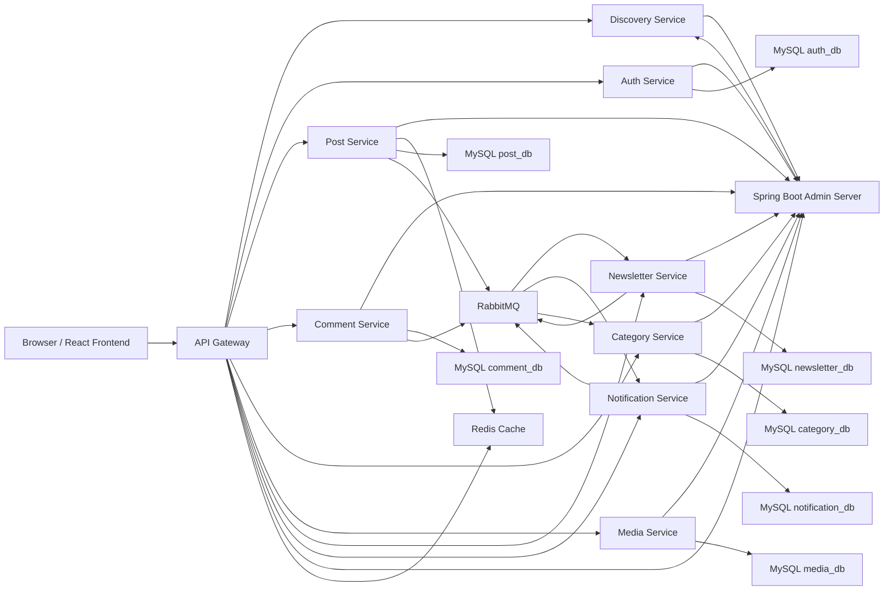

# Phase 1 - Final Architecture

## 1. High-Level Architecture



## 2. Folder Structure

```text
inkwell-platform/
|-- .mvn/
|-- admin-server/
|-- api-gateway/
|-- auth-service/
|-- category-service/
|-- comment-service/
|-- discovery-service/
|-- docs/
|-- docker/
|-- frontend-web/
|-- media-service/
|-- newsletter-service/
|-- notification-service/
|-- post-service/
|-- scripts/
|-- .env.example
|-- docker-compose.yml
|-- mvnw
|-- mvnw.cmd
|-- pom.xml
`-- README.md
```

Each backend service follows:

```text
service-name/
|-- src/main/java/com/inkwell/{service}/
|   |-- client/
|   |-- config/
|   |-- controller/
|   |-- dto/
|   |-- entity/
|   |-- enumtype/
|   |-- exception/
|   |-- mapper/
|   |-- repository/
|   |-- security/
|   |-- service/
|   `-- util/
|-- src/main/resources/
|   `-- application.yml
|-- src/test/java/
|-- Dockerfile
`-- pom.xml
```

All backend services are configured to:

- register with Eureka through `discovery-service`
- publish actuator health to `admin-server`
- use their own database instead of a shared schema

## 3. Database Design Summary

### auth_db
- `users`
- `refresh_tokens`

### post_db
- `posts`
- `post_likes`

### comment_db
- `comments`
- `comment_likes`

### category_db
- `categories`
- `tags`
- `post_category_mappings`
- `post_tag_mappings`

### media_db
- `media_files`

### newsletter_db
- `subscribers`
- `campaigns`

### notification_db
- `notifications`
- `audit_logs`

## 4. Event Flow

### RabbitMQ events
- `post.published`
  - emitted by `post-service`
  - consumed by `newsletter-service`, `notification-service`, `category-service`
- `comment.created`
  - emitted by `comment-service`
  - consumed by `notification-service`
- `comment.reply`
  - emitted by `comment-service`
  - consumed by `notification-service`
- `admin.broadcast`
  - emitted by `notification-service`
  - stored and fanned out to users
- `audit.created`
  - emitted by admin operations from auth/post/category/comment/newsletter services
  - consumed by `notification-service` for audit log storage

## 5. API Gateway Routes

| Route | Service | Notes |
|---|---|---|
| `/api/auth/**` | auth-service | public login/register, protected profile/admin ops |
| `/api/posts/**` | post-service | public feed + protected author/admin ops |
| `/api/comments/**` | comment-service | protected create/update, public fetch |
| `/api/categories/**` | category-service | public list, protected admin CRUD |
| `/api/media/**` | media-service | protected upload/library |
| `/api/newsletter/**` | newsletter-service | public subscribe/confirm, admin campaigns |
| `/api/notifications/**` | notification-service | protected notification center |
| `/actuator/**` | per service | health and metrics |
| `/v3/api-docs/**` | per service | swagger docs |

## 6. Frontend Page Map

### Public pages
- `/`
- `/posts/:slug`
- `/categories/:slug`
- `/tags/:slug`
- `/search`
- `/authors/:authorId`
- `/login`
- `/register`
- `/newsletter`

### Protected reader pages
- `/profile`
- `/notifications`

### Author pages
- `/author`
- `/author/posts`
- `/author/posts/new`
- `/author/posts/:postId/edit`
- `/author/comments`
- `/author/media`
- `/author/analytics`

### Admin pages
- `/admin`
- `/admin/users`
- `/admin/posts`
- `/admin/categories`
- `/admin/comments`
- `/admin/newsletter`
- `/admin/notifications`
- `/admin/audit-logs`

## 7. Security Design

- JWT access token validated at gateway
- refresh token flow handled in `auth-service`
- downstream services trust gateway headers:
  - `X-User-Id`
  - `X-Username`
  - `X-User-Role`
- RBAC enforced in gateway and in each service controller/security layer
- OAuth2 login supported via Google and GitHub in `auth-service`
- BCrypt for local passwords
- Bean validation on all write requests
- HTML sanitization for post/comment rich text

## 8. Design Notes

- Redis caches published feed and supports gateway rate limiting
- Media uses local disk by default and switches to S3 when credentials are configured
- Newsletter and notifications degrade gracefully when SMTP is unavailable
- Audit logs are stored in `notification-service`
- Monitoring is centralized in `admin-server` and discovery is centralized in `discovery-service`
